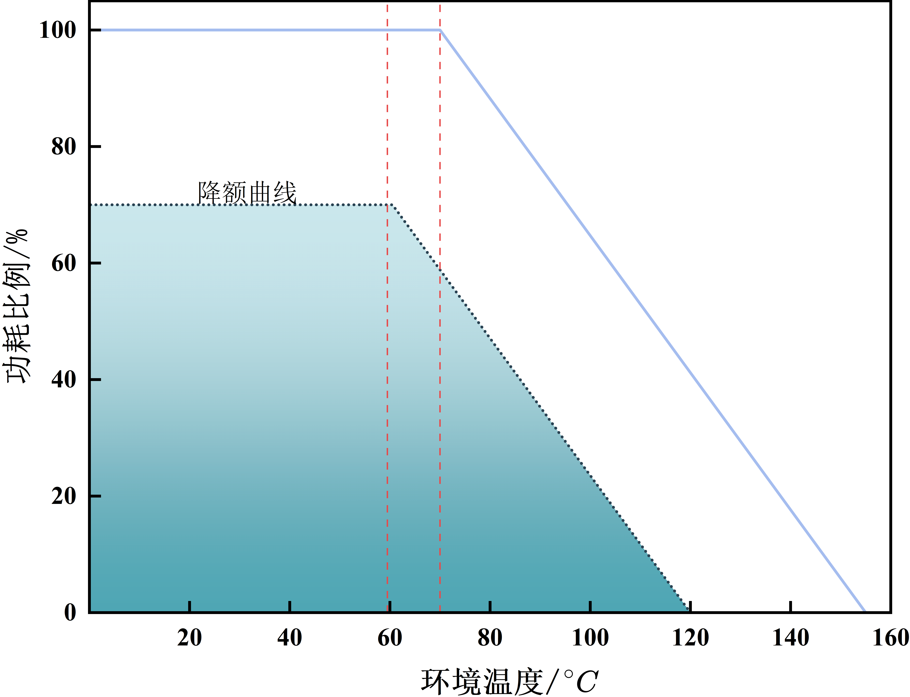
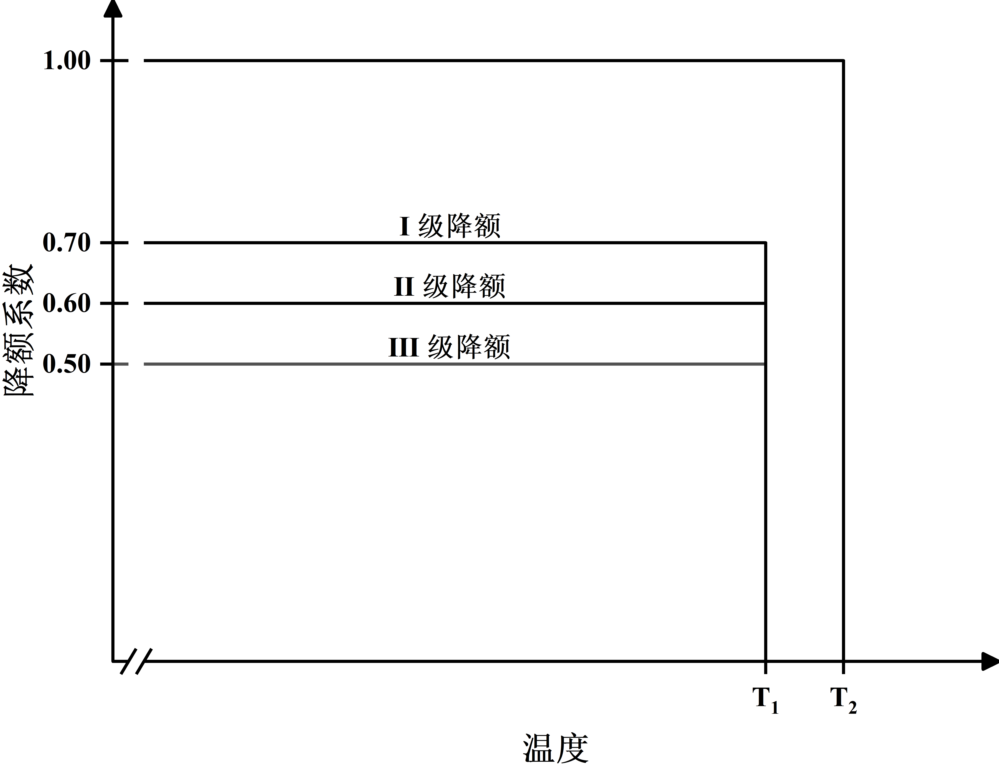

# 降额 & DFMEA

## 降额

### 0. 序言

​	在电子产品设计阶段，避免元器件被激发，失效激励、模拟测试、降额设计是提升电子产品可靠性的三个基础手段。其中降额是最有效、简单、低成本的一种。即使应力适当超标，元器件也能承受。

​	降额需要注意的一些错误：

1. 降额参数选的不对，该降的参数没降或降得不够。
   - 比如对功率元件，结温是降额的关键，而不是电压；
   - 同一类元器件，用在不同的电路里，起主导作用的参数可能不一样，如电容，用在储能时主导参数是容值和最大纹波电流，用在退耦时，主导参数是自谐振频率点，用在安规时则是耐压。
2. 同一个电路系统中，各元器件的降额不协。
   - 如对所有元器件都取降额系数为 0.5，薄膜电阻功率降额系数取 0.5，属 Ⅰ 级降额；而线绕电位器功率降额系数取 0.5，则属于 Ⅲ 级降额，因而会造成线绕电位器的降额裕量不足，薄膜电阻又降额过度。
3. 一个系统中的不同部分，根据安全性、可靠性、重要程度要求的不同，可以采用不同的降额等级。
   - 常规民用地面设备一般推荐选择 Ⅲ 级降额；而地面设备中的高可靠性元器件、组件、模块的降额可以取 Ⅱ 级降额。
4. 可调元器件降额幅度应大于定值元器件。
   - 如薄膜定值电阻功率 Ⅲ 级降额系数为 0.7，相同工艺类型的薄膜电位器功率 Ⅲ 级降额系数为 0.6。
5. 相同规格的单根金属导线，多匝应用场合时的降额幅度应大于单匝应用场合。
6. 对开关元器件，所带的负载属于不同类型时，降额参数和降额系数也会有所不同。
   - 如继电器的触点电流，在带电感负载时，继电器触点额定电流指标取 Ⅲ 级的降额系数为 0.9；带电阻负载时，继电器触点额定电流指标取 Ⅲ 级的降额系数为 0.5；带电机负载时，继电器触点额定电流 Ⅲ 级降额系数为 0.9。
7. 对于 MOSFET（或 IGBT）功率开关管。
   - 当为感性负载时，因为断开瞬间电感反向电动势的作用，会导致在 MOSFET 开关管的DS两端（IGBT 的 CE 两端）形成较高尖峰电压，因此感性负载时 MOSFET 的 $V_{DS}$（IGBT 的 $V_{CE}$）电压需要重点降额，以避免高压击穿的风险；
   - 而当为容性负载的时候，在刚刚导通的瞬间，对电容近乎短路电流的充电，该电流会经过开关管，则需要重点关注功率开关管的导通电流指标进行降额。
8. 功能相同、但生产工艺不同的元器件，对同一参数指标的降额幅度也会不同。
   - 如钽电解电容和铝电解电容，其直流耐压指标的 Ⅲ 级降额系数分别是 0.75（铝电解电容）和 0.7（钽电解电容）；
   - 膜式电阻与线绕电阻的功率指标 Ⅲ 级降额系数分别是 0.7（膜式电阻）和 0.6（精密型线绕电阻）。
9. 对大规模 IC 和高集成度元器件，主要降额系数为结温。
10. 有些元器件的参数还不能降额。
    - 比如继电器的驱动线圈电流，如果降额，则导致驱动电流产生的电磁力下降，从而使继电器触点的吸合力度不够，抗振抗冲击性能变差；
    - 光学元器件降额后，会导致发光强度减弱，影响显示效果。
11. 元器件负载特性曲线也需要降额。

​	降额等级的分类为系统设计和设计管理提供了思路，在项目设计开始，针对系统整机的降额系数、各部分的组成，确定出适宜的降额等级，然后根据相关标准查找对应的降额系数。

​	如果系统应用于特定行业，在设计上有特殊要求，如对煤矿井下设备的防爆要求，对手持设备的低功耗要求，对医疗设备的低漏电流要求，还有一些特殊要求的安规指标等，可以根据专标要求单独确定；对通用元器件没有专门安规技术要求的，推荐参考《GJB/Z 35 元器件降额准则》标准的规定进行降额，尤其是关键部件、功率元器件、驱动执行机构元器件、易坏部件，其降额系数一定要给出明确的等级要求和参考值，不可仅仅依据经验来选择。

### 1. 降额总则

#### 1.1. 定义

- 额定值：元器件允许的最大使用应力值。

- 应力：影响元器件失效率的电、热、机械、环境条件等负载。

- 降额因子：元器件工作应力与额定应力之比，又称为应力比。

- 电应力：元器件外加的电压、电流及功率等。

- 温度应力：指元器件所处工作环境的温度。

- 机械应力：指元器件所承受的直接负荷、压力、冲击、振动、碰撞和跌落等。

- 环境应力：指元器件所处工作环境条件下，温度以外的其他外界因素，如灰尘、温度、气压、盐雾、腐蚀等。

- 时间应力：指元器件承受应力时间的长短（承受应力时间越长，越易老化或失效）。

#### 1.2. 降额等级

​	通过降额设计，使元器件工作中所承受的应力低于其额定值，可达到延缓参数退化，增加工作寿命，提高使用可靠性的目的。降额设计有两大问题，一是分级，二是合理选择降额参数。

​	降额分三个等级，对于一台整机或一个独立的系统，其各组成部分的降额等级可以是不一样的。例如整机降额等级确定为 Ⅲ 级，对其中的重要关键部分及易失效部分，可以采用一个稍高的降额等级 Ⅱ 级，而其他部分为 Ⅲ 级。如小区监控系统，户内设备因为其工作环境条件较好，可以采用 Ⅲ 级降额，而户外摄像头中的电路可以采用 Ⅱ 级降额。

| 降额等级 |                    危害程度                    |           新技术新工艺           |            可维修性            |        尺寸重量限制        |
| :------: | :--------------------------------------------: | :------------------------------: | :----------------------------: | :------------------------: |
| Ⅰ 级降额 | 设备失效将导致人员伤亡或设备级保护措施严重损坏 | 高可靠性要求，采用了新技术新工艺 |         失效了不能维修         |  系统对尺寸重要有苛刻限制  |
| Ⅱ 级降额 |       设备失效瓯江导致设备与保障设备损坏       |    高可靠性要求，有专门的设计    |         较高的维修费用         |                            |
| Ⅲ 级降额 |       设备失效不会造成人员和设备伤亡破坏       |          成熟的标准设计          | 故障设备可迅速、经济的得以修复 | 设备的尺寸重量无苛刻的限制 |

​	Ⅲ 级降额最小，适用于故障对任务的完成影响很小的情况以及少量的维修。

​	降额的等级应按设备可靠性要求、设计的成熟性、维修费用和难易程度、安全性要求，及对设备重量和尺寸的限制因素，综合权衡，确定其降额等级。常规地面民用设备一般推荐选取 Ⅲ 级降额即可。

​	元器件环境应力大小直接影响元器件的失效率，虽然降额考虑的主要因素是电应力和温度，但并不仅仅是主要性能指标才需要降额，需要结合使用条件环境进行分析，确定受应力条件影响最大的指标要素。如220V电源输入端的对地电容，耐压是降额的重点指标，但用在潮湿环境条件下，漏电流也是安规的一个关键指标。

​	降额要关注的主要技术点如下：

- 降额参数的基准要考虑电路稳态工作、瞬时过载、动态电应力等条件下的综合应力叠加；
- 电阻类主要是功率降额，对高压应用环境还需电压降额；
- 电容类主要是电压和功耗降额，有时考虑工作频率降额；
- 数字 IC 对带负载能力、应用频率降额；
- 线性与混合集成电路对工作电流或工作电压降额；
- 微波 IC 对功率和频率降额；
- 晶体管对工作电流、工作电压、功耗、频率降额；
- 普通二极管频率降额；开关二极管的工作峰值反向电压降额；变容二极管的击穿电压降额；可控硅的工作浪涌电流及正向工作电流降额；
- 继电器触点电流，按容性负载、感性负载及阻性负载等不同负载的性质，做出不同比例的降额，对容性负载要按电路接通时峰值电流进行降额；
- 电连接器对工作电流降额和工作电压降额，降额程度根据触件间隙大小及直流和交流电源而定；
- 开关元器件对开关功率和触点电流的降额；
- 电缆和导线对电流降额，高压电缆和导线对工作电压降额；
- 晶体晶振在保证功率的前提下，对驱动电压降额。

​	另外也有两个注意事项：

- 降额幅度并不是越大越好，各类元器件均有一个最佳降额范围（一般推荐经验值在 40%～80% 之间，此范围为一般元器件常用区间）。在此范围内应力变化对其故障率的影响较大，较小的投入即可见到较大的可靠性收益。再继续降额，可靠性的提高很微小，甚至个别元器件还会因为降额过度而引入新的失效机理。
  - 瓷片电容的低压失效；
  - 大功率晶体管在小电流下，大大降低放大系数，参数稳定性降低。

- 有些指标不允许降额。
  - 继电器的吸合驱动线包电流，降额后会影响被吸合触点的可靠接触力大小；
  - 发光二极管、数码管电流与亮度成比例关系，降额会影响其发光的基本功能。

### 2. 电阻降额

#### 2.0. 电阻类型

​	常用的电阻有：薄膜电阻（常用于信号电路场合）、线绕电阻（温度特性较好，常用于功率电阻、精密电阻）、电位器、电阻排、热敏电阻等。根据电阻工艺的不同，会有不同的失效机理，降额时，需要侧重考虑易导致元器件失效的参数。

​	薄膜电阻有金属氧化膜和金属膜两种，高频特性好，电流噪声和非线性都较小，阻值范围宽，温度系数小，性能稳定，是使用较广泛的一类电阻器。降额参数是**电压**、**功率**和**环境温度**。

​	线绕电阻分精密型与功率型。线绕电阻器具有可靠性高、稳定性好、无非线性，以及电流噪声、温度和电压系数小的优点。降额的主要参数是**功率**、**电压**和**环境温度**。

​	电阻网络装配密度高，各元件间的匹配性能和跟踪温度系数好，对时间、温度的稳定性好。降额参数是**功率**、**电压**和**环境温度**。

​	电位器的优点是可调，但对振动敏感。虽然可以通过在调节柱上涂抹固定胶来解决，但胶状粘接物与调节铜柱、电位器塑料外壳一起，会因对温度冲击敏感而导致粘接松动，从而在振动时引起转动位移，阻值容易漂移，振动场合下一般不推荐采用。

​	结合以上电阻的特点，以及最坏电路情况分析方法，在电阻设计选用计算时，需要针对不同工艺对其对应的参数进行计算，并留出余量。

#### 2.1. 定值电阻降额

​	薄膜电阻、电阻排、线绕电阻的降额参数主要是**电压**、**功率**和**温度**。

​	薄膜电阻、电阻排的降额参数和系数：

<table align="center" border=2>
 <tr>
  <td rowspan=2 align="center">参数</td>
  <td colspan=3 align="center">降额等级</td>
 </tr>
 <tr>
  <td align="center">Ⅰ 级降额</td>
  <td align="center">Ⅱ 级降额</td>
  <td align="center">Ⅲ 级降额</td>
 </tr>
 <tr>
  <td align="center">电压</td>
  <td align="center">0.75</td>
  <td align="center">0.75</td>
  <td align="center">0.75</td>
 </tr>
 <tr>
  <td align="center">功率</td>
  <td align="center">0.50</td>
  <td align="center">0.60</td>
  <td align="center">0.70</td>
 </tr>
 <tr>
  <td align="center">环境温度</td>
  <td colspan=3 align="center">按元件负荷特性曲线降额</td>
 </tr>
</table>

​	线绕电阻降额参数和降额系数：

<table border=2>
    <tr>
    	<td rowspan=2 colspan=2 align='center'>参数</td>
       <td colspan=3 align='center'>降额等级</td>
    </tr>
    <tr>
    	<td align='center'>Ⅰ 级降额</td>
       <td align='center'>Ⅱ 级降额</td>
       <td align='center'>Ⅲ 级降额</td>
    </tr>
    <tr>
    	<td colspan=2 align='center'>电压</td>
       <td align='center'>0.75</td>
       <td align='center'>0.75</td>
       <td align='center'>0.75</td>
    </tr>
    <tr>
    	<td rowspan=2 align='center'>功率</td>
       <td align='center'>精密型</td>
       <td align='center'>0.25</td>
       <td align='center'>0.45</td>
       <td align='center'>0.60</td>
    </tr>
    <tr>
    	<td align='center'>功率型</td>
    	<td align='center'>0.50</td>
    	<td align='center'>0.60</td>
    	<td align='center'>0.70</td>
    </tr>
    <tr>
        <td colspan=2 align='center'>环境温度</td>
        <td colspan=3 align='center'>按元件负荷特性曲线降额</td>
    </tr>
</table>
​	在元器件选型计算中，常对单一参数进行计算，但实际元器件，经常会有相互影响的关联指标。电子元器件的功率与工作温度是一对这样相互影响的参数。两个参数相互影响的表征形式是负荷特性曲线。

​	元器件负荷特性曲线降额示例如下：

​	下图所示为一精密电阻的负荷特性曲线，横轴是电阻工作环境的额定温度，纵轴是电阻上消耗功耗的百分数。

  

​	由上图可以看出，在超过 70$^{\circ}C$ 后，电阻上消耗电功率的大小就会按照一个斜率逐步递减。这个递减的斜率取决于电阻的散热能力。即使在绝大部分元器件的数据手册里，未给出这条明确的曲线，但一般最高温度 $T_{max}$、功率 $P$、热阻 $R$（单位 $^{\circ}C/W$）的指标都会给出来，递减的斜率是热阻的倒数，由此就可以推导出这条负荷特性曲线。

​	负荷特性曲线的降额是先将功率降额（降额因子 $\times$ 元器件标称功率），然后对结温降额（按照目前国内一般采用《GJB/Z35 元器件降额准则》的标准，按照对系统所设定的降额等级，确定电阻的降额等级（Ⅰ、Ⅱ、Ⅲ级），在标准中找到对应该降额等级的结温降额因子，确定了降额之后的结温点，经过该结温点左斜向上画一条直线，该直线与原负荷特性曲线的下降段平行，最后与功率降额的水平线相交于一点。在降额计算时，需要保证元器件长期工作状态下的静态工作点必须位于降额后负荷特性曲线的蓝色填充范围内。

#### 2.2. 电位器降额计算

​	电位器是可调元器件，其降额系数与固定不可调电阻相比有所不同，主要体现在功率的降额上。

​	电位器降额参数表：

<table border=2>
    <tr>
        <td rowspan=2 colspan=4 align='center'>参数</td>
        <td colspan=3 align='center'>降额等级</td>
    </tr>
    <tr>
        <td align='center'>Ⅰ 级降额</td>
        <td align='center'>Ⅱ 级降额</td>
        <td align='center'>Ⅲ 级降额</td>
    </tr>
    <tr>
        <td rowspan=4 align='center'>非线 绕电 位器</td>
        <td colspan=3 align='center'>电压</td>
        <td align='center'>0.75</td>
        <td align='center'>0.75</td>
        <td align='center'>0.75</td>
    </tr>
    <tr>
        <td rowspan=2 align='center'>功率</td>
        <td colspan=2 align='center'>合成、薄膜型</td>
        <td align='center'>0.30</td>
        <td align='center'>0.45</td>
        <td align='center'>0.60</td>
    </tr>
    <tr>
        <td colspan=2 align='center'>精密塑料型</td>
        <td align='center'>不采用</td>
        <td align='center'>0.50</td>
        <td align='center'>0.50</td>
    </tr>
    <tr>
        <td colspan=3 align='center'>环境温度</td>
        <td colspan=3 align='center'>按元件负荷特性曲线降额</td>
    </tr>
    <tr>
        <td rowspan=4 align='center'>线绕 电位 器</td>
        <td colspan=3 align='center'>电压</td>
        <td align='center'>0.75</td>
        <td align='center'>0.75</td>
        <td align='center'>0.75</td>
    </tr>
    <tr>
        <td rowspan=2 align='center'>功率</td>
        <td colspan=2 align='center'>普通型、微调线绕型</td>
        <td align='center'>0.30</td>
        <td align='center'>0.45</td>
        <td align='center'>0.50</td>
    </tr>
    <tr>
        <td colspan=2 align='center'>非密封功率型</td>
        <td align='center'>---</td>
        <td align='center'>---</td>
        <td align='center'>0.70</td>
    </tr>
    <tr>
        <td colspan=3 align='center'>环境温度</td>
        <td colspan=3 align='center'>按元件负荷特性曲线降额</td>
    </tr>
</table>

​	电位器降额的主要参数是**电压**、**功率**和**环境温度**。由于电位器部分接入负载，其功率的额定值应根据作用阻值按比例进行相应降额。随着大气压的减小，电位器可承受的最高工作电压也减小，使用时应按元件相关详细规范的要求进一步降额。

#### 2.3. 热敏电阻降额

​	热敏电阻的降额计算如见表5，环境温度的降额与其他种类电阻相比有所不同。负温度系数型热敏电阻器，应采用限流电阻器，防止元器件热失控。对热敏电阻，任何情况下，即使是很短的时间，也不允许超过电阻器额定最大电流和功率。

​	热敏电阻降额参数表：

<table border=2>
	<tr>
		<td rowspan=2 align='center'>参数</td>
		<td colspan=3 align='center'>降额等级</td>
	</tr>
	<tr>
		<td align='center'>一级降额</td>
		<td align='center'>一级降额</td>
		<td align='center'>一级降额</td>
	</tr>
	<tr>
		<td align='center'>功率</td>
		<td align='center'>0.50</td>
		<td align='center'>0.50</td>
		<td align='center'>0.50</td>
	</tr>
	<tr>
		<td align='center'>环境温度</td>
		<td colspan=3 align='center'>
			<math xmlns="http://www.w3.org/1998/Math/MathML" display="block" style="font-family:Times New Roman">
				<msub>
        <mrow><ms>T</ms></mrow>                    
        <mrow><ms>A</ms><ms>M</ms></mrow>
       </msub>
       <mo>-</mo>
       <msup>
         <mrow><mn>15</mn></mrow>
         <mrow><mo></mo></mo><ms>o</ms></mrow>
       </msup>
       <ms>C</ms>
			</math>
		</td>
	</tr>
</table>

### 3 电容降额

#### 3.0 电容降额计算

​	电容直流耐压降额的计算，要求电容耐压 $\times$ 降额因子的计算结果，不得超过电路实际最高峰时的工作电压。

​	在高频电路中，通过电容的电流不应超过：
$$
I=\frac{2}{\sqrt[4]{f}}
$$
​	电容直流耐压-温度的关系曲线与电阻类、晶体管类和 IC 类有所不同，其负荷特性曲线见下图。

  

​	电容的误差一般都偏大，也因此导致电容分压的较大偏差，而电阻元器件可以做得较精密，通过并联精密电阻在电容两边的方式，确保电容分压受控在电阻的分压范围内，通过电阻的精度来实现电容两端的分压精度。

  

#### 3.1. 固定电容器降额

​	固定电容器包括玻璃釉型、云母型、陶瓷型、纸介、塑料薄膜等类型，虽然工艺结构略有差别，但在降额要求方面具有共性。

​	固定电容器降额系数：

<table border=2>
  <tr>
    <td rowspan=2 align='center'>参数</td>
    <td colspan=3 align='center'>降额等级</td>
  </tr>
  <tr>
    <td align='center'>Ⅰ 级降额</td>
    <td align='center'>Ⅱ 级降额</td>
    <td align='center'>Ⅲ 级降额</td>
  </tr>
  <tr>
    <td align='center'>直流工作电压</td>
    <td align='center'>0.50</td>
    <td align='center'>0.60</td>
    <td align='center'>0.70</td>
  </tr>
  <tr>
    <td align='center'>环境温度</td>
    <td colspan=3 align='center'>
      <math display="block" style="font-family:Times New Roman">
        <msub>
          <mrow><ms>T</ms></mrow>                    
          <mrow><ms>A</ms><ms>M</ms></mrow>
        </msub>
        <mo>-</mo>
        <msup>
          <mrow><mn>10</mn></mrow>
          <mrow><mo></mo></mo><ms>o</ms></mrow>
        </msup>
        <ms>C</ms>
      </math>
    </td>
  </tr>
</table>

#### 3.2. 电解电容器降额

​	常用的电解电容器有铝电解电容和钽电解电容，因为工艺结构的特殊性（电解液和封装形式的差别），在降额系数上与其他类型的固定值电容也有所区别。

​	电解电容器降容系数：

<table border=2>
  <tr align='center'>
    <td rowspan=2 colspan=3>参数</td>
    <td colspan=3>降额等级</td>
  </tr>
  <tr align='center'>
    <td>Ⅰ 级降额</td>
    <td>Ⅱ 级降额</td>
    <td>Ⅲ 级降额</td>
  </tr>
  <tr align='center'>
    <td rowspan=2>铝电解</td>
    <td colspan=2>直流工作电压</td>
    <td>---</td>
    <td>---</td>
    <td>0.75</td>
  </tr>
  <tr align='center'>
    <td colspan=2>环境温度</td>
    <td>---</td>
    <td>---</td>
    <td>
      <math display="block" style="font-family:Times New Roman">
        <msub>
          <mrow><ms>T</ms></mrow>                    
          <mrow><ms>A</ms><ms>M</ms></mrow>
        </msub>
        <mo>-</mo>
        <msup>
          <mrow><mn>20</mn></mrow>
          <mrow><mo></mo></mo><ms>o</ms></mrow>
        </msup>
        <ms>C</ms>
      </math>
    </td>
  </tr>
  <tr align='center'>
    <td rowspan=2>钽电解</td>
    <td colspan=2>直流工作电压</td>
    <td>0.50</td>
    <td>0.60</td>
    <td>0.70</td>
  </tr>
  <tr align='center'>
    <td colspan=2>环境温度</td>
    <td colspan=3>
      <math display="block" style="font-family:Times New Roman">
        <msub>
          <mrow><ms>T</ms></mrow>                    
          <mrow><ms>A</ms><ms>M</ms></mrow>
        </msub>
        <mo>-</mo>
        <msup>
          <mrow><mn>20</mn></mrow>
          <mrow><mo></mo></mo><ms>o</ms></mrow>
        </msup>
        <ms>C</ms>
      </math>
    </td>
  </tr>
</table>

​	使用中的电解电容器的直流电压与交流峰值电压之和不得超过降额后的直流工作电压，对于有极性电容器，交流峰值电压应小于直流电压分量。

​	**铝电解电容器**不能承受低温度和低气压，因此只限于地面设备的使用。**固体钽电容器**的漏电流将随着电压和温度的增高而加大。这种情况下有可能导致漏电流的“雪崩现象”，从而使电容器失效。为防止这种现象的发生，在电路设计中应有不小于 3Ω/V 的等效串联阻抗。固体钽电容器不能在反向波动条件下工作。**非固体钽电容器**在有极性的条件下不允许加反向电压。

### 4. 电感降额

#### 4.0. 电感降额参数

​	电感元件包括各种线圈和变压器。电感元件降额的主要参数是**热点温度**。

​	电感元件降额参数：

<table border=2>
  <tr align='center'>
    <td rowspan=2>参数</td>
    <td colspan=3>降额等级</td>
  </tr>
  <tr align='center'>
    <td>Ⅰ 级降额</td>
    <td>Ⅱ 级降额</td>
    <td>Ⅲ 级降额</td>
  </tr>
  <tr align='center'>
    <td>      
      <math style="font-family:Times New Roman">
        <ms>热点温度/</ms>
        <msup>
          <mrow></mrow>
          <mrow><mo></mo><ms>o</ms></mrow>
        </msup>
        <ms>C</ms>
      </math>
    </td>
    <td>
      <math display="block" style="font-family:Times New Roman">
        <msub>
          <mrow><ms>T</ms></mrow>                    
          <mrow><ms>H</ms><ms>S</ms></mrow>
        </msub>
        <mo>-</mo>
        <mrow><mn>(45~25)</mn></mrow>
      </math>
    </td>
    <td>
      <math display="block" style="font-family:Times New Roman">
        <msub>
          <mrow><ms>T</ms></mrow>                    
          <mrow><ms>H</ms><ms>S</ms></mrow>
        </msub>
        <mo>-</mo>
        <mrow><mn>(25~10)</mn></mrow>
      </math>
    </td>
      		<td>
      <math display="block" style="font-family:Times New Roman">
        <msub>
          <mrow><ms>T</ms></mrow>                    
          <mrow><ms>H</ms><ms>S</ms></mrow>
        </msub>
        <mo>-</mo>
        <mrow><mn>(15~0)</mn></mrow>
      </math>
    </td>
  </tr>
  <tr align='center'>
    <td>工作电流</td>
    <td>0.6~0.7</td>
    <td>0.6~0.7</td>
    <td>0.6~0.7</td>
  </tr>
  <tr align='center'>
    <td>瞬态工作电压</td>
    <td>0.90</td>
    <td>0.90</td>
    <td>0.90</td>
  </tr>
  <tr align='center'>
    <td>介质耐压</td>
    <td>0.5~0.6</td>
    <td>0.5~0.6</td>
    <td>0.5~0.6</td>
  </tr>
  <tr align='center'>
    <td>扼流圈工作电压</td>
    <td>0.70</td>
    <td>0.70</td>
    <td>0.70</td>
  </tr>
</table>

​	为防止绝缘击穿，线圈的绕组电压应维持在额定值；工作在低于其设计频率范围的电感元件会产生过热和可能的磁饱和，使元件的工作寿命缩短，甚至导致线圈缘破坏。因此，**绕组电压**和**工作频率**是固定的，不能**降额**。

#### 4.1. 热点温度计算

​	电感元件的热点温度值与线圈绕组的**绝缘性能**、**工作电流**、**瞬态初始电流**及**介质耐压**有关。电感元件的热点温度确定可用下述公式：
$$
T_{HS}=T_{A}+1.1 \times \Delta T
$$
​	式中：

- $T_{HS}$ 为热点温度，单位是 $^\circ$C；

- $T_{A}$ 为环境温度，单位是 $^\circ$C；

- $\Delta T$ 为温升，单位是 $^\circ$C；

​	$\Delta T$​ 可用直接测量法或电阻变化测定法得到，电阻变化测定法可用下述公式：
$$
\Delta T=[(R-r)/r](t+234.5)-(T_{AM}-t)
$$
​	式中：

- $\Delta T$ 为温升，单位是 $^\circ C$；

- $R$ 为温度为 $(t+\Delta T)$ 时的线圈电阻，单位是 $\Omega$；$r$ 为温度为 $t$ 时的线圈电阻，单位是 $\Omega$；

- $t$ 为接通电源时的电感工作温度，单位是 $^\circ C$；

- $T_{AM}$ 为切断电源时的最高环境温度。

​	其中：要求 $T_{AM}$ 与 $t$ 的差值不应大于 5 $^\circ C$。现对上述公式简要解释：当电感未工作时，存在一个最低温度，即最高环境温度 $T_{AM}$；当电源接通时，所测量的电感工作温度并不是电感热点温度 $T_{HS}$ ，因为在测量过程中存在热损耗，假设最高温度是 $t_{max}$ ，所测量的温度 $t$ 应该是下降后的温度，而 $T_{A}$ 代表上升后的环境温度，那么应当有 $t_{max}-t \approx (1+k)(T_{A}-T_{AM})$ ，移项后得：$t_{max} \approx T_{A} - [(1+k)T_{AM}-(t+kT_{A})]$ ，由于 $t \approx T_A$ ，所以公式可以简化为：$t_{max} \approx T_A-(1+k)(T_{AM}-t)$ ，而这仍然不是电感的热点温度，由于电感可能在工作的不同状态下存在升温，可以通过电阻变化等效温度变化：$\frac{R}{r}=\frac{t+\Delta T}{t}$ ，化简后得：$\Delta T=\frac{(R-r)}{r}t$ ，（注意这里得温度应该使用 K 氏温度计算）。而在 $\Delta T$ 与 $\Delta t$ 之间，仍然存在一个系数 $(1+k)$ ，因此最终得电感热点温度：$T_{HS}=t_{max}+\Delta t \approx T_A-(1+k)(T_{AM}-t)+(1+k)\Delta T$ ，代入化简后可得：$T_{HS}\approx T_{A}+(1+k)\{[(R-r)/r](t+234.5)-(T_{AM}-t)\}$ 。

​	根据经验参数，$k\approx0.1$ ，而令 $\Delta T=[(R-r)/r](t+234.5)-(T_{AM}-t)$ ，即可得到与上述完全相同得等式。

​	测量状态：

- 变压器初级加额定电压，次级加额定负载；

- 线圈绕组加额定直流和交流电流。

### 5. 集成电路降额

#### 5.0. 集成电路分类

​	集成电路分模拟类和数字类两类，根据制造工艺的不同，又可分为双极型、MOS（CMOS）型以及混合集成电路。集成电路芯片的电路单元小，导体截面电流密度很大，因此在有源结点上会存在高温，称之为结温。高结温 $T_j$ 是对 IC 的最大破坏性应力。集成电路降额的主要目标是降低高温集中部分的温度，避免热损伤和高温下的快速老化。中、小规模集成电路降温的主要参数是**电压**、**电流**或**功率**，以及**结温**。大规模集成电路主要是需要降低**结温**。

​	在集成电路应用设计方面，为维持较低结温，可采取以下通用措施。

- 在能满足功能的前提下，元器件运行电功率尽可能小；
- 采用去耦电路，减少瞬态电流冲击；
- 元器件的实际工作频率低于元器件的额定频率，在工作频率与元器件额定频率接近时，功耗会迅速增加；
- 采用较好的散热措施，避免选用高热阻底座，IC 与底座之间接触热阻较高的情况应加以避免。

​	为保证设备长期可靠的工作，对于集成电路，设计允许参数容差如下。

1. 模拟电路
   - 电压增益：- 25 %（运算放大器），- 20 %（其他）；
   - 输入失调电压：+ 50 %（低失调元器件可达300 %）；
   - 输入失调电流：+ 50 %或+5 nA；
   - 输入偏置电压：$\pm$ 1 mV（运算放大器和比较器）；
   - 输出电压：$\pm$ 0.25 %（电压调整器）；
   - 负载调整率：$\pm$ 0.20 %（电压调整器）。
2. 数字电路允许容差范围
   - 输入反向漏电流：+ 100 %；
   - 扇出：- 20 %；
   - 频率：- 10 %。

#### 5.1. 模拟集成电路降额

​	模拟集成电路在选取降额系数时，需要基于三个前提条件：

1. 降额的电源电压在降额后不小于推荐的正常工作电压；
2. 输入电压在任何情况下均不得超过电源电压；
3. 电压调整器的输入电压在一般情况下即为电源电压。

##### 5.1.1. 放大器降额

​	放大器降额系数：

<table border=2>
  <tr align='center'>
    <td rowspan=2>参数</td>
    <td colspan=3>降额等级</td>
  </tr>
  <tr align='center'>
    <td>Ⅰ 级降额</td>
    <td>Ⅱ 级降额</td>
    <td>Ⅲ 级降额</td>
  </tr>
  <tr align='center'>
    <td>电源电压</td>
    <td>0.70</td>
    <td>0.80</td>
    <td>0.80</td>
  </tr>
  <tr align='center'>
    <td>输入电压</td>
    <td>0.60</td>
    <td>0.70</td>
    <td>0.70</td>
  </tr>
  <tr align='center'>
    <td>输出电流</td>
    <td>0.70</td>
    <td>0.80</td>
    <td>0.80</td>
  </tr>
  <tr align='center'>
    <td>功率</td>
    <td>0.70</td>
    <td>0.75</td>
    <td>0.80</td>
  </tr>
  <tr align='center'>
    <td>      
      <math display='block' style="font-family:Times New Roman">
        <ms>最高结温/</ms>
        <msup>
          <mrow></mrow>
          <mrow><mo></mo><ms>o</ms></mrow>
        </msup>
        <ms>C</ms>
      </math>
    </td>
    <td>80</td>
    <td>95</td>
    <td>105</td>
  </tr>
</table>

#### 5.2. 数字电路降额

​	输出电流降额将使扇出减少，可能导致使用元器件的数量增加，反而使设备的预计可靠性下降。降额时应防止这种情况的发生。

##### 5.2.1. 双极性数字IC

​	双极型数字IC降额参数应遵循以下准则：

1. 在元器件数据手册上，一般都会给出电源电压的额定值容差，设计时以此容差为标准即可；
2. 频率从额定值降额；
3. 输出电流从额定值降额；
4. 结温降额给出了最高允许结温。

​	双极性数字 IC 降额系数：

<table border=2>
  <tr>
    <tr align='center'>
    <td rowspan=2>参数</td>
    <td colspan=3>降额等级</td>
  </tr>
  <tr align='center'>
    <td>Ⅰ 级降额</td>
    <td>Ⅱ 级降额</td>
    <td>Ⅲ 级降额</td>
  </tr>
  <tr align='center'>
    <td>频率</td>
    <td>0.80</td>
    <td>0.90</td>
    <td>0.90</td>
  </tr>
  <tr align='center'>
    <td>输出电流</td>
    <td>0.80</td>
    <td>0.90</td>
    <td>0.90</td>
  </tr>
  <tr align='center'>
    <td>      
      <math display='block' style="font-family:Times New Roman">
        <ms>最高结温/</ms>
        <msup>
          <mrow></mrow>
          <mrow><mo></mo><ms>o</ms></mrow>
        </msup>
        <ms>C</ms>
      </math>
    </td>
    <td>85</td>
    <td>100</td>
    <td>115</td>
  </tr>
</table>

##### 5.2.2. MOS型数字电路

​	MOS型数字IC降额参数须遵循如下准则：

1. 电源电压从额定值降额，但电源电压降额后不应小于推荐的正常工作电压，且输入电压在任何情况下不得超过电源电压；
2. 输出电流从额定值降额，仅适用于缓冲器和触发器，从 IOL 的最大值降额，工作于粒子辐射环境的元器件需要进一步降额；
3. 频率从额定值降额；
4. 结温从元器件给出的最高允许结温降额。

​	MOS型数字电路降额系数：

<table border=2>
  <tr>
    <tr align='center'>
    <td rowspan=2>参数</td>
    <td colspan=3>降额等级</td>
  </tr>
  <tr align='center'>
    <td>Ⅰ 级降额</td>
    <td>Ⅱ 级降额</td>
    <td>Ⅲ 级降额</td>
  </tr>
  <tr align='center'>
    <td>电源电压</td>
    <td>0.70</td>
    <td>0.80</td>
    <td>0.80</td>
  </tr>
  <tr align='center'>
    <td>频率</td>
    <td>0.80</td>
    <td>0.80</td>
    <td>0.90</td>
  </tr>
  <tr align='center'>
    <td>输出电流</td>
    <td>0.80</td>
    <td>0.90</td>
    <td>0.90</td>
  </tr>
  <tr align='center'>
    <td>      
      <math display='block' style="font-family:Times New Roman">
        <ms>最高结温/</ms>
        <msup>
          <mrow></mrow>
          <mrow><mo></mo><ms>o</ms></mrow>
        </msup>
        <ms>C</ms>
      </math>
    </td>
    <td>85</td>
    <td>100</td>
    <td>115</td>
  </tr>
</table>

##### 5.3. 混合集成电路降额

​	首先，组成混合集成电路的元器件各部分，均应按本标准有关规定实施降额；其次，混合集成电路基体上的互连线，根据工艺的不同，其**功率密度**及**最高结温**也应符合下表的要求。

<table border=2>
  <tr align='center'>
    <td rowspan=2>参数</td>
    <td colspan=3>降额等级</td>
  </tr>
  <tr align='center'>
    <td>Ⅰ 级降额</td>
    <td>Ⅱ 级降额</td>
    <td>Ⅲ 级降额</td>
  </tr>
  <tr align='center'>
    <td>
      <math display='block' style='font-family:Times New Roman'>
        <ms>厚膜功率密度 W/</ms>
        <msup><ms>cm</ms><mn>2</mn></msup>
      </math>
    </td>
    <td colspan=3>< 7.5</td>
  </tr>
  <tr align='center'>
    <td>
      <math display='block' style='font-family:Times New Roman'>
        <ms>薄膜功率密度 W/</ms>
        <msup><ms>cm</ms><mn>2</mn></msup>
      </math>
    </td>
    <td colspan=3>< 6.0</td>
  </tr>
  <tr align='center'>
    <td>      
      <math display='block' style="font-family:Times New Roman">
        <ms>最高结温/</ms>
        <msup>
          <mrow></mrow>
          <mrow><mo></mo><ms>o</ms></mrow>
        </msup>
        <ms>C</ms>
      </math>
    </td>
    <td>85</td>
    <td>100</td>
    <td>115</td>
  </tr>
</table>

### 6. 分立半导体元件降额

#### 6.1. 晶体管

​	晶体管有很多种类型，但无论哪种类型，降额参数都基本相同，即**电压**、**电流**和**功率**。只有 MOS 型场效应晶体管、功率晶体管和微波晶体管的降额有些特殊要求。高温与电压击穿对于晶体管来说是两个主要破坏性应力，因此功耗 / 结温、电压必须降额。而功率晶体管有二次击穿的现象，因此要对安全工作区进行降额；在遭受由于多次开关过程所致的温度变化冲击后，会产生“热疲劳”失效，使用时要根据功率晶体管的相关详细规范要求限制壳温的最大变化值。

​	晶体管的降额参数：

<table border=2>
  <tr align='center'>
    <td rowspan=2 colspan=2>参数</td>
    <td colspan=3>降额等级</td>
  </tr>
  <tr align='center'>
    <td>Ⅰ 级降额</td>
    <td>Ⅱ 级降额</td>
    <td>Ⅲ 级降额</td>
  </tr>
  <tr align='center'>
    <td rowspan=2>反向电压</td>
    <td>一般晶体管</td>
    <td>0.60</td>
    <td>0.70</td>
    <td>0.80</td>
  </tr>
  <tr align='center'>
    <td>功率 MOSFET 栅源电压</td>
    <td>0.50</td>
    <td>0.60</td>
    <td>0.70</td>
  </tr>
  <tr align='center'>
    <td colspan=2>电流</td>
    <td>0.60</td>
    <td>0.70</td>
    <td>0.80</td>
  </tr>
  <tr align='center'>
    <td colspan=2>功率</td>
    <td>0.50</td>
    <td>0.65</td>
    <td>0.75</td>
  </tr>
  <tr align='center'>
    <td rowspan=2>功率管安 全工作区</td>
    <td>C-E 间最大电压</td>
    <td>0.70</td>
    <td>0.80</td>
    <td>0.90</td>
  </tr>
  <tr align='center'>
    <td>集电极最大允许电流</td>
    <td>0.60</td>
    <td>0.70</td>
    <td>0.80</td>
  </tr>
  <tr align='center'>
    <td rowspan=3>      
      <math display="block" style="font-family:Times New Roman">
        <ms>最高结温/</ms>
        <msup>
          <mrow></mrow>
          <mrow><mo></mo><ms>o</ms></mrow>
        </msup>
        <ms>C</ms>
      </math>
    </td>
    <td>200</td>
    <td>115</td>
    <td>140</td>
    <td>160</td>
  </tr>
  <tr align='center'>
    <td>175</td>
    <td>100</td>
    <td>125</td>
    <td>145</td>
  </tr>
  <tr align='center'>
    <td>
      <math>
        <mo style="font-family:JetBrains Mono"><=</mo>
        <mn style="font-family:Times New Roman">150</mn>
      </math>
    </td>
    <td>
      <math display='block' style='font-family:Times New Roman'>
        <msub>
          <mrow><ms>T</ms></mrow><mrow><ms>J</ms><ms>M</ms></mrow>
        </msub>
        <mo>-</mo>
        <mn>65</mn>
      </math>
    </td>
    <td>
      <math display='block' style='font-family:Times New Roman'>
        <msub>
          <mrow><ms>T</ms></mrow><mrow><ms>J</ms><ms>M</ms></mrow>
        </msub>
        <mo>-</mo>
        <mn>40</mn>
      </math>
    </td>
    <td>
      <math display='block' style='font-family:Times New Roman'>
        <msub>
          <mrow><ms>T</ms></mrow><mrow><ms>J</ms><ms>M</ms></mrow>
        </msub>
        <mo>-</mo>
        <mn>20</mn>
      </math>
    </td>
  </tr>
</table>

​	晶体管反向电压从额定反向电压开始降额，电流从额定值开始降额，功率从额定功率开始降额。按照之前关于过渡过程的描述，瞬间电压峰值和工作电压峰值之和不得超过降额电压的限定值。

​	为保证电路可以长期可靠工作，设计应允许晶体管主要参数的设计容差如下：

- 电流放大系数：
  - $\pm$ 15 %（适用于已经筛选的晶体管）
  - $\pm$ 30 %（适用于未经筛选的晶体管）
- 漏电流：+ 200 %
- 开关时间：+ 20 %
- 饱和压降：+ 15 %

​	晶体管的降额以元器件参数的最大允许值乘以上表中的降额因子，计算出降额后允许的电压、电流和功率。得到这些参数后，还需要计算结温。如果结温不能满足最高结温的降额要求，则需要将参数进一步降额，满足结温降额要求。

#### 6.2. 二极管

​	二极管有很多种类型，按照功能分、按照频率分、按照功率分，都可以分成好多种，但有一点是共同的，就是都对高温、高压敏感，高温是对二极管破坏性最强的应力，其次是电压击穿。因此，二极管的**功率**（伴随着电流降额）、**结温**、**电压**必须降额。

​	二极管的降额参数：

<table border=2>
  <tr align='center'>
    <td rowspan=2 colspan=2>参数</td>
    <td colspan=3>降额等级</td>
  </tr>
  <tr align='center'>
    <td>Ⅰ 级降额</td>
    <td>Ⅱ 级降额</td>
    <td>Ⅲ 级降额</td>
  </tr>
  <tr align='center'>
    <td colspan=2>反向耐压（耐压管不适用）</td>
    <td>0.60</td>
    <td>0.70</td>
    <td>0.80</td>
  </tr>
  <tr align='center'>
    <td colspan=2>电流</td>
    <td>0.50</td>
    <td>0.65</td>
    <td>0.80</td>
  </tr>
  <tr align='center'>
    <td colspan=2>功率</td>
    <td>0.50</td>
    <td>0.65</td>
    <td>0.80</td>
  </tr>
  <tr align='center'>
    <td rowspan=3>      
      <math display='block' style="font-family:Times New Roman">
        <ms>最高结温/</ms>
        <msup>
          <mrow></mrow>
          <mrow><mo></mo><ms>o</ms></mrow>
        </msup>
        <ms>C</ms>
      </math>
    </td>
    <td>200</td>
    <td>115</td>
    <td>125</td>
    <td>145</td>
  </tr>
  <tr align='center'>
    <td>175</td>
    <td>100</td>
    <td>125</td>
    <td>145</td>
  </tr>
  <tr align='center'>
    <td>
      <math>
        <mo style='font-family:JetBrains Mono'><=</mo>
        <mn style='font-family:Times New Roman'>150</mn>
      </math>
    </td>
    <td>
      <math display='block' style='font-family:Times New Roman'>
        <msub>
          <mrow><ms>T</ms></mrow><mrow><ms>J</ms><ms>M</ms></mrow>
        </msub>
        <mo>-</mo>
        <mn>60</mn>
      </math>
    </td>
    <td>
      <math display='block' style='font-family:Times New Roman'>
        <msub>
          <mrow><ms>T</ms></mrow><mrow><ms>J</ms><ms>M</ms></mrow>
        </msub>
        <mo>-</mo>
        <mn>40</mn>
      </math>
    </td>
    <td>
      <math display='block' style='font-family:Times New Roman'>
        <msub>
          <mrow><ms>T</ms></mrow><mrow><ms>J</ms><ms>M</ms></mrow>
        </msub>
        <mo>-</mo>
        <mn>20</mn>
      </math>
    </td>
  </tr>
</table>

​	反向电压从反向峰值工作电压开始降额、电流从最大正向平均电流开始降额、功率从最大允许功率开始降额。

​	为保证电路可以长期可靠工作，设计应允许二极管主要参数的设计容差如下：

- 正向电压：$\pm$ 10 %
- 稳定电压：$\pm$ 2 %（适用于稳压二极管）
- 反向漏电流：+ 200 %
- 恢复和开关时间：+ 20 %

​	与晶体管相同，二极管也是以参数的最大允许值乘以上表的降额因子，计算出降额后允许的电压、电流和功率。得出这些参数后，还需要计算结温。如结温不能满足最高结温的降额要求，则需要将参数进一步降额，以满足结温降额要求。

​	微波二极管和基准二极管降额参数有所不同，见下表：

<table border=2>
  <tr align='center'>
    <td rowspan=2 colspan=2>参数</td>
    <td colspan=3>降额等级</td>
  </tr>
  <tr align='center'>
    <td>Ⅰ 级降额</td>
    <td>Ⅱ 级降额</td>
    <td>Ⅲ 级降额</td>
  </tr>
  <tr align='center'>
    <td rowspan=3>      
      <math display='block' style="font-family:Times New Roman">
        <ms>最高结温/</ms>
        <msup>
          <mrow></mrow>
          <mrow><mo></mo><ms>o</ms></mrow>
        </msup>
        <ms>C</ms>
      </math>
    </td>
    <td>200</td>
    <td>115</td>
    <td>140</td>
    <td>160</td>
  </tr>
  <tr align='center'>
    <td>175</td>
    <td>100</td>
    <td>125</td>
    <td>145</td>
  </tr>
  <tr align='center'>
    <td>
      <math>
        <mo style='font-family:JetBrains Mono'><=</mo>
        <mn style='font-family:Times New Roman'>150</mn>
      </math>
    </td>
    <td>
      <math display='block' style='font-family:Times New Roman'>
        <msub>
          <mrow><ms>T</ms></mrow><mrow><ms>J</ms><ms>M</ms></mrow>
        </msub>
        <mo>-</mo>
        <mn>60</mn>
      </math>
    </td>
    <td>
      <math display='block' style='font-family:Times New Roman'>
        <msub>
          <mrow><ms>T</ms></mrow><mrow><ms>J</ms><ms>M</ms></mrow>
        </msub>
        <mo>-</mo>
        <mn>40</mn>
      </math>
    </td>
    <td>
      <math display='block' style='font-family:Times New Roman'>
        <msub>
          <mrow><ms>T</ms></mrow><mrow><ms>J</ms><ms>M</ms></mrow>
        </msub>
        <mo>-</mo>
        <mn>20</mn>
      </math>
    </td>
  </tr>
</table>

### 7. 继电器降额

​	继电器的主要参数是**连续触点电流**、线圈工作电压、**线圈吸合**/释放电压、**振动**和**温度**。

​	继电器降额参数：

<table border=2>
  <tr align='center'>
    <td rowspan=2 colspan=4>参数</td>
    <td colspan=3>降额等级</td>
  </tr>
  <tr align='center'>
    <td>Ⅰ 级降额</td>
    <td>Ⅱ 级降额</td>
    <td>Ⅲ 级降额</td>
  </tr>
  <tr align='center'>
    <td rowspan=9>连续 触点 电流</td>
    <td colspan=3>小功率负荷（100 mW）</td>
    <td colspan=3>不降额</td>
  </tr>
  <tr align='center'>
    <td colspan=3>电阻负载</td>
    <td>0.50</td>
    <td>0.75</td>
    <td>0.90</td>
  </tr>
  <tr align='center'>
    <td colspan=3>电容负载（最大浪涌电流）</td>
    <td>0.50</td>
    <td>0.75</td>
    <td>0.90</td>
  </tr>
  <tr align='center'>
    <td rowspan=2>电感负载</td>
    <td colspan=2>电感额定电流</td>
    <td>0.50</td>
    <td>0.75</td>
    <td>0.90</td>
  </tr>
  <tr align='center'>
    <td colspan=2>电阻额定电流</td>
    <td>0.35</td>
    <td>0.40</td>
    <td>0.75</td>
  </tr>
    <tr align='center'>
    <td rowspan=2>电机负载</td>
    <td colspan=2>电机额定电流</td>
    <td>0.50</td>
    <td>0.75</td>
    <td>0.90</td>
  </tr>
  <tr align='center'>
    <td colspan=2>电阻额定电流</td>
    <td>0.15</td>
    <td>0.20</td>
    <td>0.75</td>
  </tr>
    <tr align='center'>
    <td rowspan=2>灯丝负载</td>
    <td colspan=2>灯泡额定电流</td>
    <td>0.50</td>
    <td>0.75</td>
    <td>0.90</td>
  </tr>
  <tr align='center'>
    <td colspan=2>电阻额定电流</td>
    <td>0.07~0.08</td>
    <td>0.10</td>
    <td>0.30</td>
  </tr>
  <tr align='center'>
    <td colspan=4>触点功率（舌簧水银式）</td>
    <td>0.40</td>
    <td>0.50</td>
    <td>0.70</td>
  </tr>
  <tr align='center'>
    <td colspan=2 rowspan=2>线圈吸合电压</td>
    <td colspan=2>最小维持电压</td>
    <td>0.90</td>
    <td>0.90</td>
    <td>0.90</td>
  </tr>
  <tr align='center'>
    <td colspan=2>最小线圈电压</td>
    <td>1.10</td>
    <td>1.10</td>
    <td>1.10</td>
  </tr>
    <tr align='center'>
    <td colspan=2 rowspan=2>线圈释放电压</td>
    <td colspan=2>最大允许值</td>
    <td>1.10</td>
    <td>1.10</td>
    <td>1.10</td>
  </tr>
  <tr align='center'>
    <td colspan=2>最小允许值</td>
    <td>0.90</td>
    <td>0.90</td>
    <td>0.90</td>
  </tr>
  <tr align='center'>
    <td colspan=4>最高额定环境温度</td>
    <td>
      <math display='block' style='font-family:Times New Roman'>
        <msub>
          <mrow><ms>T</ms></mrow><mrow><ms>A</ms><ms>M</ms></mrow>
        </msub>
        <mo>-</mo>
        <mn>20</mn>
      </math>
    </td>
    <td>
      <math display='block' style='font-family:Times New Roman'>
        <msub>
          <mrow><ms>T</ms></mrow><mrow><ms>A</ms><ms>M</ms></mrow>
        </msub>
        <mo>-</mo>
        <mn>20</mn>
      </math>
    </td>
    <td>
      <math display='block' style='font-family:Times New Roman'>
        <msub>
          <mrow><ms>T</ms></mrow><mrow><ms>A</ms><ms>M</ms></mrow>
        </msub>
        <mo>-</mo>
        <mn>20</mn>
      </math>
    </td>
  </tr>
  <tr align='center'>
    <td colspan=4>振动限值</td>
    <td>0.60</td>
    <td>0.60</td>
    <td>0.60</td>
  </tr>
  <tr align='center'>
    <td colspan=4>工作寿命（循环次数）</td>
    <td>0.50</td>
    <td colspan=2>---</td>
  </tr>
</table>

**注意：**

1. 切忌用触点并联方式来增加电流量！因为触点在吸合或释放瞬间并不同时通断，这样可能在一个触点上通过全部负载电流，使触点损坏。

2. 电感负载断开的瞬间，电感抑制电流突变，抑制的方式是产生反向电动势，反向电动势加上源电压，会形成一个瞬间的高压，而恰在此时，继电器触点正处于断开的瞬间，在断开的两个触点之间，会产生一个很大的场强E=U/d（U为反向电动势+源电压之和，d为触点的间距），巨大的场强会击穿触点间的绝缘层，从而产生拉弧。高温的拉弧会严重伤害触点。一般的解决方法是在继电器触点两端并联阻容吸收回路或者钳位电路。

3. 电容和白炽灯泡负载的开/关瞬间，其瞬态脉冲电流可比稳态电流大十倍，这种瞬态脉冲电流超过继电器的额定电流时，将严重损伤触点，大大降低继电器的工作寿命。因此应采取相应的防范措施。

4. 继电器吸合 / 释放瞬时的触点电弧会引起金属迁移和氧化，使触点表面变得粗糙，进而出现接触不良或释放不开的问题，使用中应有消弧电路。

5. 环境温度的升高，将使线圈电阻加大。为使继电器正常工作，需要有更大的线圈驱动功率。

## DFMEA

​	DFMEA （Design Failure Mode and Effects Analysis，设计失效模式与影响分析），是一种可靠性设计的重要方法。它对各种可能的风险进行评价、分析，以便在现有技术的基础上消除这些风险，或将这些风险减小到可接收的水平。及时性是成功实施的最重要因素之一，它是一个“事前行为”，而不是“事后行为”。为达到最佳效益，FMEA 必须在故障模式被纳入产品之前进行。

