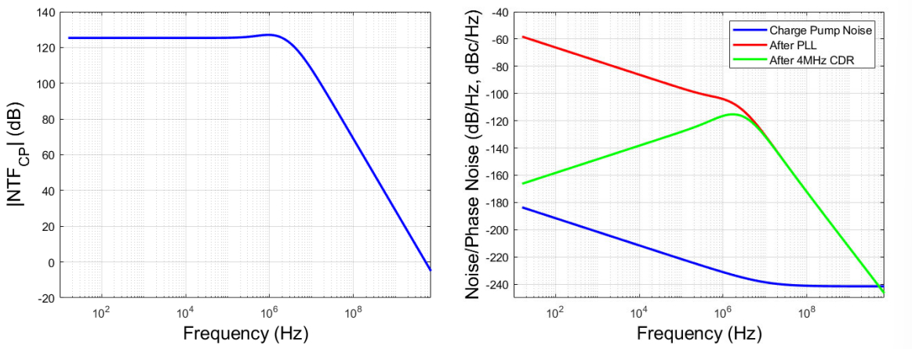
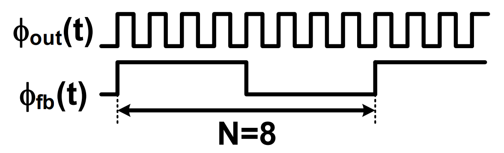

# PLL

## PLL 构成

### PLL 概述

​	一个完整的锁相环（Phase Lock Loop，PLL），由以下部分构成：鉴相器，电荷泵，环路滤波器，外部压控振荡器，N 倍分频器。

- 鉴相器用于对比本地时钟和外部压控振荡器分频后的相位，并将时钟的差分信号输出至电荷泵；
- 电荷泵用于根据差分信号产生一个电流，这个电流用于给环路滤波器的电容充电并产生一个输出电压；
- 环路滤波器可以调节开环传递函数，进而影响环路带宽以及最终的输出相位噪声，起到近似于滤波器的作用；
- 外部压控振荡器可以根据环路滤波器的输出电压调节振荡频率；
- 最后 N 倍分频器用于将压控振荡器的振荡频率分频至 $\frac{1}{N}$​。

### PLL 模块图

​	一个锁相环是一个负反馈系统，它将 VCO 产生的信号的频率和相位锁定至参考信号。

	电荷泵锁相环是一种实现方式。

- 两个积分器理论上可以无错误的对比输入和反馈相位；
- 环路滤波器的电阻用于提供一个稳定的零相位错误；
- 二阶电容 $C_2$ 通常用于降低参考纹波；

### 线性 PLL 模型

- 相位是系统的关键变量：
  - 对于环路中一个特定点注入刺激的输出相位响应；
  - 相位误差响应也是很有用的。
- 线性”小信号“分析对于理解锁相环的动力学特性是很有用的：
  - 锁相环是否锁定（或者接近锁定）；
  - 输入相位的偏差幅度是否足够小，能够被包含在锁定范围内。

## PLL 的频率响应

### PLL 闭环频率响应

​	对于电荷泵锁相环而言：
$$
K_{PD}=\frac{I_{CP}}{2\pi} \\
F(s)=\frac{(\frac{1}{C_2})(s+\frac{1}{RC_1})}{s(s+\frac{C_1+C_2}{RC_1C_2})} \\
H(s)=\frac{\phi_{out}(s)}{\phi_{in}(s)}=\frac{\frac{K_{PD}K_{VCO}}{C_2}(s+\frac{1}{RC_1})}{s^3+(\frac{C_1+C_2}{RC_1C_2})s^2+(\frac{K_{PD}{K_{VCO}}}{NC_2})s+\frac{K_{PD}K_{VCO}}{NRC_1C_2}}
$$
​	

### PLL 噪声频率响应

#### 噪声源输出功率谱密度

​	每一部分噪声源对于输出相位的影响可以用下述公式表示：至于有关功率谱密度的传递函数推导见[9-1 功率谱密度传递函数](./9-1_功率谱密度传递函数.md)。
$$
S_{\phi_{out}}^{\phi_{in}}=S_{\phi_{in}}|NTF_{IN}(s)|^2 \\
S_{\phi_{out}}^{i_{CP}}=S_{i_{CP}}|NTF_{CP}(S)|^2 \\
S_{\phi_{out}}^{v_{R}}=S_{v_{R}}|NTF_{R}(s)|^2 \\
S_{\phi_{out}}^{\phi_{VCO}}=S_{\phi_{VCO}}|NTF_{VCO}(S)|^2
$$

#### 噪声传递函数

$$
NTF_{IN}(s)=\frac{\phi_{out}(s)}{\phi_{in}(s)}=\frac{(N)LG(s)}{1+LG(s)} \\
NTF_{CP}(s)=\frac{\phi_{out}(s)}{i_{CP}(s)}=\frac{(\frac{N}{K_{PD}})LG(s)}{1+LG(s)} \\
NTF_{R}(s)=\frac{\phi_{out}(s)}{v_{R}(s)}=\frac{\frac{K_{VCO}}{s}}{1+LG(s)} \\
NTF_{VCO}(s)=\frac{\phi_{out}(s)}{\phi_{VCO}(s)}=\frac{1}{1+LG(s)}
$$

- 输入参考和电荷泵噪声经过了一个低通滤波器；
- 环路滤波器噪声（VCO 输入噪声）经过了一个带通滤波器；
- VCO 输出相位噪声经过了一个高通滤波器。

#### PLL 相位噪声（Phase Noise）& 抖动（Jitter）

​	PLL 时域抖动可以通过对输出相位噪声的积分获得：
$$
\sigma_{j,Total}^2=\frac{2}{w_{0}^2}\int_{fstart}^{fstop}S_{\phi_{out}}^{Total}(f)df \\
RMS \ Jitter \  \sigma_i=\sqrt{\sigma_{j,Total}^2}
$$
​	也可以建立每个独立噪声源对时域抖动的贡献：
$$
\sigma_{j,i}^2=\frac{2}{w_0^2}\int_{fstart}^{fstop}S_i(f)|NTF_i(f)|^2df \\
\sigma_{j,Total}^{2}=\Sigma_{i}\sigma_{j,i}^2
$$

- RX CDR-generator 的采样时钟与输入数据之间的相对抖动（动力学相位误差）决定了系统的时间裕度；

- CDR 的高通滤波特性提供了额外的滤波；

- 包含 CDR 的系统的输出噪声频率谱密度为：
  $$
  \sigma_{jSYS,i}^2=\frac{2}{w_0^2}\int_{0}^{\frac{f_0}{2}}S_i(f)|NTF_i(f)|^2|CDR(f)|^2df
  $$
  

#### 输入参考噪声

$$
NTF_{IN}(s)=\frac{\frac{K_{PD}K_{VCO}}{C_2}(s+\frac{1}{RC_1})}{s^3+(\frac{C_1+C_2}{RC_1C_2})s^2+(\frac{K_{PD}{K_{VCO}}}{NC_2})s+\frac{K_{PD}K_{VCO}}{NRC_1C_2}}
$$

#### 电荷泵噪声

$$
S_{i_{CP}}=\frac{T_{rst}}{T_{ref}}(S_{i_{n,MP}}+S_{i_{n,MN}})
$$

- 电荷泵电流噪声在鉴频鉴相器的复位时间内被引入环路滤波器；
- 复位时间的延迟器用于折衷电荷泵噪声与死区健壮性，延迟器会引入电流噪声，同时减少 PDF 的死区；
- 晶体管的闪烁噪声会贡献很大的 PLL 带内相位噪声。

$$
NTF_{CP}(s)=\frac{\frac{K_{VCO}}{C_2}(s+\frac{1}{RC_1})}{s^3+(\frac{C_1+C_2}{RC_1C_2})s^2+(\frac{K_{PD}{K_{VCO}}}{NC_2})s+\frac{K_{PD}K_{VCO}}{NRC_1C_2}}
$$

#### 环路滤波器 R 噪声

$$
S_{v_{R}}=4kTR \  dB/Hz
$$

- 在电阻热噪声，环路滤波器电容值和电荷泵噪声之间做折衷；
  - 更小电阻导致了更大的电容（更大的环路带宽）和更大的电荷泵电流（更大的 $S_{i_{CP}}$ ）；

$$
NTF_{R}(s)=\frac{K_{VCO}s(s+\frac{1}{RC_1})}{s^3+(\frac{C_1+C_2}{RC_1C_2})s^2+(\frac{K_{PD}{K_{VCO}}}{NC_2})s+\frac{K_{PD}K_{VCO}}{NRC_1C_2}}
$$

#### VCO 噪声

$$
NTF_{R}(s)=\frac{s^2(s+\frac{1}{RC_1})}{s^3+(\frac{C_1+C_2}{RC_1C_2})s^2+(\frac{K_{PD}{K_{VCO}}}{NC_2})s+\frac{K_{PD}K_{VCO}}{NRC_1C_2}}
$$

#### 总噪声

#### PLL 噪声传递函数的知识点

- PLL 影响相位噪声波形的方式取决于噪声被引入的位置；
- 为了一个噪声源而优化环路带宽可能会增强另一个噪声源；
- 总之，PLL 以低通的方式影响输入的相位噪声，以带通的方式影响 VCO 输入电压噪声，并且以高通的方式影响 VCO 输出的相位噪声。

### PLL 开环频率响应

#### PLL 环路增益（Loop Gain，LG）

$$
LG(s)=\frac{K_{PD}F(s)K_{VCO}}{Ns}=\frac{K_{PD}K_{VCO}(s+\frac{1}{R_1C_1})}{NC_2s^2(s+\frac{C_1+C_2}{R_1C_1C_2})} \\
\omega_{z}=\frac{1}{R_1C_1}, \qquad \omega_{p1}=\omega_{p2}=0, \qquad \omega_{p3}=\frac{C_1+C_2}{R_1C_1C_2} \\
\Phi=tan^{-1}(\frac{\omega}{\omega_{z}})-tan^{-1}(\frac{\omega}{\omega_{p3}})
$$

#### PLL 环路增益响应

- PLL 的环路增益频率响应分为幅度和相位：
  - 当幅度小于 $0 \ dB$ 时，环路会抑制该频段的信号；
  - 当相位小于 $180^\circ$ 时，会改变环路的负反馈，引起不稳定；
  - 规定幅度为 $0 \ dB$ 时，对应的相位与 $180 ^\circ$ 的差值为相位裕度，对应频率为环路带宽；相位为 $180^ \circ$ 时，对应的幅度与 $0 \ dB$ 的差值为幅度裕度。
- 为了获得最大的相位裕度，一般将 LG 相频响应的最大值设计在环路带宽处。

##### 设计步骤

1. 根据实际指标约束的**相位裕度**设计环路滤波器的**电容比**：
   $$
   K_{C}=\frac{C_1}{C_2}=2(tan^2(\Phi_m)+tan(\Phi_m))
   $$

2. 根据**环路带宽** & 低噪声约束的**电阻**设计环路滤波器的值：
   $$
   \omega_z=\frac{\omega_u}{\sqrt{1+K_C}} \\
   C_1=\frac{1}{\omega_zR},\quad C_2=\frac{C_1}{K_C}
   $$
   

3. 根据**环路增益** $0 \ dB$ 点，设计**电荷泵的电流**：
   $$
   I_{cp}=\frac{NC_2\omega_u^2}{K_{VCO}}\sqrt{\frac{\omega_{p3}^2+\omega_u^2}{\omega_z^2+\omega_u^2}}
   $$

### PLL 模块频率响应

#### 鉴相器（Phase Detector）

- 鉴相器取出输入参考时钟与反馈信号的差分相位：

  <table>
    <td>
      
    </td>
    <td>
      
    </td>
  </table> 

- 环路滤波器会对鉴相器输出进行滤波，为了表征鉴相器的增益，使用平均电压或者平均电流：

  

- 因数 $K_{PD}$ 取决于特定的鉴相器电路：
  - 当使用无量纲滤波器时：$K_{PD}$ 的单位是 $V/rad$ 。
  - 当使用阻抗滤波器和电荷泵时：$K_{PD}$ 的单位是 $rad^{-1}$ 或者 $A/rad$ 。

##### 鉴频鉴相器（Phase Frequency Detector）

  

- 鉴频鉴相器允许更大的频率锁定范围，并且完善 VCO 的调谐范围；
- 三阶段操作，w/ UP 和 DN；
- 上升沿触发导致了占空比不敏感。

<table align='center'>
  <td align='center'>
    
  </td>
  <td align='center'>
    
  </td>
</table>

###### 平均 PFD 传递特征

  

- 恒定的斜率和关于 0 相位点的极性不对称允许了更大范围的相位误差；
- 平均 PFD 增益为 $\frac{1}{2\pi}$ ，单位为 $rad^{-1}$ 。

###### PFD 死区

<table>
  <td align='center'>
    
  </td>
  <td align='center'>
  	
  </td>
</table>

- 如果相位误差很小，那么由 PFD 产生的短输出脉冲，不能有效的打开电荷泵 $i_{cp}$ ，这种现象叫做鉴相器的死区。死区会降低环路增益并增加时钟抖动。

###### PFD w/ 操作复位延迟

<table>
  <td align='center'>
    
  </td>
  <td align='center'>
    
  </td>
</table>

- 解决死区的方法是在 PFD 的复位路径上增加一个延迟器，用于给 UP 和 DN 提供一个最小的脉冲宽度；
- 时钟锁定时，UP 和 DN 的电流源在复位时间（$T_{rst}$）内，都是导通的，理想情况下，没有电流传送给环路滤波器。

###### 在 $2\pi$ 附近的问题

  

- PFD 在复位延迟时间内处于高电平，无法响应输入的上升沿；
- 导致在下一个上升沿到来时，电荷泵输出错误的电流方向；
- 复位延迟器会增加调谐时间，并且限制最大的 PFD 操作频率。

###### PFD w/ 复位延迟器的传递特性

  

- PFD 的复位延迟器产生了错误的频率信息；

- 如果错误频率信息占据了参考时钟的大部分时间，那么 PFD 可能无法锁定正确的频率：
  $$
  Max \ T_{rst}=\frac{T_{ref}}{2} \\
  Max \ PFD \ Frequency=\frac{1}{2T_{rst}}
  $$

#### 电荷泵（Charge-Pump）

- 将 PFD 的输出信号转化为电荷量；

- 电荷量大小与 PFD 的脉冲宽度成比例。
  $$
  Total\ PFD\ \& \ Charge \ Pump\ Gain=\frac{I_{CP}}{2\pi}\left(\frac{Amps}{rad}\right)
  $$

  

#### 环路滤波器（Loop Filter）

  

- 环路滤波器可以通过电荷量在 $C_1$ 的积分，输出连续的控制电压，进而建立一个均匀变化的输出频率；
- 电阻（与增益成比例）可以控制积分的时间，将相位校正（PD）与频率校正（VCO）分隔开；
- 电容 $C_1$ 会影响环路带宽；
- 零点频率会影响 PLL 稳定性；
- 电阻增加了一个热噪声，并且这个热噪声被锁相环的带通滤波器滤除。

##### 环路滤波器传递函数

$$
F(s)=\frac{\frac{1}{C_2}(s+\frac{1}{RC_1})}{s^2+\frac{s(C_1+C_2)}{RC_1C_2}}\\
p_1=0 \ Hz \qquad p_2=\frac{C_1+C_2}{2\pi RC_1C_2}\ Hz \qquad z=\frac{1}{2\pi RC_1}\ Hz
$$

##### $C_2$ 的作用

- 二阶电容可以平滑控制电压的纹波；
- 电容的取值范围：
  - 稳定性：$C_2 < C_1/10$​
  - 低时域抖动：$C_2>C_1/50$

##### 环路滤波器的电容

- 为了减小规模，可以使用高密度电容；
- 薄氧化层 MOS 电容的栅极泄露是一个问题：
  - 近似于给电容增加了一个非线性电阻；
  - 泄露取决于电压和温度；
  - 将导致过剩的相位噪声和毛刺。

- 金属电容或者厚氧化层电容是更好的选择：
  - 在占用面积上做折衷。
- 金属电容的密度 $<1/10$ 的薄氧化层电容；
- 滤波器电容的频率响应可以相对减小，以适应更小的环路带宽。

#### 压控振荡器（VCO）

  

##### 压控振荡器传递函数

<table>
  <td align='center'>
    
  </td>
  <td align='center'>
    
  </td>
</table>

$$
\omega_{out}(t)=\omega_0+\Delta\omega_{out}(t)=\omega_0+K_{VCO}v_{ctrl}(t)
$$

- **时域相位关系：** 忽略 $\omega_0$

$$
\phi_{out}(t)=\int{\Delta\omega_{out}(t)}dt=\int K_{VCO}v_{ctrl}(t)dt \\
K_{VCO}\ units\ are\ \frac{rad}{s\cdot V}
$$

- **Laplace 域相位关系：**

$$
\phi_{out}(s)=\frac{K_{VCO}}{s}v_{out}(s)
$$

##### 变容二极管（Varactors）

- PN 结变容二极管：
  - 避免正向偏置连接，阻止振荡器的非线性作用。

  

- MOS 变容二极管：
  - 积累模式的设备比反向模式的设备具有更高的 Q。

  

#### 分频器（Divider）

  

##### 环路分频器

  <table>
    <td align='center'>
      
    </td>
    <td align="center">
      
    </td>
  </table>

- **时域模型：**

$$
\omega_{fb}(t)=\frac{1}{N}\omega_{out}(t) \\
\phi_{fb}(t)=\int\frac{1}{N}\omega_{out}(t)dt=\frac{1}{N}\phi_{out}
$$

​	分频器在锁相环线性模型中无量纲。