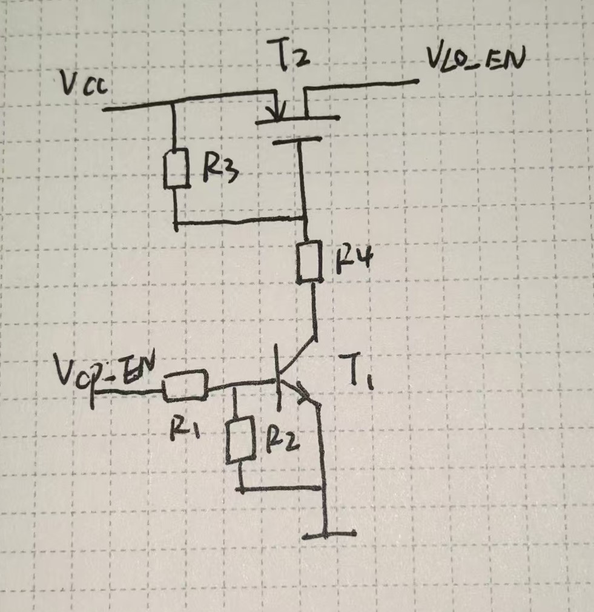
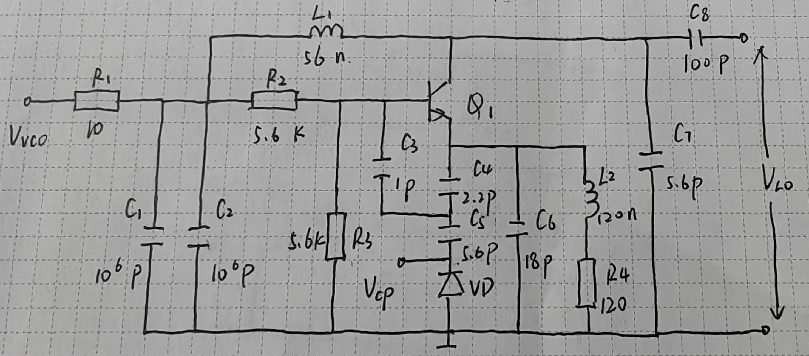
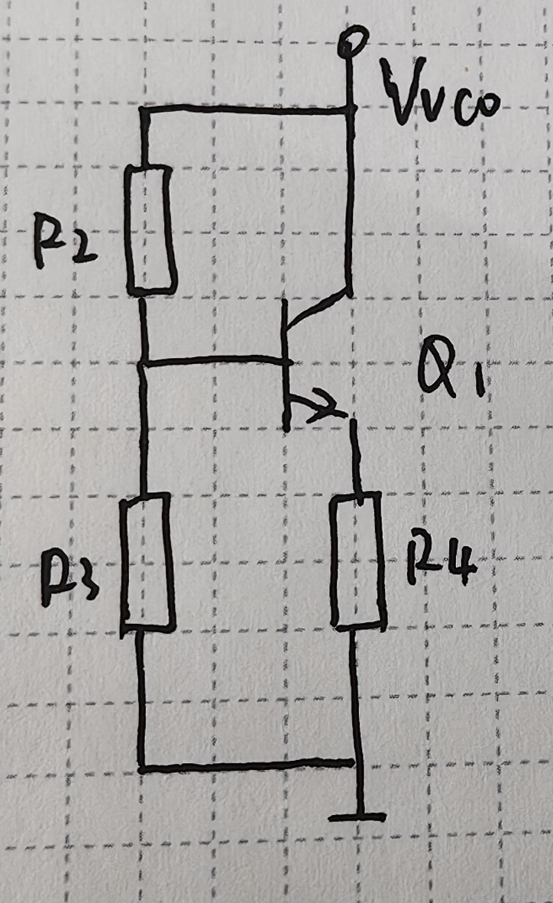
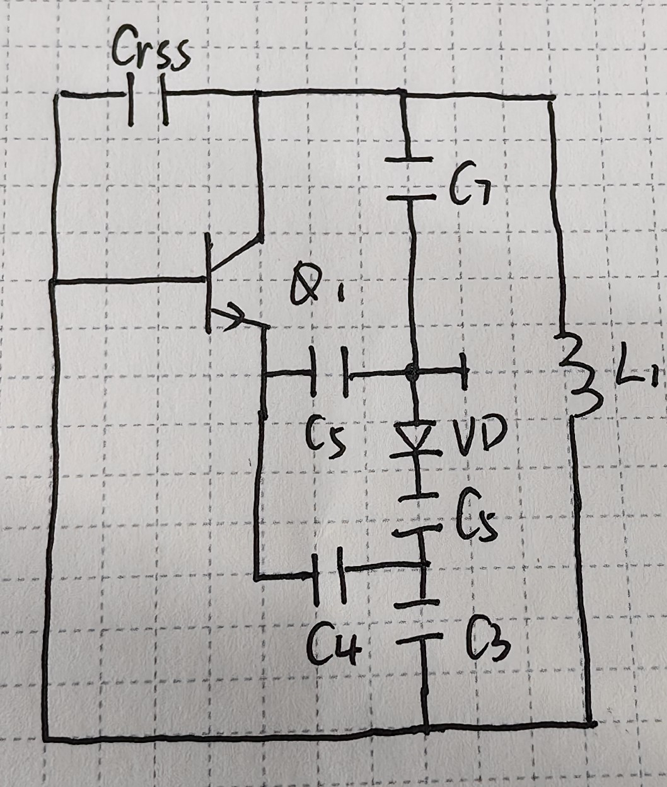

# 工作中遇到的各种问题汇总解决

## 微带线阻抗匹配

### 匹配方式

​	基础的匹配方式有支节匹配和感容匹配，由于产品设计制版后，不能用支节匹配法，只能使用感容匹配。

#### 支节匹配

- 单支节
- 双支节
- 三支节

#### 感容匹配

​	以后产品板子的驻波比不好可能都需要重新做阻抗匹配，而在PCBA设计之初，会预留出未来调整驻波比的焊盘。感容匹配阻抗大致分为四种：**电容串**，**电感串**，**电容并**，**电感并**

- 电容与电感串接进电路：不会引起电路电阻的变化，在 Smith 圆图上体现为，负载点在等电阻线上转动。阻抗圆图上，感抗圆半径越大，感抗越小；容抗圆半径越大，容抗越小。

  - 串入电感：负载点电抗增大，沿等电阻线顺时针转动；
  - 串入电容：负载点电抗减小，沿等电阻线逆时针转动。

- 电容与电感并接进电路：并联阻抗在 Smith 阻抗 圆图上并不好体现，但是在导纳圆图上可以很方便的体现。具体过程是：阻抗的并联相当于导纳的串联，假设两并联支路的阻抗分别为$Z_{0}$和$Z_{1}$
  $$
  Y_{0} = \frac{1}{Z_{0}};Y_{1} = \frac{1}{Z_{0}} \\
  Y = Y_{0} + Y_{1}
  $$
  这样做的结果是：原来复杂的计算过程转变为负载点处的电纳与并联电容电感的电纳直接计算，而不改变负载点的电导。这体现在导纳圆图上为负载点在等电导线上转动。不同之处在于，对于导纳而言，虚部为正代表容性，虚部为负代表感性。导纳圆图上 ，感纳圆半径越大，感纳越小；容纳圆半径越大，容纳越小。

  - 并入电容：负载点电纳增加，沿等电导线顺时针转动；
  - 并入电感：负载线电纳减小，沿等电导线逆时针转动。

- 总结 ：串电容，并电感，逆时针转动；并电容，串电感，顺时针转动。

  - 注意：阻抗圆图感性部分为正，容性部分为负；导纳圆图感性部分为负，容性部分为正。电抗增加，顺时针转动，电纳增加，对应到阻抗图为逆时针转动。

- 仅仅知道串并联方式是不够的，还需要知道匹配中使用的电容、电感的具体参数。一方面，可以直接读图获得参数，但是这种方法不够精确，另一方面，可以通过联立方程解出具体参数。一般情况下，射频电路的工作频率$w$已知，等效阻抗一般是$Z_{0}=50 \  \Omega$。以串联电感、并联电容为例：
  $$
  \left\{
  \begin{array}{c}
  Z_{S} &=& \frac{1}{jwC}//Z_{L} + jwL = Z_{0} \\
  \omega_{c} &=& \frac{1}{\sqrt{LC}}
  \end{array}
  \right.
  $$

### 微带线

​	微带线是由双导线演变而来，一根导线演化为一个平面，另一个导线演化为导电条，中间放置介质层。

### 电路理论知识回顾

​	简单回顾一下关于阻抗与电纳的关系推导，与电容，电感的电流，电压相位关系。

- 首先，推导一下阻抗与导纳的转换关系

$$
\begin{align*}
&For  & Z =& R+jX ,  & Y &= G+jB\\
&Where  & X =& X_{L}-X_{C},  & B &= B_{C}-B_{L}\\
&Derivation & Y =& \frac{1}{Z} =\frac{1}{R+jX} = \frac{R-jX}{R^{2}+X^{2}}  &(|Z| &= \sqrt{R^{2}+X^{2}}) \\
& & =&\frac{R}{|Z|^{2}}+j(-\frac{X}{|Z|^{2}}) = G+jB \\
&So & G= &\frac{R}{|Z|^{2}} \qquad B=-\frac{X}{|Z|^{2}}
\end{align*}
$$

​	类似的，也可以推导出由导纳转化为阻抗的公式。

- 可以看出，对于阻抗来说，感性为正，容性为负；对于导纳来说，感性为负，容性为正。

- 串连电容，$X$减小，串联电感，$X$增大；并联电容，$B$增大，并联电感，$B$减小。

- 其次，回顾一下电容与电感的定义：
  $$
  i_{C} = C \frac{du_{C}}{dt}; \quad u_{L} = L \frac{di_{L}}{dt}
  $$

​	因此电容两端的电压不能突变，放置电流过大击穿电容器；电感两端的电流不能突变，放置电压过大击穿电感器。

- 假设电容器的电压为$u(t)=Asin(wt+\psi)$，流过电容器的电流为$i(t)=A \cdot C \cdot wcos(wt+\psi)$。在时间轴上，相同相位处$cos(x)$超前$sin(x)90^{\circ}$，所以电容器两端电流的相位超前于电压$\frac{\pi}{2}$。

- 假设电感器的电流为$i(t)=Asin(wt+\psi)$，流过电感器的电流为$u(t)=A \cdot C \cdot wcos(wt+\psi)$。在时间轴上，相同相位处$cos(x)$超前$sin(x)90^{\circ}$；所以电感器两端电压的相位超前于电流$\frac{\pi}{2}$。

## 射频滤波器设计

​	公司中常用的滤波器有晶体滤波器、声表面滤波器和阻容感滤波器。阻容感滤波器主要处理射频部分的滤波，而电阻会导致信号的衰弱，故一般采用$\pi$型C-L-C滤波器。多采用三阶和五阶对称滤波器。

### 三阶滤波器参数计算

​	滤波器最重要的参数就是截止频率，往往需要依据截止频率设计$\pi$型网络的电容、电感参数。以三阶C-L-C低通滤波器为例，计算过程如下：假设电容为$C$，电感为$L$。

​	根据阻抗分压：
$$
\begin{align*}
V_{out} =& \frac{\frac{1}{jwC}}{\frac{1}{jwC}+jwL}V_{in} \\
A = & \frac{V_{out}}{V_{in}}  = \frac{1}{1-w^{2}LC}
\end{align*}
$$
​	当分母$1-w^{2}LC=0$时，即为低通的滤波器的截止频率，推导得：
$$
w=\frac{1}{\sqrt{LC}}
$$
​	射频电路得阻抗匹配尤为重要，要使得满足截止频率得同时，还要使其在微带线中表现为特征阻抗$Z_{0}$。
$$
Z_{0} &=& C // \{L+(C//Z_{L})\} \\ 
for \quad Z_{L}= Z_{0} \ : \\
Z_{0} &=& \frac{1+\omega^{2}LCZ_0-j\omega(L+LZ_0+CZ_0)}{\omega^{2}LCZ_0-j\omega C}
$$
​	根据上式，即可由截止频率确定电容、电感参数；$\pi$型网络的输入端还有另外一个并接的电容，电容用于匹配电路，并且提高截止频率处的衰减速度，并且由增益A的公式可以看出，增大电容还可以提高通带内的增益，消除截止频率附近的纹波。

### 五阶滤波器参数计算

​	五阶滤波器的截止频率计算方法类似，假设电容为$C_{1}, C_{2}$，电容为$L$，具体计算过程如下：

​	五阶滤波器可以看成一个三阶滤波器级联一个阻抗分压电路，输入输出电压之间的频率响应为：
$$
V_{out} & =& \frac{\frac{1}{jwC_{1}}}{\frac{1}{jwC_{1}}+jwL} \cdot \frac{\frac{1}{jwC_{2}}}{\frac{1}{jwC_{2}}+jwL}  V_{in} \\
A & = & \frac{V_{out}}{V_{in}}=\frac{1}{1-w^{2}L(C_{1}+C_{2})+w^{4}L^{2}C_{1}C_{2}} \\
& = & \frac{1}{L^{2}C_{1}C_{2}[w^{2}-\frac{(C_{1}+C_{2})}{2LC_{1}C_{2}}]^{2}+[1+\frac{(C_{1}+C_{2})^2}{4C_{1}C_{2}}]} \\
$$
​	上式可以看出，五阶C-L-C低通滤波器的截止频率为：
$$
w=\sqrt{\frac{C_{1}+C_{2}}{2LC_{1}C_{2}}}
$$
​	五阶滤波器相较于三阶滤波器多了一个参数，确定的方式也更困难了，可以通过如下方程组解得三个参数值：
$$
\left\{
\begin{array}{c}
A_{max} &=& \frac{1}{1+\frac{(C_{1}+C_{2})^2}{4C_{1}C_{2}}} \\
w_{c} &=& \sqrt{\frac{C_{1}+C_{2}}{2LC_{1}C_{2}}} \\
Z_{0} &=& f(C_{1}, C_{2}, L)
\end{array}
\right.
$$
​	其中特性阻抗的表达式$f(C_{1},C_{2},L)$ 可以用等效阻抗变换求得，通过解上面的方程组，可以得知参数的值。

## 几种常用的数字基带信号调制方式

### QAM

​	正交幅度调制，有很多种调制方式来控制调制信号的幅度和相位，最常见的是：

1. 两路正交调幅（AM）信号；
2. 两路正交调相（PM）信号；

​	公司目前的调制方式不清楚，以两路正交调幅信号为例，假设$P = A_{1}sin(wt+\psi), Q = A_{2}cos(wt+\psi)$，输出的射频信号为$s(t) = P+Q$，可以通过两路信号幅度画出星座图。

### MSK

​	最小频移键控，是频移键控的改进型，所谓最小，是指表示不同码元的频率之差最小。假设表示0，1信号的频率分别为：$f_{0},f_{0}$，对于 MSK 调制方式来说，$|f_{0}-f_{1}|=\frac{1}{2T_{B}}$，其中$T_{B}$表示码元持续时间，这个时间是 2FSK 信号的最小频率间隔。

​	经过推导，一个码元周期中，两种码元所包含的各自频率的正弦波数总是相差$\frac{1}{2}$。
$$
T_{B} = (N+\frac{m+1}{4})T_{0}=(N+\frac{m-1}{4})T_{1} \\
where \quad T_{0}=\frac{1}{f_{0}}, \quad T_{1}=\frac{1}{f_{1}} \\
N \ is \ positive \ integer,\quad m=0,1,2,3
$$
​	并且 MSK 调制信号可以改进 FSK 调制下，信号相位不连续的问题，第 k 个码元可以表示为：$e_{k}(t)=cos[w_{c}t+\theta_{k}(t)]$。使第 k-1 个码元的末相位，等于第 k 个码元的初始相位，可以推导出$\psi_{k}$的表达式。结果是，通过比特流，可以获得每一个码元的初始相位$\psi_{k}$，将获得的每一个初始相位，分别代入分段函数$\theta_{k}(t)$中，可以使得每个码元的相位连续。
$$
\theta_{k}(t) = \frac{a_{k}\pi}{2T_{B}}+\psi_{k}, \qquad kT_{B} \leq t \leq (k+1)T_{B} \\

\psi_{k} = \psi_{k-1} + \frac{k\pi}{2}(a_{k-1}-a_{k}) = 
\left\{
\begin{array}{c}
	\psi_{k-1} \ &a_{k} =& a_{k-1} \\
	\psi_{k-1} \pm k\pi \ &a_{k} \ne& a_{k-1}
\end{array}
\right.
\quad (mod \  2\pi)
\\

Namely \qquad \qquad  \psi_{k} = 0\ or \ \pi \quad (mod\ 2\pi)
$$
​	MSK 信号还是可以正交化的，类似于 QAM 信号，可以被分为相互正交的两路信号。将$\theta_{K}(t)$代入，第 k 个码元可表示为：$e_{k}(t)=cos(w_{c}t+\frac{a_{k}\pi}{2T_{B}}+\psi_{k})\qquad kT_{B} \leq t \leq (k+1)T_{B}$。三角展开并化简可得：
$$
e_{k}(t) = p_{k}cos(\frac{\pi t}{2T_{B}})cos(w_{c}t)-q_{k}sin(\frac{\pi t}{2T_{B}})sin(w_{c}t) \quad \qquad kT_{B} \leq t \leq (k+1)T_{B} \\
where \quad p_{k} = cos(\psi_{k}) = \pm1, \qquad q_{k} = a_{k}cos(\psi_{k}) = \pm a_{k}
$$

### GMSK

​	为了进一步使 MSK 信号的功率谱密度集中和减少对邻道的干扰，可以再调制前，先通过一个高斯型低通滤波器，这种体制叫做高斯最小频移键控。低通滤波器的频率特性与冲激响应如下：
$$
H(f)=exp[-(ln2/2)(f/B)^2] \\
h(t)=\frac{\sqrt{\pi}}{\alpha}exp\left[-\left(\frac{\pi}{\alpha}t\right)^2\right]
$$
​	其中，B为滤波器3dB带宽，$\alpha=\sqrt{\frac{ln2}{2}}\frac{1}{B}$。由于$h(t)$为高斯特性，故称为高斯型滤波器。GMSK 体制的缺点是存在码间串扰（ISI），$BT_{B}$的值越小，码元周期越短，一旦信道特性不够理想，码元产生拖尾，容易影响其他码元，产生严重的码间串扰。

### OFDM

​	单载波体制下，码元持续时间短，占用带宽大，由于信道$|C(F)|$不理想，容易产生码间串扰。采用多载波后，码元持续时间$T_{B}=NT_{B}$，码间串扰得到改善。

​	缺点主要有两个方面：1. 对信道产生的频率偏移和相位噪声很敏感；2. 信号的峰均比高，会降低射频功放的效率。OFDM 是由 N 个相互独立的子载波信号构成，若某个时刻，多个子载波向某一方向累加，就会产生很高的峰值，而峰值可能会落入功放管的非线性区域，为了满足峰值要求，需要提升功放管的指标，降低效率。

​	OFDM 的实现过程：1. 将原始数据比特流按照每 F 个比特分成帧；2. 每一帧按照信道个数分成 N 个码元，每个码元的持续时间为 F 个比特的总时间；3. 每个码元按照不同进制的调制方式，完成数字信号基带的调制；4. 将调制好的信号累加，获得最终的 OFDM 信号；5. 将信号搬移至载频，完成射频输出。

## 电容基础知识

> 电容的电压与电流的关系定义为：$i_{c}=C\frac{du_{c}}{dt}$，但是电容两端的电压并不能通过定义式得知。

### 电容的充电电压

​	如果将直流电源直接与电容两端相接，那么电容没有电流流过，但是增加一个串联电阻，由于分压会在电阻上产生一个电流，致使存在电流流入电容，给电容器充电，效果为一个可以滤除电源纹波的滤波电路。

​	由定义式可以得知电流与电压之间的关系，变化的电压会在电容内部产生电流。现假设一个直流电源  $V_{cc}$ 对电容进行充电，尝试获得电容在充电时的电压 $U$ 的表达式。

​	假设电容的初始电压为 $V_{0}$ ，电阻为 $R$ ，电容为 $C$ ：
$$
\left\{
\begin{array}{c}
C &=& \frac{dQ}{dU} \\
dQ &=& i \cdot dt \\
i &=& \frac{V_{cc}-U}{R}
\end{array}
\right.
$$
​	由上式联系可得微分方程：
$$
U'+\frac{1}{RC}U=\frac{1}{RC}V_{cc}
$$
​	解得：
$$
U(t)=V_{cc}+C \cdot e^{-\frac{t}{RC}}
$$
​	代入初始条件，当 $t=0$ 时，$U(t)=V_{0}$ ：
$$
C &=& &V_{0}-V_{cc} \\
U(t) &=& &V_{cc}+(V_{0}-V_{cc})e^{-\frac{t}{RC}} \\
    &=& &V_{0} + (V_{cc}-V_0)(1-e^{-\frac{t}{RC}})
$$

### 时间常数

​	电容的充电电压呈现指数形式，令 $RC$ 为时间常数，当 $t=RC$ 时，假设电容初始电压为 0 ，此时电容上的电压为 $V_{cc}(1-\frac{1}{e})$ ，规定这个时间为 RC 电路的时间常数。

​	简单的 RC 串联电路，时间常数即为 RC，如果是复杂的 RC 电路，等效电阻为从电容向外看的等效电阻。时间常数一定是针对某一个只含有一个电容的电路而言，这个电容的时间常数一定可以通过等效电阻求得。

​	这种等效方法可以理解为：无论何种复杂的结构，最终要等效为简单的 RC 串联电路，也就是说，所有的电阻最终要等效为一个与电容串联的电阻。当等效时，可以忽略电源的影响，即将电压源置 0；此时就是多个电阻与一个电容的回路，从电容的一端口向外看，所得到的等效电阻最终会与电容串联，即完成了最开始的想法，将电阻等效为简单的 RC 电路，就可以使用已有的公式计算时间常数。

​	当然，从理论推导的角度也可以证明上述等效过程的正确性，假设在电容上额外并联一个电阻 $R_{2}$ ，此时从电容向外看的等效电阻为 $R_{1} // R_{2}$ ，时间常数应为：$\tau = C \cdot (R_{1} // R_{2})$，下面通过计算验证这个结论：

​	此时电路中的总电流 $I$ 为：
$$
I_{}=\frac{V_{cc}-U}{R}
$$
​	流过电阻 $R_{2}$ 的电流 $i_{R_{2}}$ 为：
$$
i_{R_{2}}=\frac{U}{R_{2}}
$$
​	流过电容的电流 $i_{c}$ 为：
$$
i_c=I-i_{R_{2}}=\frac{V_{cc}-U}{R}-\frac{U}{R_{2}}
$$
​	根据电流列些微分方程为：
$$
\frac{V_{cc}-U}{R}-\frac{U}{R_{2}}dt=CdU
$$
​	化简得：
$$
U'+\frac{R_{1}+R_{2}}{R_1R_2}U=\frac{V_{cc}}{CR_{1}}
$$
​	令 $\frac{R_{1}+R_{2}}{R_1R_2}=\frac{1}{R_{1}//R_{2}}$ ，解微分方程得：
$$
U &=& \frac{R_{1}//R_{2}}{R_{1}}V_{cc}+(V_{0}-\frac{R_{1}//R_{2}}{R_{1}}V_{cc})e^{-\frac{t}{C (R_{1}//R_{2})}} \\
&=& V_{0}+(\frac{R_{1}//R_{2}}{R_{1}}V_{cc}-V_{0})(1-e^{-\frac{t}{C (R_{1}//R_{2})}})
$$
​	可以看到，通过理论推导求得得时间常数也为 $\tau = C \cdot (R_{1} // R_{2})$。

## 并联谐振

​	首先，搞清楚一个知识点，什么是谐振。谐振是共振在电路中的说法，即两个物体达到相同的频率，振幅最大时。对于电路来说，如何使其达到谐振状态呢？以并联电路为例，并联电路的电压相同，感容元件分流，因此当流过电容、电感的电流最大时，即为谐振状态。为了使电流最大，应当是并联电压尽可能的大，即当电流全部流过电阻时，并联电压最大，此时电容、电感的分流最大，但总电流为 0，等效于并联电路的电纳为 0。从另一个角度理解：电路有一个固有频率，对于固有频率而言，纯电抗电路是无耗的，当外界施加固有频率的激励时，能量从电源经过电容、电感的转化后输出，损耗是最小的，即电路谐振了。

​	对于并联谐振而言，电源的能量先被转化为电感中的磁能，再被转化为电容上的电能，最后输出，当谐振时，电路阻抗最大，电容上的电流幅度最大；而非谐振状态下，由于电容、电感的失配，导致存储的能量减少，电容上的的电流幅度变小。可以通过品质因数 Q 来衡量一个电路在谐振状态下的传输效率。Q 的值为电路在谐振时，输出的能量与耗散的能量之比，而电路谐振时输出的能量为电容和电感上储存的能量，耗散的能量是电阻的产热。

​	并联谐振的品质因数 Q 为：
$$
Q=\frac{U^2\omega C}{U^2 G}=\omega CR=\frac{R}{\omega L}
$$
​	并联谐振时电容或电感上的电流为：
$$
I=U \cdot \omega C=I_s \cdot \omega CR=I_s \cdot Q
$$
​	因此，并联谐振又称作电流谐振，需要耐流器件。并联谐振时，电阻上的电流等于源电流，电容、电感上的和电流为 0，即电容、电感的等效并联电纳为 0。
$$
B=\omega C-\frac{1}{\omega L}=0
\Rightarrow \omega=\frac{1}{\sqrt{LC}}
$$
​	谐振频率与串联谐振相同，但是复杂串并联结构下的谐振频率要另算，以电感支路额外串联一个电容 $C_1$ 为例，串联谐振频率为 $\omega_0=\frac{1}{\sqrt{LC_1}}$ ，但是并联谐振频率要如何计算呢？

​	解决问题总是将未知的问题转化为已知的问题，思路在于将这种结构转化为已知的并联结构，首先从定义出发，无论何种结构，总是要求其在谐振时的等效电纳为 0（如果有电阻混入感容网络，也可以通过计算等效导纳将电阻提取出去）：
$$
B_{eq}=\omega C_2 - \frac{1}{\omega L - \frac{1}{\omega C_1}}=\frac{\omega (LC_1C_2 \omega^2 -C_1+C_2)}{\omega^2 LC-1} \Rightarrow \omega=\frac{1}{\sqrt{L\frac{C_1C_2}{C_1+C_2}}}
$$
​	通过观察可以发现，等效电容是 $C_1$ 与 $C_2$ 的串联，这可以理解为，并联谐振时，无电流流出，回路中的能量在电感和两个串联电容间转换。由此可得，并谐电路的等效电容为从电感向外看的等效电容。

## $\pi$ 型衰减器

​	射频线路中，经常会使用到 $\pi$ 型衰减器，其由三个电阻构成，用于将输入信号的幅度衰减。由于射频电路中阻抗匹配尤为重要，因此衰减器是对称的结构，可以通过衰减大小和阻抗匹配共同确定电阻的阻值。假设串联电阻为 $R_1$ ，并联电阻为 $R_2$ 。
$$
\left\{
\begin{array}{l}
\frac{V_o}{V_i}=\frac{R_2//R_L}{R_2//R_L+R_1} \\
R_{in}=R_2//(R_1+R_2//R_L) \\
R_{out}=R_2//(R_1+R_2//R_S)
\end{array}
\right.
$$
​	一般情况下，射频电路的前后级会做匹配处理，即 $R_L=R_S=50 \ \Omega$ ；而衰减值会用 $dB$ 表示，即 $Att(dB)=20lg(\frac{V_o}{V_i})$ 。上式可化简为：
$$
\left\{
\begin{array}{l}
Att(dB)=20log(\frac{R_2//Z_0}{R_2//Z_0+R_1}) \\
Z_0=R_2//(R_1+R_2//Z_0)
\end{array}
\right.
$$
​	由上述方程组联立，通过衰减值与特性阻抗即可解得两个电阻的阻值。

## S 参数

### 定义计算法

​	对于双口线性网络，归一化入射波与归一化反射波之间是线性关系，由此可以定义出入射波与反射波之间的关系，在此不再赘述，下面主要想讨论 S 参数的具体计算方法。需要注意，S 参数描述的是电压之间的关系，反射系数为另一端口接匹配负载时，同一端口内，反射电压与入射电压之比，传输系数为另一端口接匹配负载时，不同端口内，输出电压与输入电压之比。
$$
\vec{b}= \vec{S} \cdot \vec{a} \\
\vec{b}=\begin{pmatrix}
b_1 \\
b_2
\end{pmatrix}, \ 
\vec{S}= \begin{pmatrix}
S_{11} & S_{12} \\
S_{21} & S_{22}
\end{pmatrix}, \ 
\vec{a}=\begin{pmatrix}
a_1 \\
a_2
\end{pmatrix}
$$
​	以 PI 衰的变种电路为例，假设去除一个左侧的并联电阻，此时的网络阻抗不再匹配，在上一节中的分压的计算公式不再适用。需要注意：上一节中公式成立的前提为阻抗匹配，此时反射波为 0，端口电压等于输入电压，分压公式成立！

​	当阻抗失配时，入射波会在端口产生一个反射波，这个反射波对于端口而言与入射波同向，增加了端口电压，而增大了输出的电压，导致了 $S_{21}$ 的上升。下面将简述 S 参数的计算公式：
$$
S_{11}=|\Gamma_{1}|=|\frac{Z_{L_1}-Z_0}{Z_{L_1}+Z_0}| \\
S_{22}=|\Gamma_{2}|=|\frac{Z_{L_2}-Z_0}{Z_{L_2}+Z_0}| \\
$$
​	而传输系数并没有固定的公式计算，以上述的变种电路为例，并联电阻 $R_1=120 \ \Omega$ ，串联电阻 $R_2=51 \ \Omega$ ，通过两个端口的等效电阻可以轻易获得 $S_{11}=0.266$3 ，$S_{22}=0.0462$ 。此时计算输出电压仍然通过电阻分压的方式：
$$
S_{12}=\frac{U_{T_2}}{U_2} \cdot \frac{Z_0}{Z_0+R_2} \\
S_{21}=\frac{U_{T_1}}{U_1} \cdot \frac{Z_0//R_1}{Z_0//R_1+R_2}
$$
​	值得注意之处在于，我特意将端口电压 $U_{T_2}$ 与输入电压 $U_1$ 分别表示，这是由于在阻抗不匹配时，两者并不相等，端口电压 $U_{T_2}$ 是输入电压与发射电压之和，因此上式会比匹配情况下多出一个 $(1+\Gamma_i)$ 的因子。因此在失配情况下，传输系数反而提高了。

​	此外，纯电阻网络一定是互易电路，这点通过互易定理可以得知，因此纯电阻网络的互阻抗 $Z_{12}$，$Z_{21}$ 一定相等，而通过简单的线性代数推导，即可得证互易电路的 S 参数 $S_{12}=S_{21}$ ，这点并不代表相同的输入电压会响应出相同的输出电压是互易定理的体现，实际上这一点与互易定理无关，只是恰好 S 参数具备这样的性质，其他网络可能并不具备。

​	下面代入数值计算：
$$
S_{21}=(1+0.2663) \cdot \frac{35.29}{86.29}=0.5179 \\
S_{21}(dB)=20log(0.5179)=-5.7151 \\
S_{12}=(1+0.0462) \cdot \frac{50}{101}=0.5179 \\
S_{12}(dB)=20log(0.5179)=-5.7151
$$
​	这个结果与仿真结果吻合，证明上述分析无误，传输系数计算时，需要将端口电压代入为入射波与反射波之和。

### 阻抗计算法

​	在上述的计算法中，提到了一种互阻抗，这种对于双口网络阻抗的一种定义方式，定义为另一端口断开时的电压与输入电流之比。类似的：
$$
\vec{U}= \vec{Z} \cdot \vec{I} \\
\vec{U}=\begin{pmatrix}
U_1 \\
U_2
\end{pmatrix}, \ 
\vec{Z}= \begin{pmatrix}
Z_{11} & Z_{12} \\
Z_{21} & Z_{22}
\end{pmatrix}, \ 
\vec{I}=\begin{pmatrix}
I_1 \\
I_2
\end{pmatrix}
$$
​	将阻抗归一化后：
$$
u=\widetilde{Z} \cdot i \\
\widetilde{Z}= \begin{pmatrix}
\widetilde{Z}_{11} & \widetilde{Z}_{12} \\
\widetilde{Z}_{21} & \widetilde{Z}_{22}
\end{pmatrix}
$$
​	推导可得：
$$
\left\{\begin{array}{l}
u=u^++u^-=a+b \\
i=u^+-u^-=a-b \\
u=\widetilde{Z} \cdot i
\end{array}\right.
$$
​	其中 $\widetilde{Z}$ 为归一化阻抗，对于匹配网络，等于 $\frac{Z}{Z_0}$ ，化简得：
$$
b=(\widetilde{Z}+U)^{-1}(\widetilde{Z}-U)a=(\widetilde{Z}-U)(\widetilde{Z}+U)^{-1}a
$$
​	其中，$U$ 为单位矩阵，因此，S 参数矩阵为：
$$
S=(\widetilde{Z}+U)^{-1}(\widetilde{Z}-U)=(\widetilde{Z}-U)(\widetilde{Z}+U)^{-1}
$$
​	由此得，如果算出双口网络得阻抗矩阵，也可以求得散射参数矩阵。依旧上述电路为例，易求得其阻抗矩阵为：
$$
\vec{Z}=\begin{pmatrix}
171 & 120 \\
120 & 120
\end{pmatrix}, \ 
\widetilde{Z}=\begin{pmatrix}
2.42 & 2.4 \\
2.4  & 2.4 \\
\end{pmatrix}
$$
​	代入公式计算得：
$$
S&=&\begin{pmatrix}
1.42 & 2.4 \\
2.4 & 1.4
\end{pmatrix} \cdot
\begin{pmatrix}
3.42 & 2.4 \\
2.4 & 3.4
\end{pmatrix} ^{-1} \\
&=&\begin{pmatrix}
0.266293 & 0.517911 \\
0.517911 & 0.046180
\end{pmatrix}
$$
​	计算结果与仿真结果吻合，证明阻抗矩阵计算正确。值得注意的一点：在使用 Mathmatica 计算矩阵乘法时要使用 `.` ，如果使用 `*` 会计算按位乘。

## 开关电路

​	在公司的原理图中，发现了一种特殊的开关电路，用于控制本振的使能信号的输出。其由两个三极管构成，晶体管 $T_1$ 用于控制 PMOS 管 $T_2$ 的栅压，$T_2$ 用于输出本振的使能信号。

​	当时钟输出的使能信号 $V_{CP \underline{} EN}$ 为低电平时，晶体管 $ T_1$ 关断，PMOS管 $T_2$ 关断，输出信号 $V_{LO\underline{}EN}$ 为低电平：
$$
V_{gs}=-V_{cc}\frac{R_3}{R_3+R_4}>V_{th}
$$
​	当时钟输出信号 $V_{cp \underline{} EN}$ 为高电平时，晶体管 $T_1$ 导通，PMOS管 $T_2$ 导通，输出信号 $V_{LO\underline{}EN}$ 为高电平：
$$
V_{gs}=-V_{cc}\frac{R_3}{R_3+R_4}+[V_{cc}-V_{ce}(1+\frac{R_4}{R_3+R_4})]<V_{th}
$$
​	即要求根据管子的特性设计电阻值，使得 $[V_{cc}-V_{ce}(1+\frac{R_4}{R_3+R_4})]<0$ ，且满足小于截止电压时，电路可以正常工作。导通后，PMOS 管的 $r_{ds} \approx 0 \ \Omega$ ，因此管子的压降 $V_{ds} \approx 0 \ V$ ，这个电路可以完成开关的功能。  

## 三极管基础知识

### 带负载能力

​	从输出向前看，等效电阻为输出电阻，在小信号等效模型中，输出信号串联输出电阻共同构成上一级的输出。而下一级的输入电阻等效为上一级的负载电阻。所以在前后级连接处，信号可以简化为信号源内阻，负载电阻，与信号源的串联回路。

​	如果需要强带负载能力，需要信号源内阻小，而负载电阻大，这样输出电压可以用于负载电阻，此时可以驱动阻值更小的负载，如果信号源内阻大，那么小负载上基本无分压，无法驱动小负载。即要求每一级放大电路的输入电阻大，而输出电阻小。	

​	如果需要考虑输出功率，那么就要考虑负载电阻与源内阻的匹配问题，在射频电路中，一般输入输出均为 50 $\Omega$ 时，输出功率最大。

### 寄生电容

​	在三极管的三个管脚之间，存在寄生电容。以 MOSFET 为例，分别为： $C_{gs}$、$C_{ds}$、$C_{gd}$，

​	分别表示在栅源、漏源、栅漏之间的电容。

​	MOSFET 常被用做开关，因此引入了三个参数：输入电容（$C_{iss}$）、输出电容（$C_{oss}$）、反向传输电容（或反馈电容，$C_{rss}$）。下面以共源电路为例，讨论每个参数的含义。

| 参数      | 公式            | 意义     |
| --------- | --------------- | -------- |
| $C_{iss}$ | $C{gs}+C_{gd}$  | 输入电容 |
| $C_{oss}$ | $C_{gd}+C_{ds}$ | 输出电容 |
| $C_{rss}$ | $C_{gd}$        | 反馈电容 |

#### 输入电容

​	输入电容是从输入端看去，将输出端置零的等效电容。要使管子工作，需要驱动该电容，是考察元件驱动能力和损耗的参数。

#### 输出电容

​	输出电容是输出端的整体电容，当 $C_{oss}$ 较大时，即使关断栅极，输出端由于电容的放电，仍然会存在一定时间的电流。可以用于考察零点漂移的程度。

#### 反向传输电容

​	反馈电容即跨接在输入输出的电容，也就是栅漏之间的寄生电容 $C_{gd}$ ，当 $C_{rss}$ 的值较大时，反馈的电流会变大，导致当栅极导通时，漏极电流上升慢，栅极关闭时，漏极电流下降慢。也就是说，反馈电容会影响开关电路的性能。

## 电容三端振荡电路

​	公司使用到了一种自研的本振，这种本振电路是由振荡电路与锁相环共同工作可以稳定输出 300~400 MHz 的高频本振信号，下面将从详细的分析本振的工作原理，以及输出频率的表达式。

​	本振的振荡电路原理图见下图：

    

​	简要分析一下电路的工作原理：$V_{vco}$ 为三极管 $Q_1$ 的供电电压，$V_{cp}$ 为锁相环反馈的调节电压。其中 $R_{1}$ 为保护电阻，$C_1$、$C_2$ 为输入的去耦电容，$R_2$、$R_3$ 为配置直流工作点的分压电阻，$L_2$、$R_4$ 为射级直流偏置电阻与隔交流电容，$C_6$ 为射级旁路电容。$C_4$ 为隔直电容，将交流通路与直流通路分离，放置影响静态工作点的稳定性。$L_1$、$C_3$、$C_4$、$C_5$、$VD$、$C_7$ 构成了电容三端式振荡电路。下面将分别画出振荡电路的直流等效电路与交流等效电路，左侧为直流等效，右侧为交流等效。

<table frame=void>
    <td align="center" border="0px">
        	
    </td>    
    <td align="center" border="0px">
        	
    </td>
</table>

​	在交流等效下，可以清晰的看出其属于电容三端式振荡电路，其谐振角频率 $\omega _0$ 为：
$$
\omega_0=\frac{1}{\sqrt{L_{eq}C_{eq}}} \\
L_{eq}=L_1, \quad C_{eq}=C_7+C_{VD}+C_5+C_3
$$
​	如果考虑到晶体管 $Q_1$ 的寄生参数，那么等效电容为：
$$
C_{eq}=(C_7+C_{VD}+C_5+C_3)//C_{rss}
$$

## 一些名词

### RBW & VBW

​	频谱仪测量的是电路的平均功率密度，即电路在某一时刻，某一个频点处的功率大小。对于公司 DTRU 所使用的多载波系统，以及功放级的性能需求，我们通常需要关注信号的峰均比是多少，而频谱仪对于多载波系统所使用的峰均比计算方法为 **CCDF**（Complementary Cumulative Distribution Function，互补累积分布函数），这种方法用于表示峰均比的统计特性，即峰均比超过某一门限值的概率。

​	**RBW（Resolution Bandwidth，分辨率带宽）**，表示峰均比计算的宽度。宽度越小，证明其分辨率越高，峰均比相应的减小，如果过小，可能导致检测不出噪声峰值；宽度越大，证明其分辨率越低，更多的频谱分量混杂在一起，峰均比相应的增加，如果过大，可能对功放级增加过需的指标要求。

​	**VBW（Video Bandwith，视频带宽）**，表示峰均比的平滑滤波器的带宽。用于平滑显示频谱图形，以消除噪声和杂散信号的干扰，使信号更易于观察和分析。VBW 通常比 RBW 大，以确保频谱图形的平滑显示。

### 用于 EVM

​	EVM（Error Vector Magnitude），错误向量幅度，用于表征 QAM 调制下，星座图的失真。随着调制阶数的上升，解调器对于信号噪声的容限降低，而解调时，信号落在星座图上的位置与其理论位置之间的距离，即为 EVM。很多因素都会引起 EVM 的恶化：

- I/Q增益和相位失配：增益失配源自两个基带调制信号（I和Q）在上变频器处有幅度差异。相位（或正交）失配在两个调制基带信号并不100%正交（90°）时会出现；

- 相位噪声： 起源于LO（RF或IF）；
- PA放大器压缩及非线性： 起源于放大器工作在其增益压缩区域或表现出非线性 。

### 上拉电阻 & 下拉电阻

​	下拉电阻与上拉电阻本质上就是看电阻接在哪里，如果接在电源上，就是上拉电阻，接在地上，就是下拉电阻。

​	对于输入端口而言：如果不接上拉电阻，可能会导致输入的初始电平模糊，接入上拉电阻后，可以将输入初始电平稳定在高电平；下拉电阻同样的道理，会将初始电平稳定在低电平。这样可以提高电路的稳定性。

​	对于输出端口而言：接入上拉电阻可以提高输出电流，进而提升带负载能力；接入下拉电阻可以吸收电流，抵抗干扰。

​	详细内容可以查看：[上拉 & 下拉电阻](https://blog.csdn.net/uiojhi/article/details/107678488#:~:text=%E4%B8%8A%E6%8B%89%E7%94%B5%E9%98%BB%E5%92%8C%E4%B8%8B%E6%8B%89%E7%94%B5%E9%98%BB%E6%98%AF%E7%94%A8%E5%9C%A8%E6%95%B0%E5%AD%97%E7%94%B5%E8%B7%AF%E4%B8%AD%EF%BC%8C%E5%AD%98%E5%9C%A8%E9%AB%98%E4%BD%8E%E7%94%B5%E5%B9%B3%E7%9A%84%E5%9C%BA%E5%90%88%E3%80%82%20%E4%B8%8A%E6%8B%89%E7%94%B5%E9%98%BB%E6%98%AF%E7%94%A8%E6%9D%A5%E8%A7%A3%E5%86%B3%E6%80%BB%E7%BA%BF%E9%A9%B1%E5%8A%A8%E8%83%BD%E5%8A%9B%E4%B8%8D%E8%B6%B3%E6%97%B6%E6%8F%90%E4%BE%9B%E7%94%B5%E6%B5%81%E7%9A%84%E9%97%AE%E9%A2%98%E7%9A%84%E3%80%82,%E4%B8%80%E8%88%AC%E8%AF%B4%E6%B3%95%E6%98%AF%E4%B8%8A%E6%8B%89%E5%A2%9E%E5%A4%A7%E7%94%B5%E6%B5%81%EF%BC%8C%E4%B8%8B%E6%8B%89%E7%94%B5%E9%98%BB%E6%98%AF%E7%94%A8%E6%9D%A5%E5%90%B8%E6%94%B6%E7%94%B5%E6%B5%81%EF%BC%88%E6%8A%B5%E6%8A%97%E5%B9%B2%E6%89%B0%EF%BC%89%E3%80%82%20%E4%B8%8A%E6%8B%89%E6%98%AF%E5%B0%86%E7%94%B5%E5%8E%8B%E6%8B%89%E9%AB%98%EF%BC%8C%E4%B8%8B%E6%8B%89%E6%98%AF%E5%B0%86%E7%94%B5%E5%8E%8B%E6%8B%89%E4%BD%8E%EF%BC%8C%E4%B8%BB%E8%A6%81%E7%94%A8%E5%9C%A8%E4%B8%89%E6%9E%81%E7%AE%A1%E6%88%96%E5%9C%BA%E7%AE%A1%E7%9A%84%E6%8E%A7%E5%88%B6%E6%9E%81%E7%9A%84%E7%94%B5%E4%BD%8D%EF%BC%8C%E5%9B%A0%E4%B8%BA%E5%8F%AA%E6%9C%89%E6%BB%A1%E8%B6%B3%E7%94%B5%E5%8E%8B%E5%B7%AE%E6%89%8D%E4%BC%9A%E5%B7%A5%E4%BD%9C%E3%80%82) 。

### TETRA & PDT

#### TETRA

​	**TETRA**（Trans European Trunked Radio）是由欧洲电信标准协会制定的开放性无线数字集群标准，它采用TDMA 制度。允许用户在每一个时隙内使用相同的频率通信。其中，每个载频 4 个时隙，调制方式为 $\frac{\pi}{4}QPSK$，载频间隔为 25 kHz。

##### 系统的优点

1. 数据 + 语音，频谱利用率高：TETRA 支持数据与语音并发，频谱利用率是普通频分调制系统的 2 倍。
2. 支持大规模组网：适合于大网络和多用户。理论上用户数没有限制，可以拥有无限多用户和覆盖无限大区域，但是成本相对较高。
3. 支持脱网直通（DMO）：终端在没有网络信号的情况下，两种终端可以直接通信，支持网络与脱网模式。
4. 保密性高：支持高达 128 bit 数据位的加密密钥。
5. 补充业务丰富。

##### 系统的缺点

1. 小区制、成本造价高：系统覆盖能力较模拟系统差，需要建设更多的基站；相比模拟系统和终端，价格比较贵。
2. 系统互联互通性差：各厂家网络侧的接口定义不一致。
3. 加密接口不开放：目前受政治影响，对中国不开放加密接口，存在加密和使用安全性的问题。
4. 专利壁垒较高：标准和专利由欧洲国家提出，国内厂家在 IOP 测试方面受限。

#### PDT

​	PDT（Police Digital Trunking），即警用数字集群。PDT 提出的主要需求是解决模拟集群存在保密性差、频谱利用率低、容量小、易受干扰等问题。其中，每个载波 2 个时隙，调制方式为 4FSK ，载波频率间隔为12.5 kHz。

##### 系统的优点

1. 大区制、成本低：基站少，网络建设投入和后期运营维护成本少。
2. 兼容模拟系统：PDT 基站可以采用与模拟基站共址增加、替换模拟信道、模数互联方案，也可以采用模数兼容信道机方案。
3. 互连接口标准化：完善的系统间互联及统一网管协议。
4. 自主知识产权：满足公安自主安全加密需求。
5. 加密机制：采用基于国产商密算法的加密机制，满足公安机关的加密需求。

### 寄生响应

#### 离散型寄生

​	在非谐波的频点处出现的杂散，主要由电源或其他器件产生。主要集中在发射信号的第一谱线附近。

#### 分布型寄生

​	在整个频谱范围内广泛出现，分布较广，会恶化底噪。

### 峰均比

​	通常定义为信号功率时域波形的包络峰值与均值的比值，例如 4FSK 调制，基带波形为恒包络，因此峰均比为1，也即 0 dB。有时也定义为电压波形的包络峰值与均值的比值。
