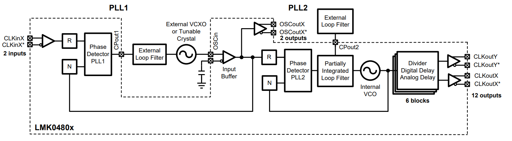
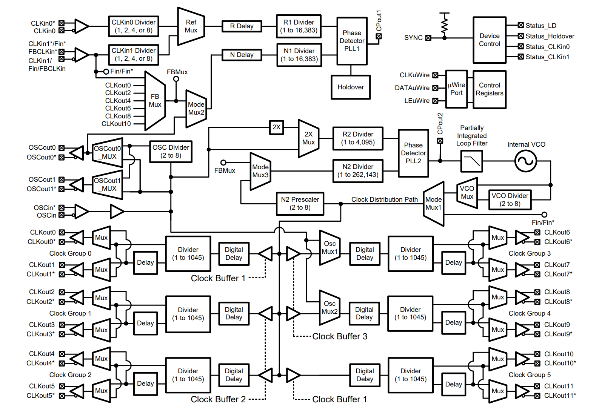
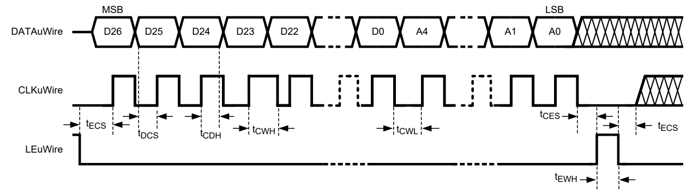

# 时钟芯片

## 时钟芯片工作原理

## 概述

​	LMK0408BISQ 由两个锁相环构成，工作时需要外部提供两个参考时钟，一个为 PLL1 的输入参考时钟，另一个为 PLL2 的输入参考时钟。其中 PLL1 的参考时钟为 10 MHz，使用基带板提供，PLL2 的参考时钟为 153.6 MHz，使用外部晶振提供。锁相环 PLL1 用于锁定外部晶振的输入时钟，锁相环 PLL2 用于锁定时钟芯片内部的压控振荡器 VCO 。输出时钟由 VCO 和 OSCin 分频提供。

​	时钟芯片的简化模块图见下图：

​	具体[使用手册](./assets/LMK0480x.pdf)见PDF。

## 详细描述

### 功能模块图

### 特征描述

#### 串行 MICROWIRE 时序图

​	在每一个 CLKuWire 信号的上升沿，DATAuWire 上的寄存器编程信息被送入到一个移位寄存器。在每一个 LEuWire 信号的上升沿，信息从移位寄存器被送到对应的寻址寄存器。在编程结束后，CLKuWire、DATAuWire、LEuWire，应该被复位为低电平。如果在内部振荡器 VCO 锁定时，CLKuWire 或 DATAuWire 没有复位（有时候这些数据线可能在与其他部分交互），那么在编程器件，相位噪声可能恶化。

#### Inputs / Outputs

##### PLL1 参考输入（CLKin0 和 CLKin1）

​	参考时钟输入可以任选 CLKin0 或 CLKin1。使用者可以手动选择或者配置一个自动开关操作模式。CLKin0 or CLKin1 有分频器，可以允许设备在参考输入与不同分频见调整，而不需要重新编程 PLL1 的 R 分频器。CLKinx 的预分频器可以配置1，2，4，8。CLKin1 的输入也可替代为外部反馈（0-延迟模式），或者外部 VCO 输入（Fin），公司使用Fin = 10 MHz 作为 PLL1 的输入参考。

##### PLL2 OSCin / OSCin* Port

​	在外部，振荡器的反馈被 PLL1 锁定，并用于产生 CPout1 控制振荡器频率；在内部，信号被连接至 PLL1 的 N 分频器和 PLL2 的参考输入。振荡器的输入可以是单端的，也可以是差分的，并且必须是交流耦合。如果配置为单端模式，那么未使用的端口必须通过 0.1 $\mu F$ 的电容接地。

##### Crystal Oscillator

​	OSCin 端口的内部电路也支持使用以晶体为基础的振荡电路：晶体、变容二极管和其他少量的外部器件。

##### Input Clock Switching

​	CLKin_SELECT_MODE 寄存器提供了三种开关模式：手动、引脚选择和自动。

