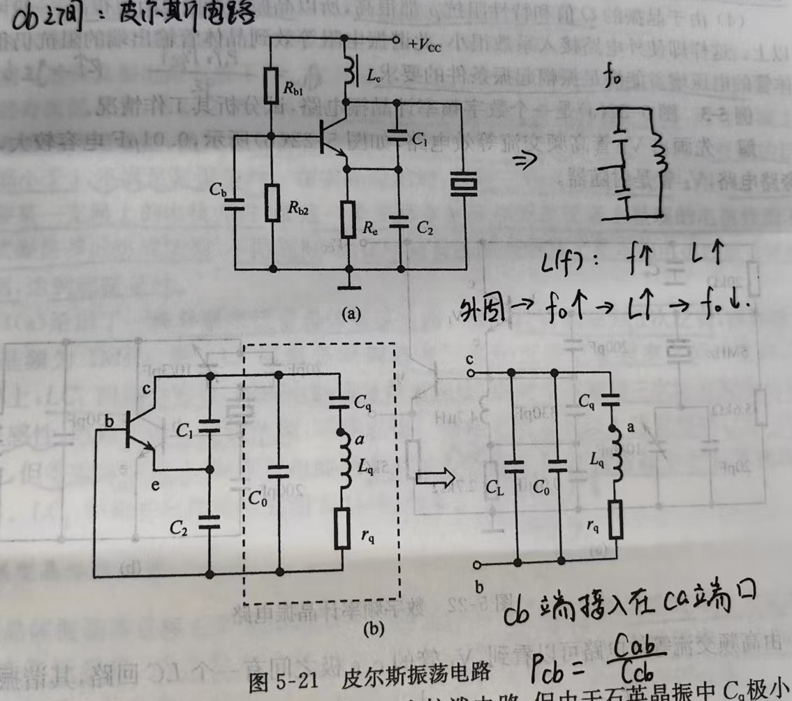

# 晶振

## 晶振名称及分类

> 从材质上：分为陶瓷晶振和石英晶振
>
> 从属性上：分为有源晶振和无源晶振
>
> 有源晶振不会有陶瓷材质，按输出类型可分为单端与双端

### 陶瓷晶振与石英晶振

#### 材质

- 石英晶振利用石英晶体的压电效应，晶片越薄频率越高；
- 陶瓷晶振利用人工技术处理，将细微的粉末给予压电效应、燃结成型，厚度越大，频率越高。

#### 频率精度

- 石英晶振精度：10 ppm ~ 300 ppm
- 陶瓷晶振精度：300 ppm ~ 5000 ppm
- ppm：晶振的精度，含义为百万分之一，表示晶体频率会偏移标称频率的多少。

#### 起振时间

- 石英晶体需要通电一段时间才开始起振，时间一般在毫秒级；
- 陶瓷晶体通电立刻起振，时间一般在纳秒级。

#### 内部结构

- 石英晶振结构：压电体构成，无内置电容；
- 陶瓷晶振结构：有压电体和内置电容构成，可以不加内置电容。

#### 价格不同 

- 陶瓷晶振成本较低，石英晶振相对成本高。

### 有源晶振与无源晶振

> - 有源晶振比较贵，但稳定性比无源晶振好
> - 有源晶振最高精度可以达到 0.1 ppm，而无源晶振最高达到 5 ppm

#### 无源晶振

> 两个引脚的无极性元件，需要借助时钟电路才能产生振荡。

#### 有源晶振

> 一般有四个引脚，是一个完整的振荡器，内部有时钟电路，只需要供电就可以起振。

​	将晶振用于三极管电路，在电路中根据不同的频率充当电容或者电感，例如皮尔斯振荡电路，将电容三端式振荡器中的电感更换为石英晶体。

    

​	根据交流等效电路可以计算谐振回路的并联谐振频率 $f_{0}$ ：
$$
& f_{0} &=& \frac{1}{2\pi \sqrt{LC_{\Sigma}}} \\
where: \quad &C_{\Sigma} &=& (C_{L}+C_{0})//C_{q} \\
& &=& \frac{C_{q}(C_{L}+C_{0})}{C_{q}+C_{L}+C_{0}} \\
&C_{L} &=& C_{1}+C_{2} \\
& &=& \frac{C_{1}C_{2}}{C_{1}+C{2}}
$$

##### 插入系数

​	晶振 cb 端的插入系数 $P_{cb}$ 应为 cb 端的阻抗与 ab 端的阻抗之比：
$$
P_{cb}=\frac{\frac{1}{\omega C_{cb}}}{\frac{1}{\omega C_{ab}}} &=& \frac{C_{ab}}{C_{cb}} & =&\frac{C_{q}}{C_{q}+C_{0}+C_{L}} \\
where: \quad C_{L} &=& C_{1}+C_{2}& \\
&=& \frac{C_1C_2}{C_{1}+C_{2}} &
$$
​	对于整个电路而言，实际上由三部分构成：晶体管、振荡回路与负载。晶体管负责提供放大和起振的条件，而振荡产生的信号被传送至负载，振荡回路负责频率的筛选。换句话说，振荡回路连接了晶体管与负载，由于 $C_{q}+C_{0}+C_{L}>>C_{q}$ ，所以晶振的 cb 端插入系数很小，因而后级电路对晶振的影响很小。因此晶体管与负载之间的耦合很弱，提高了电路的稳定性。

​	这里为什么选择 cb 端口作为插入系数的判断端口呢？为什么不是 eb 端，或者 ce 端呢？这是由于起振时，暂态过程中，由基极的微弱信号开始，取集电极经过放大的信号再反馈回基极，直至最终稳定的过程。也就是说，晶体管最终产生的信号实际上是在 cb 之间的产生的，所以选择 cb 端口作为插入系数的判断端口。

​	不难看出，信号实际上是从电容 $C_{q}$ 的上端取得，而在计算插入系数时，却认为信号是从电容 $C_{q}$ 的下端取出，为什么可以这样等效呢，这是由于在并联谐振时，类似于电容时间常数的计算，并联电容可以看作从电感向外看的等效电容，实际上相当于电容 $C_{q}$ 串入电路，所以两种电路在谐振时是等效的，可以认为在谐振频率下的插入系数为上式。

​	类似的，还可以得到 eb 端、ce 端的插入系数：

$$
P_{eb}=\frac{\frac{1}{\omega C_{eb}}}{\frac{1}{\omega C_{ab}}} &=& \frac{C_{ab}}{C_{eb}} & =&\frac{C_{q}//C_{0}+C_{2}}{C_{q}//C_{0}+C_{L}} \\
P_{ce}=\frac{\frac{1}{\omega C_{ce}}}{\frac{1}{\omega C_{ab}}} &=& \frac{C_{ab}}{C_{ce}} & =&\frac{C_{q}//C_{0}+C_{1}}{C_{q}//C_{0}+C_{L}} \\
where: \quad C_{L}&=& C_{1}+C_{2}& \\
&=& \frac{C_1C_2}{C_{1}+C_{2}} &
$$
​	这种计算方法实际上也是理论推导的结果，复杂连接下的串联电容等价于从某个电容向外看的等效电容。通过公式可以看出，其他端口的插入系数并不小，但是由于端口并不产生信号，所以插入系数的大小无关紧要。

### 单端晶振与差分晶振

- 单端信号只有一根信号线，参考段在地；
- 双端信号有两根信号线，振幅相等，相位相反，输出为差分信号；
- 差分信号抗干扰能力强，适合高频传输和噪声环境；
- 单端晶振不适合高速信号，传输距离近，走线方便，抗干扰能力差。

## 有源晶振的输出波形

### 晶振输出模式

> 晶振常用的输出模式主要包括：TTL、CMOS、ECL、PECL、LVDS、Sine Wave。都是行业常用的波形。
>
> 其中 TTL、CMOS、ECL、PECL、LVDS 均属于方波，Sine Wave 属于正弦波。
>
> 通常，方波输出功率大，驱动能力强 ，但谐波分量丰富；正弦波输出功率不如方波，但其谐波分量小很多。

#### TTL

​	**Transistor-Transistor Logic**（晶体管-晶体管逻辑电路），传输延迟时间快，功耗高，属于电流控制器件。

- 输入输出端都用三极管电路，是一种饱和型电路，开关速度较高，$V_{CC}=+5\ V$ 。
- 当 $V_{CC}=+3.3\ V$ 时，称作 LVTTL 电路。 

#### COMS

​	**Complementary Metal Oxide Semiconductor**（互补金属氧化物半导体 CMOS 逻辑电路），传输延迟时间慢，功耗低，属于电压控制器件。

- CMOS 相对于 TTL 有了更大的噪声容限，输入阻抗远大于 TTL 输入阻抗；
- 对应 3.3 V LVTTL，出现了 LVCMOS，可以与 3.3 V 的 LVTTL 直接相互驱动；
- HCMOS 采用全静态设计、高速互补金属氧化物半导体工艺，CMOS 采用互补金属氧化物半导体，最终 CMOS 会被 HCMOS 取代。

#### ECL

​	**Emitter-Couple Logic**（发射级耦合逻辑电路），该电路的特点是基本门电路工作在非饱和状态，速度快，驱动能力强。

- ECL 电路逻辑摆幅较小，约为 0.8 V，而 TTL 的逻辑摆幅约为 2.0 V；
- ECL 电路具有相当高的速度，平均延迟时间可达毫微秒甚至亚毫微秒级，这是由于当电路从一种状态过渡到另一种状态时，对寄生电容的充放电时间将减少；
- 输入级是差动放大电路，输出级是共集电极放大，用来放大电流及降低输出阻抗；
- ECL 电路对抗干扰能力不利，另外其具有很高的输入阻抗和低输出阻抗。

#### PECL&LVPECL

​	**Positive Emitter-Couple Logic**（发射极耦合逻辑电路），由于 ECL 功耗大，需要负电源。为了简化电源，出现了 PECL （ECL 结构用正电压供电）和 LVPECL 的输出模式。LVPECL （**Low Voltage Positive Emitter-Couple Logic**，低压正发射极耦合逻辑电路）。

- ECL、PECL、LVPECL 使用时注意，不同电平不能直接驱动，中间可用交流耦合、电阻网络或专用芯片进行转换；
- LVPECL 的典型输出为一对差分信号，输出为射级跟随输出结构；
- PECL 的输出需要下拉电阻，输出电压在 $V_{CC}$ ~ $V_{CC}-2$ 之间；而 LVPECL 需要上拉和下拉电阻，控制输出电平在低电压。

#### LVDS

​	**Low Voltage Differential Signaling**（低电压差分信号），是一种低摆幅的差分信号技术，使得信号能在差分 PCB 线或平衡电缆上高速传输，[电流模式驱动输出](https://blog.csdn.net/lxm920714/article/details/107955275)。

- 电流模式驱动不易于振铃和产生切换尖峰信号，能够抑制共模噪声，低噪声，低功耗；

- LVDS 接收端需要接终端匹配电阻，没有匹配电阻，LVDS 不能工作，匹配电阻需要并接在差分线上，且靠近接收端；
- LVDS 内部有恒流源 3.5 ~ 4.0 mA，在差分线上改变流过匹配电阻的方向控制逻辑值。当恒流源为 3.5 mA，匹配电阻为 100 $\Omega$ 时，接收端的电平为 $\pm$​ 350 mV。
- LVDS 的应用模式有三种：
  - 单向点对点，双向点对点（可以通过双绞线实现双向的半双工通信）
  - 多分支形式，即一个驱动器连接多个接收器；
  - 多点结构，此时多点总线支持多个驱动器，也可以采用 BLVDS 驱动器，它可以提供双向的半双工通信，但是任意时刻，只能有一个驱动器工作。

#### Clipped Sine Wave

​	削顶正弦波，相比于方波，谐波分量少很多，但驱动能力较弱。

#### Sin Wave 

​	通常晶振正弦波输出的负载阻抗为 50 $\Omega$ 。波形谐波分量小，一般谐波抑制大于 -30 dBc。

