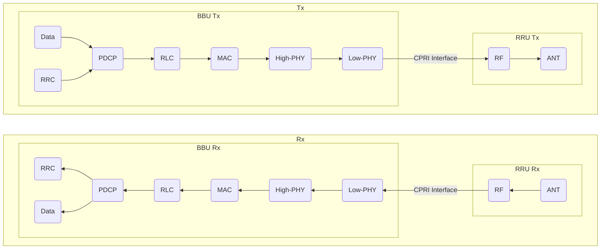
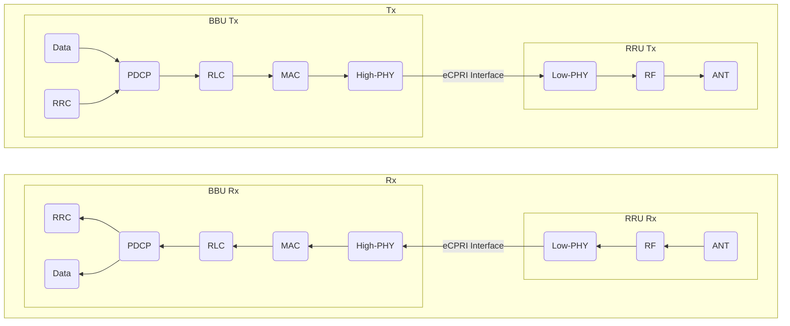
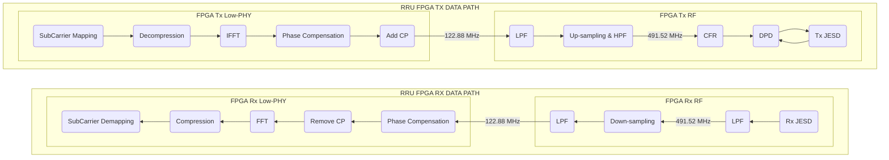

# 通信协议

## 一、4G LTE

### 1.1. 定义

​	4G 是第四代移动通信系统（The 4th Generation Communication System) 的简称。在 ITU（国际电联）的定义里，任何达到或超过 100 Mbps 的无线数据网络系统都可以称作 4G 。4G 技术是一种基于 IP 协议的宽带无线接入方式，传输速率高、覆盖范围广、容量大并且安全性高。

​	LTE（Long Term Evolution，长期演进）是由 3GPP（The 3rd Generation Partnership Project，第三代合作伙伴计划）组织制订的 UMTS（Universal Mobile Telecommunications System，全球移动通信系统）技术标准的长期演进。频率范围 700 MHz ~ 2.7 GHz ，采用了多天线发送/接受的 MIMO（Multi Input Multi Output，多入多出），以及云讯基站间多重访问的 SDMA （Space Dvision Multiple Access，空分多址）等天线技术。另外采用了 OFDMA（Orthogonal Frequency Division Multiple Access，正交频分多址）和 SC-FDMA（Signle Carrier Frequency Division Multiple Access，单载波频分多址）作为多路传输系统。

​	通常所说的 4G 与 LTE 大体上是一个东西，但是在一些细节方面又有所不同。

### 1.2. 空口技术

​	移动通信系统主要由终端、基站和核心网三部分组成，终端（UE）和基站（BS）组成基站子系统，核心网内部很多复杂的网元组成网络子系统。

​	其中，UE 与 BS 之间的接口，通过电磁波在空气中传播，因为被称为空口。而负责 4G 系统中空口传输的协议为 LTE 。

## 二、5G NR

### 2.1. 定义

​	NR（New Radio，新空口），用于负责 5G 基站与终端的空口传输，NR 基于 LTE 设计而成，也使用了 OFDM 调制方式，在 MIMO 的基础上，使用 Massive MIMO（波束赋性）技术，在帧结构上，修正了 4G 的一些不合理之处，增加了对大连接和低延迟的支持，因此更加灵活，频率效率更高。但是 NR 与 LTE 并不兼容，对于终端而言，这时两套完全不同的空口协议。

## 三、PDT

### 3.1. 定义

​	PDT（Police Digital Trunk，警用数字集群），采用频率和时间分割的方法划分信道。频率分割是在给定的 350 ~ 390 MHz 频段内，以 12.5 kHz 信道间隔和 10 MHz 收发间隔划分载波信道。时间分割采用时分复用/时分多址（TDMA）技术划分时隙信道。规定每载波时隙为两个，即物理信号为两个，再根据需要设置业务和控制逻辑信道。

### 3.2. 射频规范

#### 3.2.1. 射频调制方式

​	射频调制方法采用四电平频移键控（4FSK）。

#### 3.2.2. 调制速率

​	调制发送 4800 符号/s ，每个符号由两个比特信息组成。这里的调制速率等同于波特率，即 $R_{B} = 4800\ Baud$ ，比特率为 9600 bit/s 。

#### 3.2.3. 带宽

​	4FSK 的基带信号带宽可以描述为：
$$
B_{4FSK} = |f_{max}-f_{min}| + 2 R_B
$$
​	因此，PDT 规范下，每载波带宽 $B = 9600 +\Delta f \  Hz$ ，约为 10 kHz 。

​	规范中要求的邻道功率比（ACPR），在 $f_0 \pm 12.5 kHz$ 处，需要小于 -60 dB，在 $f_0 \pm 25.0 kHz$ 处，需要小于 -70 dB 。而每载波的基带信号带宽约在 10 kHz 左右，调制时由于滤波器引入的带宽扩展需要控制，保证与规范中描述的指标一致。

### 3.3. 频率规划

#### 3.3.1. 工作频段

​	350 兆有三个频段可供 PDT 使用：

1. 单频段频率：358 MHz ~ 361 MHz ，用于脱网直通模式；
2. 双频段频率 1：上行 351 MHz ~ 355 MHz（含），下行 361 MHz ~ 365 MHz（含），用于集群模式；
3. 双频段频率 2：上行 355 MHz ~ 356 MHz ，下行 365 MHz ~ 366 MHz ，用于转信或集群模式；

#### 3.3.2. 频率编号规则

​	单频段频率起始频率为 358.0125 MHz，其实频率号为 1，频率间隔 12.5 kHz。

​	双频段频率 1 起始频率为 351.0125 MHz/ 361.0125 MHz，起始频率号为 241，频率间隔 12.5 kHz。

​	双频段频率 2 起始频率为 355.0125 MHz/ 365.0125 MHz，起始频率号为 561，频率间隔 12.5 kHz。

#### 3.3.3. 频率分组

​	双频段频率宜按照无三阶互调的组合分成若干组使用，每组指定一个主用控制信号和一个备用控制信道。

## 四、TETRA

### 4.1. 定义

​	TETRA（Terrestrial Trunked Radio，地面集群无线电）

# 架构

## 一、概述

​	传统基站架构中，BBU（Baseband Unit，基带单元）与 RRU（Remote Radio Unit，无线单元）在一个机房中，因此需要从基站机柜所在的塔基到安装天线的塔顶铺设更长的同轴电缆，作为天线的馈线。而馈线会增加传输损耗，并且机房需要空调为 RRU 散热。

​	现代基站架构中，往往将 RRU 外置在塔上，这样即解决了馈线过长引起的输出功率升高的问题，又解决了机房散热的问题。BBU 与 RRU 之间通过光纤连接，而这段光纤上运行的协议就是 CPRI（Common Public Radio Interface，公共无线接口），其旨在定义一个公开的规范，以标准化基站设备（BBU 与 RRU）之间的协议接口。

## 二、CPRI & eCPRI

### 2.1. CPRI 定义

​	数据通过通信协议栈，各层会在上一层的基础上附加本层的功能，层层加码后，数据量急剧增加。CPRI 协议在 BBU 与 RRU 之间传输的物理层数据，不但包含了承载的数据，还含有大量物理层信息。

​	以 20 MHz 带宽 LTE 载波为例，支持 2$\times$2 MIMO ，可支持 150 Mbps 速率的数据流。而 CPRI 接口处，带宽需求则达到 2.5 Gbps 。如此大的数据速率，需要用光纤传输，硬件几乎没有带宽的限制。将 BBU 与 RRU 使用的电信号转换为光信号则需要使用光模块，然而光模块支持的速率和传输的距离是有上限的。

### 2.2. eCPRI 定义

​	到了 5G 时代，为了支撑 eMBB 业务，基站发生了一些变化：RRU 演变成了集成超大规模天线阵列的 Massive MIMO AAU；载波带宽大幅扩展，Sub6G 载波需要支持 100 M 带宽，而毫米波需要支持 400 M 带宽；基站所需承载的数据流量达到 10 Gbps 级别。

​	这些变化对 CPRI 接口提出了更高的要求，仅 100 MHz 带宽 64 天线，所需要 CPRI 口速率就达到了 172.8 Gbps 。在这样的背景下，需要能够降低前传带宽的新接口，eCPRI（enhanced CPRI）应运而生。

​	eCPRI 的设计思路很简单，既然通信协议栈上传输的数据会层层加码，越到物理层数据量越大，那就把 BBU 处理的数据上移一层，High PHY 以上的 BBU 处理，Low PHY 以下的 RRU 处理，这样 BBU 与 RRU 之间的数据量就少了，代价是 RRU 的复杂度提升。

​	以原来 172.8 Gbps 光口速率的配置为例，变更为 eCPRI 后，所需的光口速率仅为 24.3 Gbps，带宽仅为原先的 14% 。

### 2.3. Low-PHY

​	不同架构，协议下，Low-PHY 阶段需要进行的处理也并不相同。下面以 NR PHY 为例，Low-PHY 的数据处理流程如下图所示。

​	其中，LPF、Down Sampling、CFR、DPD、JESD 等环节的实现是大部分 RRU 的共性，下文主要针对 eCPRI 比 CPRI 多出的 Low-PHY 部分的数据处理。

#### 2.3.1. SubCarrier Maping

​	NR 空口协议中采用的信号调制方式为 OFDM 。为了增加信号传输的比特率，简化数字域的计算复杂度，需要使用子载波映射，将二进制序列按照 QAM 映射为复数序列 $\{ S_n \}$ 。

​	映射时，由于选择的 QAM 位数不同，提升比特率的程度也不同。以 16 QAM 为例，可以将连续的 4 个二进制数据，根据星座图，映射为 1 个复数，在码元速率相同的情况下，比特率提升了 4 倍。

#### 2.3.2. IFFT & FFT

​	OFDM 调制信号是通过对多个正交子载波的幅度调制，合成最终信号，这个过程简单的描述为：
$$
S(t) = \sum_0^N{} S[n] \cdot e^{jn\omega_0 t/N}
$$
​	其中，N 表示子载波个数。上式类似于 INDFT 的表达式，因而可以通过 IFFT 调制信号。

​	而对于解调来说，需要从 $S(t)$ 中还原序列 $S[n]$ ，其过程简单的描述为：
$$
S[n] = \int_0^{+\infty}S(t)e^{-jn\omega_0 t}dt
$$
​	类似地，OFDM 信号的解调可以通过 FFT 实现。

#### 2.3.3. Phase Compensation

​	相位补偿是 5G NR 中新引入的概念，用于解决发射端中心频点和接收端的中心频点不一致而带来的相位旋转问题。由于基站和 UE 的基带或载波频点可能不一致，并且收端并不知道发端中心频点，因此需要在上、下变频的过程中，分别补偿。

​	除此以外，在上变频的过程中，5G NR 为了消除 ISI（Inter Symbol Interference，符号间串扰）和 ICI（Inter Carrier Interference，载波间串扰）的影响，在每个码元的开始添加了一段时间的 CP（Cyclic Prefix，循环前缀），这将导致每个码元的初始相位不为 0，通过相位补偿可以消除初始相位的对信号解调的干扰。
$$
Signal = Re\{ S(t) \cdot exp[j\omega_c(t-t_{CP} \} ]
$$
​	上式中，$S(t)$ 为时域基带信号，$\omega_c$ 为载波角频率，$t_{CP}$ 为 CP 时间。

#### 2.3.4. CP

​	循环前缀（Cyclic Prefix，CP）可以消除 OFDM 信号传输过程中产生的 ISI 与 ICI 。

​	符号间串扰（ISI）在 OFDM 中产生于多径效应。对同一个子载波而言，多径产生的多个信号会在接收端重叠，可能导致信号判决出现误差。可以通过添加保护间隔（Zero Prefix，ZP），只要保护间隔大于最大的信号时延，多径效应产生的 ISI 基本就可以消除。

<table align="center">
  <tr align="center">
  	<td></td>
    <td></td>
  </tr>
  <tr align="center">
  	<td>Only Time Delay</td>
    <td>Protect Interval</td>
  </tr>
</table>

​	载波间串扰（ICI）产生于保护间隔（ZP），由于在码元开始处增加了一段时间的 0 值，这导致在 FFT 积分时间内，不同载波间的周期数的差值可能不是整数，这破坏了子载波间的正交性，无法彻底分离某些子载波内的信息。

<table>
  <tr align="center">
  	<td  colspan="2"></td>
  </tr>
  <tr align="center">
  	<td colspan="2">Multi Path Signal</td>
  </tr>
  <tr align="center">
  	<td></td>
    <td></td>
  </tr>
  <tr align="center">
  	<td>Recovery from Only Time Delay</td>
    <td>Recovery from Protect Interval</td>
  </tr>
</table>

​	为了同时解决 ISI 与 ICI ，将原来的保护间隔替换为循环前缀。这样不会破坏子载波间的正交性，消除了ICI 。这样处理的结果是，在 FFT 积分时间内，只要多径的最大时延小于循环前缀的时长，每条路径的采样都是一个完整的码元。但是，这样看起来仍然无法解决问题，因为这时采样得到的接收信号仍然不是最初的信号。

<table>
    <tr align="center">
  	<td></td>
    <td></td>
  </tr>
  <tr align="center">
  	<td>Time Delay & Cyclic Prefix</td>
    <td>Multi Path Signal</td>
  </tr>
</table>

​	对于每一条路径而言，传输过程相当于为信号增加了一个幅度因子。时延不为采样周期整数倍的多径信号，可以划归到某一采样周期整数倍的幅度因子内，因此只考虑那些时延为采样周期整数倍的路径。设它们的幅度因子序列为 $\{ h[n] \}$ ，输出射频信号为 $S(t)$ ，那么接收端采样的信号 $y(n)$ 应为：
$$
\begin {flalign*}
y[n] = & \sum_0^k S([(n-k)T_s]_{T_{symbol}}) \cdot h[k] \\
 = & \ S[n] \circledast h[n]
\end {flalign*}
$$
​	其中，k 为路径延迟与采样周期的比值，$T_s$ 为采样周期，$T_{symbol}$ 为码元周期。显然，接收端获得的信号与输出的射频信号相差甚远，需要从采样信号中恢复出 $S(t)$ 。公式所描述的正是循环卷积，而循环卷积的傅里叶变换与 DFT 相同，那么在频域上，可以描述为：
$$
DFT(y[n]) = DFT(S[n]) \times DFT(h[n])
$$
​	通过信道估计可以获得幅度因子序列 ${h[n]}$ ，即可从 $y[n]$ 中恢复出原始信号的采样信号 $S[n]$ 。这种方法，可以从理论上完全消除 ISI 与 ICI 。

<table>
    <tr align="center">
  	<td></td>
    <td></td>
  </tr>
  <tr align="center">
  	<td>Recovery from Time Delay & Cyclic Prefix</td>
    <td>Large Time Delay</td>
  </tr>
</table>
