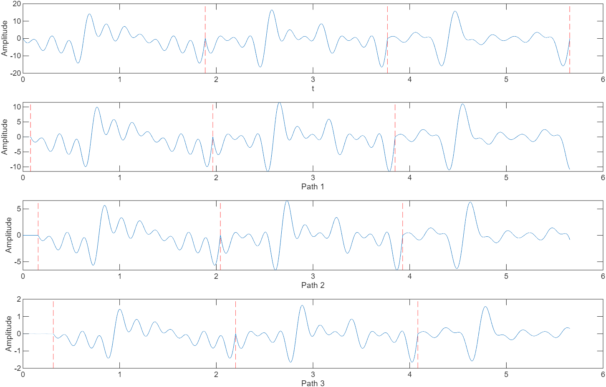

# 通信协议

## 一、4G LTE

### 1.1. 定义

​	4G 是第四代移动通信系统（The 4th Generation Communication System) 的简称。在 ITU（国际电联）的定义里，任何达到或超过 100 Mbps 的无线数据网络系统都可以称作 4G 。4G 技术是一种基于 IP 协议的宽带无线接入方式，传输速率高、覆盖范围广、容量大并且安全性高。

​	LTE（Long Term Evolution，长期演进）是由 3GPP（The 3rd Generation Partnership Project，第三代合作伙伴计划）组织制订的 UMTS（Universal Mobile Telecommunications System，全球移动通信系统）技术标准的长期演进。频率范围 700 MHz ~ 2.7 GHz ，采用了多天线发送/接受的 MIMO（Multi Input Multi Output，多入多出），以及云讯基站间多重访问的 SDMA （Space Dvision Multiple Access，空分多址）等天线技术。另外采用了 OFDMA（Orthogonal Frequency Division Multiple Access，正交频分多址）和 SC-FDMA（Signle Carrier Frequency Division Multiple Access，单载波频分多址）作为多路传输系统。

​	通常所说的 4G 与 LTE 大体上是一个东西，但是在一些细节方面又有所不同。

### 1.2. 空口技术

​	移动通信系统主要由终端、基站和核心网三部分组成，终端（UE）和基站（BS）组成基站子系统，核心网内部很多复杂的网元组成网络子系统。

​	其中，UE 与 BS 之间的接口，通过电磁波在空气中传播，因为被称为空口。而负责 4G 系统中空口传输的协议为 LTE 。

## 二、5G NR

### 2.1. 定义

​	NR（New Radio，新空口），用于负责 5G 基站与终端的空口传输，NR 基于 LTE 设计而成，也使用了 OFDM 调制方式，在 MIMO 的基础上，使用 Massive MIMO（波束赋性）技术，在帧结构上，修正了 4G 的一些不合理之处，增加了对大连接和低延迟的支持，因此更加灵活，频率效率更高。但是 NR 与 LTE 并不兼容，对于终端而言，这时两套完全不同的空口协议。

## 三、PDT

### 3.1. 定义

​	PDT（Police Digital Trunk，警用数字集群），采用频率和时间分割的方法划分信道。频率分割是在给定的 350 ~ 390 MHz 频段内，以 12.5 kHz 信道间隔和 10 MHz 收发间隔划分载波信道。时间分割采用时分复用/时分多址（TDMA）技术划分时隙信道。规定每载波时隙为两个，即物理信号为两个，再根据需要设置业务和控制逻辑信道。

### 3.2. 射频规范

#### 3.2.1. 射频调制方式

​	射频调制方法采用四电平频移键控（4FSK）。

#### 3.2.2. 调制速率

​	调制发送 4800 符号/s ，每个符号由两个比特信息组成。这里的调制速率等同于波特率，即 $R_{B} = 4800\ Baud$ ，比特率为 9600 bit/s 。

#### 3.2.3. 带宽

​	4FSK 的基带信号带宽可以描述为：
$$
B_{4FSK} = |f_{max}-f_{min}| + 2 R_B
$$
​	因此，PDT 规范下，每载波带宽 $B = 9600 +\Delta f \  Hz$ ，约为 10 kHz 。

​	规范中要求的邻道功率比（ACPR），在 $f_0 \pm 12.5 kHz$ 处，需要小于 -60 dB，在 $f_0 \pm 25.0 kHz$ 处，需要小于 -70 dB 。而每载波的基带信号带宽约在 10 kHz 左右，调制时由于滤波器引入的带宽扩展需要控制，保证与规范中描述的指标一致。

### 3.3. 频率规划

#### 3.3.1. 工作频段

​	350 兆有三个频段可供 PDT 使用：

1. 单频段频率：358 MHz ~ 361 MHz ，用于脱网直通模式；
2. 双频段频率 1：上行 351 MHz ~ 355 MHz（含），下行 361 MHz ~ 365 MHz（含），用于集群模式；
3. 双频段频率 2：上行 355 MHz ~ 356 MHz ，下行 365 MHz ~ 366 MHz ，用于转信或集群模式；

#### 3.3.2. 频率编号规则

​	单频段频率起始频率为 358.0125 MHz，其实频率号为 1，频率间隔 12.5 kHz。

​	双频段频率 1 起始频率为 351.0125 MHz/ 361.0125 MHz，起始频率号为 241，频率间隔 12.5 kHz。

​	双频段频率 2 起始频率为 355.0125 MHz/ 365.0125 MHz，起始频率号为 561，频率间隔 12.5 kHz。

#### 3.3.3. 频率分组

​	双频段频率宜按照无三阶互调的组合分成若干组使用，每组指定一个主用控制信号和一个备用控制信道。

## 四、TETRA

### 4.1. 定义

​	TETRA（Terrestrial Trunked Radio，地面集群无线电）是一个由 ETSI 技术协会提出的欧洲标准。其采用 $\pi/4-DQPSK$（Differential Quaternary Phase-Shift Keying，差分正交相移键控）和滚降系数为 0.35 平方根升余弦调制滤波器，调制速率（码元速率）为 36 kbit/s 。

​	工作在 DMO（Direct Mode Operation）模式下，一种可能的参考架构如下：

​	其中，1：信息比特（发送）；2：块编码比特；3：卷积编码比特；4：重排序和交织的比特；5：加扰的比特；6：多路复用的比特；7：调制的比特；8：贴纸的码元。

### 4.2. 调制（Modulation）

​	下面的指标应用于下行基带信号。调试方式使用 $\pi/4-DQPSK$ ，调制速率（码元速率）为 36 kbit/s 。

#### 4.2.1. 调制符号定义

​	$B(m)$ 提供了需要发送的比特序列，其中 m 表示比特索引。调制比特序列应当被映射于调制符号序列 $S(k)$ ，其中 k 对应于符号索引。

​	调制符号 $S(k)$ 应当从一个差分编码中得出，这意味着，$S(k)$ 应当由上一个调制符号 $S(k-1)$ 施加一个相位变换 $D_{\phi}(k)$ 得出。因此，用复数表示：
$$
S(k) = S(k-1)exp(jD_{\phi}(k)) \\
S(0) = 1
$$
​	符号 $S(0)$ 位于第一个载波的第一个符号之前，应当作为相位参考传输。相位变换 $D_{\phi}(k)$ 应当与调制比特有关。

| $B(2k-1)$ | $B(2k)$ | $D_{\phi}(k)$ |
| :-------: | :-----: | :-----------: |
|     1     |    1    |   $-3\pi/4$   |
|     0     |    1    |   $+3\pi/4$   |
|     0     |    0    |   $+\pi/4$    |
|     1     |    0    |   $-\pi/4$    |

​	复数调制符号 $S(k)$ 应当具有 $exp(j\ n\pi/4)$ 的八种相位之一，当 k 为偶数时，n = 2, 4, 6, 8；当 k 为奇数时，n = 1, 3, 5, 7。此种调制符号的星座图及其不同符号间可能的转变如下图：

#### 4.2.2. 调制后符号定义

​	经过调制的信号，载波频率为 $f_c$ ，应该为：
$$
M(t) = Re\{s(t)exp(j(2\pi f_ct + \phi_0))\}
$$
​	其中：

- $\phi_0$ 是一个任意的相位；

- $s(t)$ 是经过调制的信号的复数包络，定义为：
  $$
  s(t) = \sum_{k=0}^KS(k)g(t-t_K)
  $$

  - K 是最大符号数；

  - T 是符号周期；

  - $t_{K} = kT$ 是对应于 $S(k)$ 的符号时间；

  - g(t) 是一个理想符号波形，由平方根升余弦频谱 G(f) （定义如下）作傅里叶逆变换获得：
    $$
    \begin{flalign*}
    
    &G(f) = 1 \qquad \qquad \qquad \qquad \qquad \qquad  \qquad \qquad \quad \ \ for \qquad \qquad  |f| \le (1-\alpha) / 2T \\
    &G(f) = \sqrt{0.5(1-sin(\pi(2|f|T-1)/2\alpha))} \qquad \qquad  for \qquad \qquad (1-\alpha)/2T \le |f| \le (1+\alpha)/2T \\
    &G(f) = 0 \qquad \qquad \qquad \qquad \qquad \qquad \qquad \qquad \quad \ \ for \qquad \qquad |f| \ge(1+\alpha)/2T &
    
    \end{flalign*}
    $$
    
    - 其中，$\alpha$ 是滚降系数，在给定符号速率后用于确定发射带宽。$\alpha$ 的值应当为 0.35 。在特定实现下，设计基于特定调精度和给定的相邻信道衰减，可能需要为 $g(t)$ 加时限窗。
  

#### 4.2.3. 调制滤波器定义

​	调制滤波器应当具有线性相位，并且其幅频响应应为 $|H(f)|=G(f)$ 。

#### 4.2.4. 调制模块图

​	调制过程的模块图如下所示，下图仅做解释目的，并不规定具体的实现方式。理想情况下，受狄拉克冲激函数 $S(k)\delta(t-t_K)$ 激励的调制滤波器具有冲激响应 $g(t)$ 。

### 4.3. 无线电发射与接收

#### 4.3.1. 调制精度

##### 理想条件

​	通过理想发射器发射的调制符号 $s(t)$ 具有一个冲击响应为 $g(t)$ 的滤波器，定义于 4.2 。假使 $Z(k)$ 作为冲击响应为 $g(-t)|_{t=t_K}$ 的理想接收机滤波器的输出，理想发射机和接收机滤波器级联产生升余弦奈奎斯特滤波器，其具有一个位域符号持续期间隔的零点，因此，在任意时刻 $t = t_K$ ，系统不存在符号间串扰，$t_K$ 对应于第 K 个符号的符号时间。

​	在这种情况下，一个受理想发射机激励的理想接收滤波器，在任意时刻 $t_K$ 下的输出，将等于第 k 个调制符号 $S(k)$ ：
$$
Z(k) = s(t) \times g(-t)|_{t=t_K} = S(k)
$$
​	本条款中，所使用的调制符号的编号方式见条款 9 。

##### 向量误差幅度

​	假使 $Z(k)$ 作为真实发射机通过理想接收滤波器在某一个符号时间 $t_K$ 的观测结果。$Z(k)$ 可以表示为：
$$
Z(k) = \{C_0 + [S(k) + E(k)] \} C_1W(k)
$$
​	其中：

- $E(k)$ 为调制符号 $S(k)$ 的向量误差；
- $W(k) = exp(jk\Theta)$ 描述了一种相位偏移，其由于接收机频率误差造成在每个符号处 $\Theta \ rad$ 相位旋转；
- $C_0$ 为一个表征残余载波的复常数；
- $C_1$ 为一个代表接收机输出幅度和初始相位的复常数。

​	$C_0$ 的幅度应当小于 $S(k)$ 幅度的 5% 。此后，测试接收机的任务是：

- 估计符号时间用于处理接收部分；

- 估计 $C_0$、$C_1$ 和 $\Theta$ 的值，评估结果分别由 $C_0'$、$C_1'$ 和 $\Theta'$ 表示；

- 对调制符号 $Z(k)$ 施加一个相应的归一化。归一化后的调制符号表示为：
  $$
  Z'(k)=[Z(k)exp(-jk\Theta')/C_1']-C_0'
  $$

​	根据上述符号表示，向量误差平方和（the Sum Square Vector Error，SSVE）定义为：
$$
SSVE = \sum_{k = 0}^{SN\ max}|Z'(k)-S(k)|^2
$$
​	其中，SN max 是一个突发中符号的数量。

​	RMS 向量误差由 SSVE 除以一个突发中的符号数量并取平方根计算而出：
$$
RMSVE = \sqrt{SSVE/SN\ max+1}
$$
​	任意突发中的 RMS 向量误差应当小于 0.1 。任意符号的峰值向量误差幅度 $|Z'(k)-S(k)|$ 应当小于 0.3 。

#### 4.3.2. 传输条件

##### 抽头增益处理类型

​	本条款通过多普勒频谱建模所使用的 PDF（Probability Density Function，概率密度函数）和 PDS（Power Density Spectrum，功率密度频谱）定义了应用于传输模型的静态复抽头增益处理的统计特性。复抽头增益处理，表示为 $a(t)$ 并定义如下，归一化为单位功率。

​	抽头增益处理 CLASS 类，具有与经典多普勒频谱相等 PDS。$a(t)$ 的实部和虚部呈现相同的高斯 PDF、相同的 PDS 并且相互统计独立。因此 $|a(t)|$ 具有Rayleigh（瑞利）分布。$a(t)$ 的 PDS 定义如下：
$$
S(f) = S_{CLASS}(f,f_d) = 1/[\pi f_d\sqrt{1-(f/f_d)^2}] \\
for -f_d < f < f_d,\ and\ S(f) = 0,\ elsewhere
$$
​	其中，参数 $f_d$ 定义为$f_d = v/\lambda$ ，代表最大多普勒频移（单位为 Hz），$v$ 表示车速（单位为 m/s），$\lambda$ 为波长（单位为 m）。

​	抽头增益处理 STATIC($f_s$) ，具有常数幅度 $|a(t)| = 1$ 。$a(t)$ 的 PDS 定义为：
$$
S(f) = S_{STATIC}(f,f_s) = \delta(f - f_s)
$$
​	其中，$\delta(.)$ 代表狄拉克 Delta 函数并且 $f_s$ 代表多普勒频移（单位为 Hz）。

​	抽头增益处理 RICE 是两种处理 CLASS 和 STATIC($f_s$) 之和，且 $f_s = 0.7\cdot f_d$ ，每一种贡献总功率的一般。因此，$|a(t)|$ 服从 Rician（莱斯）分布（一种主信号服从瑞利分布的多径信号分量的和）且 PDS 定义为：
$$
S(f) = S_{RICE}(f,f_d) = 0.5 S_{CLASS}(f,f_d) + 0.5 S_{STATIC}(f,0.7f_d)
$$

### 4.4. 信道编码和加扰

#### 4.4.1. 错误控制码

##### 16 状态速率自适应穿孔卷积码

​	16-state Rate-Compatible Punctured Convolutional（RCPC）编码应该编制 $K_2$ 个类型 2（具体类型见4.1.）比特$b_2(1), b_2(2), ..., b_2(K_2)$ 为 $K_3$ 个类型 3 比特 $b_3(2), b_3(2), ..., b_3(K_3)$。此编码通过两步实施：

1. 使用 16 状态母码以 1/4 码率编码；
2. 母码穿孔以获得一个 16 状态 $K_2/K_3$ 码率的 RCPC 码。

##### 1/4 码率 16 状态母码编码

​	任意的类型 2 比特输入，都会由母码产生 4 比特输出，表示为 $V(4(k-1)+i),\ i = 1,\ 2,\ 3,\ 4$ ，输出可如下计算：

​	母码四个生成多项式 $G_i(D),\ i=1,\ 2,\ 3,\ 4$ 中任意一个可以被写作：
$$
G_i(D) = \sum_{j=0}^4g_{i,j}D^j, \ for\ i = 1,\ 2,\ 3,\ 4 \\
where\ g_{i,j} = 0\ or\ 1,\ j = 1,\ 2,\ 3,\ 4
$$
​	这意味着编码后的比特定义为：
$$
V(4(k-1) + i) = \sum_{j=0}^4 b_2(k-j)g_{i,j},\\
for\ i = 1,2,3,4,\ and\ k = 1,2,\ ...,K_2
$$
​	其中，求和为二进制模 2 求和，并且当 $k\le j$ 时，$b_2(k-j)=0$ 。

​	母码的生成多项式可以为：
$$
\left\{
\begin{flalign*}
&G_1(D)=1+D+D^4 \\
&G_2(D)=1+D^2+D^3+D^4 \\
&G_3(D)=1+D+D^2+D^4 \\
&G_4(D)=1+D+D^3+D^4
\end{flalign*}
\right.
$$

##### 母码穿孔

​	将母码穿孔至码率为 $K_2/K_3$ 的 16 状态 RCPC 码，需要从依据母码编码的 $4K_2$ 个比特中筛选出 $K_3$ 个类型 3 的比特。挑选方式如下。

​	t 个穿孔系数（任意系数可能为 1，2，3，4，5，6，7 或 8）表示为 $P(1), P(2), ..., P(t)$ ，类型 3 比特写作：
$$
b_3(j) = V(k),\ for\ j = 1,\ 2,\ ...,\ K_3 \\
with\ k = 8((i-1)divt)+P(i-t((i-1)divt))
$$
​	其中，i 和 t 在后续穿孔体系中定义，$divt$ 表示对 t 做除法并取整。

##### 码率 2/3 的 RCPC 码穿孔体系

​	$t = 3$ 的穿孔系数为：
$$
P(1) = 1,\ P(2) = 2,\ P(3) = 5,\ and\ i = j
$$

##### 码率为 292/432 的 RCPC 码穿孔体系

​	$t = 3$ 的穿孔系数为：
$$
P(1) = 1,\ P(2) = 2,\ P(3) = 5,\ and\ i = j + (j-1)div\ 65 \\
with\ j = 1,\ 2,\ ...,\ 432
$$

##### 码率为 148/432 的 RCPC 码穿孔体系

​	t = 6 的穿孔系数为：
$$
P(1) = 1,\ P(2) = 2,\ P(3) = 3,P(4) = 5,\ P(5) = 6,\ P(6) = 7\ \\ 
and\ i = j + (j-1)div\ 35,\ with\ j = 1,\ 2,\ ...,\ 432
$$

##### 块编码

​	$(K_1+16,\ K_1)$ 码可以将 $K_1$ 个类型 1 的比特 $b_1(1),\ b_1(2),\ ...,\ b_1(K_1)$ 编码为 $(K_1+16)$ 个类型 2 比特 $b_2(1),\ b_2(2),\ ...,\ b_2(K_1+16)$ 。编码规则如下：

- 类型 1 比特作为多项式的系数：

$$
M(X) = \sum_{k=1}^{K_1}b_1(k)X^{K_1-k}
$$

​	设 $F(X)$ 为：
$$
F(X) = 
\left[\left(
X^{16}M(X)+X^{K_1}\sum_{i=0}^{15}X^i
\right)
mod\ G(X)
\right]
+\sum_{i=0}^{15}X^i
$$
​	其中，所有的运算均为模 2 运算，并且 $G(X)$ 为编码的生成多项式：
$$
G(X) = X^{16} + X^{12} + X^{5} + 1
$$
​	$F(X)$ 阶数为 15，其系数表示为 $f(0),\ f(1),\ ...,\ f(15)$ ：
$$
F(X) = \sum_{i=0}^{15}f(i)X^i
$$
​	$K_2$ 个类型 2 比特（$K_2 = K_1+16$）由下式得出：
$$
b_2(k) = b_1(k),\ for\ k = 1,\ 2,\ ...,\ K_1;\ and \\
b_2(k) = f(K_1+16-k),\ for\ k = K_1+1,K_1+2,\ ...,\ K_1+16
$$

#### 4.4.2. 交织（Interleaving）体系的定义

##### 模块交织

​	一个 $(K,\ a)$ 模块交织器能够重新排序 $K_3$ 个类型 3 比特 $b_3(1),\ b_3(2),\ ...,\ b_3(K_3)$ 为 $K_4$ 个类型 4 比特 $b_4(1),\ b_4(2),\ ...,\ b_4(K_4)$ ，并且 $K = K_3 = K_4$ ，方法如下：
$$
b_4(k) = b_3(i),\ i = 1,\ 2,\ ...,\ K \\
with\ k = 1+((a \times i)mod\ K)
$$

##### N 模块交织

​	N 模块交织通过两个步骤将 M 个 432 比特的类型 3 的模块 $B_3(1),\ B_3(2),\ ...,\ B_3(M)$ ，转换为 (M+N-1) 个 432 比特的类型 4 的模块序列 $B_4(1),\ B_4(2),\ ...,\ B_4(M+N-1)$ ，其中 M 为一个整数，N 的值为 1，4 或 8 。交织过程如下：

​	首先，一个对角交织器将 M 个模块 $B_3(1),\ B_3(2),\ ...,\ B_3(M)$ 交织为 (M+N-1) 个模块 $B_3'(1),\ B_3'(2),\ ...,\ B_3'(M+N-1)$ 。用 $b'_3(m,k)$ 表示模块 $B_3'(m)$ 的第 k 个比特（k=1, 2, …, 432，m=1, 2, …, M+N-1）。
$$
b_3'(m,\ k) = b_3(m-j,\ j+1+(i*N)),\ for\ 1 \le m-j \le M \\
b_3'(m,\ k) = 0,\ otherwise
$$
​	上式中，有 $j = (k-1)\ div\ (432/N)$ 和 $i = (k-1)\ mod\ (432/N)$ 。

​	然后，模块交织器会将每一个模块 $B_3'(m)$ 交织为类型 4 模块 $B_4(m),\ m = 1,\ 2,\ ...,\ M+N-1$ ：
$$
b_4(m,\ i) = b_3'(m,\ k)
$$
​	上式中，有 $k = 1,\ 2,\ ...,\ 432$ 和 $i = 1+((103 \times k)\ mod\ 432)$ 。

#### 4.4.3. 加扰（Scrambling）体系的定义

##### 加扰方式

​	加扰可以将 $K_4$ 个类型 4 比特 $b_4(1),\ b_4(2),\ ...,\ b_4(K_4)$ 转换为 $K_5$ 个类型 5 比特 $b_5(1),\ b_5(2),\ ...,\ b_5(K_5)$ ，并且 $K_5 = K_4$ ，过程如下：
$$
b_5(k) = b_4(k) + p(k),\ fork = 1,\ 2,\ ...,\ K_5
$$
​	其中，式中二进制，$p(k)$ 为扰码序列的第 k 个比特。

##### 扰码序列

​	扰码序列 ${p(k),\ k = 1,\ 2,\ ...,\ K_5}$ ，可以通过线性反馈寄存器从 30 位 DM 颜色码 $e(1),\ e(2),\ ...,\ e(30)$ 中产生，DSB（Direct Mode Synchronization Burst，直连模式同步突发）中的 SCH/S 和 SCH/H 除外。对 DSB 的 SCH/S 和 SCH/H 的加扰，所有比特 $e(1),\ e(2),\ ...,\ e(30)$ 应该被设置为 0 。

​	扰码序列的生成器可以基于以下连接多项式：
$$
c(x) = \sum_{i=0}^{32} c_i X^i
$$
​	其中，当 i = 0, 1, 2, 4, 5, 7, 8, 10, 11, 12, 16, 22, 23, 26, 32 时，$c_i = 1$ ，其余情况下，$c_i = 0$ ，并且所有的运算为二进制。结果多项式为：
$$
c(x) = 1 + X + X^2 + X^4 + X^5 + X^7 + X^8 + X^{10} + X^{11} + X^{12} + X^{16} + X^{22} + X^{23} + X^{26} + X^{32}
$$
​	扰码序列的第 k 个比特由下式给出：
$$
p(k) = \sum_{i=1}^{32} c_ip(k-i)
$$
​	初始条件如下：
$$
p(k) = e(1-k),\ for\ k = -29,\ -28,\ ...,\ 0 \\
p(k) = 1,\ for\ k = -31,\ -30
$$

### 4.5. 差错控制体系

#### 4.5.1. 信令通道

##### 同步信令通道（Synchronization Signalling Channel，SCH/S）

​	一个类型 1 块应该含有 60 位类型 1 比特 $b_1(1),\ b_1(2),\ ...,\ b_1(60)$ 。

​	一个 (76, 60) 块应该将 60 位类型 1 比特编码为 76 位比特，$b_2(1),\ b_2(2),\ ...,\ b_2(76)$ ，即定义在块编码中的 $(K_1+16,\ K_1)$ 且 $K_1 = 60$ 。

​	4 个尾比特，$b_2(77),\ b_2(78),\ b_2(79),\ b_2(80)$ ，全部设置为 0 ，添加在 76 位快编码比特后。

​	由此获得的比特 $b_2(1),\ b_2(2),\ ..,\ b_2(80)$ ，为类型 2 比特。

​	一个码率为 2/3 的 16 状态的 RCPC 码会将 80 位类型 2 比特编码为 120 位类型 3 比特，$b_3(1),\ b_3(2),\ ...,\ b_3(120)$ 。

​	一个 (120, 11) 交织器会将 120 位类型 3 比特重新排序为 120 位类型 4 比特，$b_4(1),\ b_4(2),\ ...,\ b_4(120)$ 。

​	120 位类型 4 比特 $b_4(1),\ b_4(2),\ ...,\ b_4(120)$ 构成了 SCH/S 的类型 4 模块。它们应被扰码序列加扰为类型 5 比特 $b_5(1),\ b_5(2),\ ...,\ b_5(120)$ 。 

​	同步模块的复用比特应当被定义为：
$$
sb(k) = b_5(k),\ for\ k = 1,\ 2,\ ...,\ 120
$$

##### 半时隙信令通道（Half-slot Signalling Channel，SCH/H）和窃用信道（Stealing Channel，STCH）

​	一个类型 1 块应该含有 124 位类型 1 比特 $b_1(1),\ b_1(2),\ ...,\ b_1(124)$ 。

​	一个 (140, 124) 块应该将 124 位类型 1 比特编码为 140 位比特，$b_2(1),\ b_2(2),\ ...,\ b_2(140)$ ，即定义在块编码中的 $(K_1+16,\ K_1)$ 且 $K_1 = 124$ 。

​	4 个尾比特，$b_2(141),\ b_2(142),\ b_2(143),\ b_2(144)$ ，全部设置为 0 ，添加在 140 位快编码比特后。

​	由此获得的比特 $b_2(1),\ b_2(2),\ ..,\ b_2(144)$ ，为类型 2 比特。

​	一个码率为 2/3 的 16 状态的 RCPC 码会将 144 位类型 2 比特编码为 216 位类型 3 比特，$b_3(1),\ b_3(2),\ ...,\ b_3(216)$ 。

​	一个 (216, 101) 交织器会将 216 位类型 3 比特重新排序为 216 位类型 4 比特，$b_4(1),\ b_4(2),\ ...,\ b_4(216)$ 。

​	216 位类型 4 比特 $b_4(1),\ b_4(2),\ ...,\ b_4(216)$ 构成了 SCH/H 和 STCH 的 类型 4 模块。它们应被扰码序列加扰为类型 5 比特 $b_5(1),\ b_5(2),\ ...,\ b_5(216)$ 。 

​	类型 5 比特可以复用于 block-1，这种情况下，复用比特定义为：
$$
bkn1(k) = b_5(k),\ for\ k = 1,\ 2,\ ...,\ 216
$$
​	或者可以被复用于 block-2，这种情况下，复用比特定义为：
$$
bkn2(k) = b_5(k),\ for\ k = 1,\ 2,\ ...,\ 216
$$

##### 全时隙信令信道（Full-slot Signalling Channel，SCH/F）

​	一个类型 1 块应该含有 268 位类型 1 比特 $b_1(1),\ b_1(2),\ ...,\ b_1(268)$ 。

​	一个 (284, 268) 块应该将 268 位类型 1 比特编码为 284 位比特，$b_2(1),\ b_2(2),\ ...,\ b_2(284)$ ，即定义在块编码中的 $(K_1+16,\ K_1)$ 且 $K_1 = 268$ 。

​	4 个尾比特，$b_2(285),\ b_2(286),\ b_2(287),\ b_2(288)$ ，全部设置为 0 ，添加在 284 位快编码比特后。

​	由此获得的比特 $b_2(1),\ b_2(2),\ ..,\ b_2(288)$ ，为类型 2 比特。

​	一个码率为 2/3 的 16 状态的 RCPC 码会将 288 位类型 2 比特编码为 432 位类型 3 比特，$b_3(1),\ b_3(2),\ ...,\ b_3(432)$ 。

​	一个 (432, 103) 交织器会将 432 位类型 3 比特重新排序为 432 位类型 4 比特，$b_4(1),\ b_4(2),\ ...,\ b_4(432)$ 。

​	432 位类型 4 比特 $b_4(1),\ b_4(2),\ ...,\ b_4(432)$ 构成了 SCH/F  的类型 4 模块。它们应被扰码序列加扰为类型 5 比特 $b_5(1),\ b_5(2),\ ...,\ b_5(432)$ 。 

​	类型 5 比特可以复用于 block-1，这种情况下，复用比特定义为：
$$
bkn1(k) = b_5(k),\ for\ k = 1,\ 2,\ ...,\ 216
$$
​	或者可以被复用于 block-2，这种情况下，复用比特定义为：
$$
bkn2(k) = b_5(k + 216),\ for\ k = 1,\ 2,\ ...,\ 216
$$

#### 4.5.2. 电路切换模式下的业务信道（Traffic Channel）

​	若作用于下面定义的数据业务信道之一的窃取帧激活，block-1 或 block-1 和 block-2 的复用帧会被 STCH 比特替换。这意味着那些编码、交织和加扰后的比特将被替换。STCH 比特的结构定义在上文。

##### 业务信道，net rate = 7.2 kbit/s（TCH/7.2）

​	一个由 M 个类型 1 模块组成的序列，$B_1(m),\ m = 1,\ 2,\ ...,\ M$ ，应当被发送，其中 M 不作限制。

​	一个类型 1 模块应当包含 432 位类型 1 比特，$b_1(1),\ b_1(2),\ ...,\ b_1(432)$ 。

​	应当有 432 位类型 4 比特，其与类型 1 比特相同：
$$
b_4(k) = b_1(k),\ for\ k = 1,\ 2,\ ...,\ 432
$$
​	432 位类型 4 比特 $b_4(1),\ b_4(2),\ ...,\ b_4(432)$ 应当构成类型 4 模块用于 TCH/7.2 。其应当被扰码序列加扰为 $b_5(1),\ b_5(2),\ ...,\ b_5(432)$ 。

​	block-1 的复用比特应被定义为：
$$
bkn1(k) = b_5(k),\ for\ k = 1,\ 2,\ ...,\ 216
$$
​	若帧窃取 block-1，$bkn1(1),\ bkn1(2),\ ...,\ bkn1(216)$ 应当丢弃，并替换为 STCH 比特。

​	block-2 的复用比特应被定义为：
$$
bkn2(k) = b_5(k+216),\ for\ k = 1,\ 2,\ ...,\ 216
$$
​	若帧窃取 block-2，$bkn2(1),\ bkn2(2),\ ...,\ bkn2(216)$ 应当丢弃，并且替换为 STCH 比特。

##### 业务信道，net rate = 4.8 kbit/s（TCH/4.8）

​	一个由 M 个类型 1 模块组成的序列，$B_1(m),\ m = 1,\ 2,\ ...,\ M$ ，应当被发送，其中 M 不作限制。

​	一个类型 1 模块应当包含 288 位类型 1 比特，$b_1(1),\ b_1(2),\ ...,\ b_1(288)$ 。

​	$K_2 = 292$ 位类型 2 比特应当包含 288 位类型 1 比特，映射如下：
$$
b_2(j)= b_1(j),\ for\ j = 1,\ 2,\ ...,\ 288
$$
​	额外的四位尾比特，$b_2(289),\ b_2(290),\ b_2(291),\ b_2(292)$ ，设置为 0 。

​	一个码率为 292/432 的 16 状态的 RCPC 码会将 292 位类型 2 比特编码为 432 位类型 3 比特，$b_3(1),\ b_3(2),\ ...,\ b_3(432)$ 。

​	一个 N 模块的交织器会将 M 个类型 3 模块（每个具有 432 比特）交织为 (M+N-1) 个类型 4 模块（每个具有 432 比特）：每个类型 4 模块中的比特应当被表示为 $b_4(1),\ b_4(2),\ ...,\ b_4(432)$ 。参数 N 应当在呼叫建立时预设，可能的值为 1，4 或 8 。

​	432 位类型 4 比特 $b_4(1),\ b_4(2),\ ...,\ b_4(432)$ 构成了 TCH/4.8 的 类型 4 模块。它们应被扰码序列加扰为类型 5 比特 $b_5(1),\ b_5(2),\ ...,\ b_5(432)$ 。 

​	block-1 的复用比特应被定义为：
$$
bkn1(k) = b_5(k),\ for\ k = 1,\ 2,\ ...,\ 216
$$
​	若帧窃取 block-1，$bkn1(1),\ bkn1(2),\ ...,\ bkn1(216)$ 应当丢弃，并替换为 STCH 比特。

​	block-2 的复用比特应被定义为：
$$
bkn2(k) = b_5(k+216),\ for\ k = 1,\ 2,\ ...,\ 216
$$
​	若帧窃取 block-2，$bkn2(1),\ bkn2(2),\ ...,\ bkn2(216)$ 应当丢弃，并且替换为 STCH 比特。

##### 业务信道，net rate = 2.4 kbit/s（TCH/2.4）

​	一个由 M 个类型 1 模块组成的序列，$B_1(m),\ m = 1,\ 2,\ ...,\ M$ ，应当被发送，其中 M 不作限制。

​	一个类型 1 模块应当包含 144 位类型 1 比特，$b_1(1),\ b_1(2),\ ...,\ b_1(144)$ 。

​	$K_2 = 148$ 位类型 2 比特应当包含 144 位类型 1 比特，映射如下：
$$
b_2(j)= b_1(j),\ for\ j = 1,\ 2,\ ...,\ 144
$$
​	额外的四位尾比特，$b_2(145),\ b_2(146),\ b_2(147),\ b_2(148)$ ，设置为 0 。

​	一个码率为 148/432 的 16 状态的 RCPC 码会将 148 位类型 2 比特编码为 432 位类型 3 比特，$b_3(1),\ b_3(2),\ ...,\ b_3(432)$ 。

​	一个 N 模块的交织器会将 M 个类型 3 模块（每个具有 432 比特）交织为 (M+N-1) 个类型 4 模块（每个具有 432 比特）：每个类型 4 模块中的比特应当被表示为 $b_4(1),\ b_4(2),\ ...,\ b_4(432)$ 。参数 N 应当在呼叫建立时预设，可能的值为 1，4 或 8 。

​	432 位类型 4 比特 $b_4(1),\ b_4(2),\ ...,\ b_4(432)$ 构成了 TCH/2.4 的 类型 4 模块。它们应被扰码序列加扰为类型 5 比特 $b_5(1),\ b_5(2),\ ...,\ b_5(432)$ 。 

​	block-1 的复用比特应被定义为：
$$
bkn1(k) = b_5(k),\ for\ k = 1,\ 2,\ ...,\ 216
$$
​	若帧窃取 block-1，$bkn1(1),\ bkn1(2),\ ...,\ bkn1(216)$ 应当丢弃，并替换为 STCH 比特。

​	block-2 的复用比特应被定义为：
$$
bkn2(k) = b_5(k+216),\ for\ k = 1,\ 2,\ ...,\ 216
$$
​	若帧窃取 block-2，$bkn2(1),\ bkn2(2),\ ...,\ bkn2(216)$ 应当丢弃，并且替换为 STCH 比特。

### 4.6. 信道复用

# 架构

## 一、概述

​	传统基站架构中，BBU（Baseband Unit，基带单元）与 RRU（Remote Radio Unit，无线单元）在一个机房中，因此需要从基站机柜所在的塔基到安装天线的塔顶铺设更长的同轴电缆，作为天线的馈线。而馈线会增加传输损耗，并且机房需要空调为 RRU 散热。

​	现代基站架构中，往往将 RRU 外置在塔上，这样即解决了馈线过长引起的输出功率升高的问题，又解决了机房散热的问题。BBU 与 RRU 之间通过光纤连接，而这段光纤上运行的协议就是 CPRI（Common Public Radio Interface，公共无线接口），其旨在定义一个公开的规范，以标准化基站设备（BBU 与 RRU）之间的协议接口。

## 二、CPRI & eCPRI

### 2.1. CPRI 定义

​	数据通过通信协议栈，各层会在上一层的基础上附加本层的功能，层层加码后，数据量急剧增加。CPRI 协议在 BBU 与 RRU 之间传输的物理层数据，不但包含了承载的数据，还含有大量物理层信息。

​	以 20 MHz 带宽 LTE 载波为例，支持 2$\times$2 MIMO ，可支持 150 Mbps 速率的数据流。而 CPRI 接口处，带宽需求则达到 2.5 Gbps 。如此大的数据速率，需要用光纤传输，硬件几乎没有带宽的限制。将 BBU 与 RRU 使用的电信号转换为光信号则需要使用光模块，然而光模块支持的速率和传输的距离是有上限的。

### 2.2. eCPRI 定义

​	到了 5G 时代，为了支撑 eMBB 业务，基站发生了一些变化：RRU 演变成了集成超大规模天线阵列的 Massive MIMO AAU；载波带宽大幅扩展，Sub6G 载波需要支持 100 M 带宽，而毫米波需要支持 400 M 带宽；基站所需承载的数据流量达到 10 Gbps 级别。

​	这些变化对 CPRI 接口提出了更高的要求，仅 100 MHz 带宽 64 天线，所需要 CPRI 口速率就达到了 172.8 Gbps 。在这样的背景下，需要能够降低前传带宽的新接口，eCPRI（enhanced CPRI）应运而生。

​	eCPRI 的设计思路很简单，既然通信协议栈上传输的数据会层层加码，越到物理层数据量越大，那就把 BBU 处理的数据上移一层，High PHY 以上的 BBU 处理，Low PHY 以下的 RRU 处理，这样 BBU 与 RRU 之间的数据量就少了，代价是 RRU 的复杂度提升。

​	以原来 172.8 Gbps 光口速率的配置为例，变更为 eCPRI 后，所需的光口速率仅为 24.3 Gbps，带宽仅为原先的 14% 。

### 2.3. Low-PHY

​	不同架构，协议下，Low-PHY 阶段需要进行的处理也并不相同。下面以 NR PHY 为例，Low-PHY 的数据处理流程如下图所示。

​	其中，LPF、Down Sampling、CFR、DPD、JESD 等环节的实现是大部分 RRU 的共性，下文主要针对 eCPRI 比 CPRI 多出的 Low-PHY 部分的数据处理。

#### 2.3.1. SubCarrier Maping

​	NR 空口协议中采用的信号调制方式为 OFDM 。为了增加信号传输的比特率，简化数字域的计算复杂度，需要使用子载波映射，将二进制序列按照 QAM 映射为复数序列 $\{ S_n \}$ 。

​	映射时，由于选择的 QAM 位数不同，提升比特率的程度也不同。以 16 QAM 为例，可以将连续的 4 个二进制数据，根据星座图，映射为 1 个复数，在码元速率相同的情况下，比特率提升了 4 倍。

#### 2.3.2. IFFT & FFT

​	OFDM 调制信号是通过对多个正交子载波的幅度调制，合成最终信号，这个过程简单的描述为：
$$
S(t) = \sum_0^N{} S[n] \cdot e^{jn\omega_0 t/N}
$$
​	其中，N 表示子载波个数。上式类似于 INDFT 的表达式，因而可以通过 IFFT 调制信号。

​	而对于解调来说，需要从 $S(t)$ 中还原序列 $S[n]$ ，其过程简单的描述为：
$$
S[n] = \int_0^{+\infty}S(t)e^{-jn\omega_0 t}dt
$$
​	类似地，OFDM 信号的解调可以通过 FFT 实现。

#### 2.3.3. Phase Compensation

​	相位补偿是 5G NR 中新引入的概念，用于解决发射端中心频点和接收端的中心频点不一致而带来的相位旋转问题。由于基站和 UE 的基带或载波频点可能不一致，并且收端并不知道发端中心频点，因此需要在上、下变频的过程中，分别补偿。

​	除此以外，在上变频的过程中，5G NR 为了消除 ISI（Inter Symbol Interference，符号间串扰）和 ICI（Inter Carrier Interference，载波间串扰）的影响，在每个码元的开始添加了一段时间的 CP（Cyclic Prefix，循环前缀），这将导致每个码元的初始相位不为 0，通过相位补偿可以消除初始相位的对信号解调的干扰。
$$
Signal = Re\{ S(t) \cdot exp[j\omega_c(t-t_{CP} \} ]
$$
​	上式中，$S(t)$ 为时域基带信号，$\omega_c$ 为载波角频率，$t_{CP}$ 为 CP 时间。

#### 2.3.4. CP

​	循环前缀（Cyclic Prefix，CP）可以消除 OFDM 信号传输过程中产生的 ISI 与 ICI 。

​	符号间串扰（ISI）在 OFDM 中产生于多径效应。对同一个子载波而言，多径产生的多个信号会在接收端重叠，可能导致信号判决出现误差。可以通过添加保护间隔（Zero Prefix，ZP），只要保护间隔大于最大的信号时延，多径效应产生的 ISI 基本就可以消除。

<table align="center">
  <tr align="center">
  	<td></td>
    <td></td>
  </tr>
  <tr align="center">
  	<td>Only Time Delay</td>
    <td>Protect Interval</td>
  </tr>
</table>

​	载波间串扰（ICI）产生于保护间隔（ZP），由于在码元开始处增加了一段时间的 0 值，这导致在 FFT 积分时间内，不同载波间的周期数的差值可能不是整数，这破坏了子载波间的正交性，无法彻底分离某些子载波内的信息。

<table>
  <tr align="center">
  	<td  colspan="2"></td>
  </tr>
  <tr align="center">
  	<td colspan="2">Multi Path Signal</td>
  </tr>
  <tr align="center">
  	<td></td>
    <td></td>
  </tr>
  <tr align="center">
  	<td>Recovery from Only Time Delay</td>
    <td>Recovery from Protect Interval</td>
  </tr>
</table>

​	为了同时解决 ISI 与 ICI ，将原来的保护间隔替换为循环前缀。这样不会破坏子载波间的正交性，消除了ICI 。这样处理的结果是，在 FFT 积分时间内，只要多径的最大时延小于循环前缀的时长，每条路径的采样都是一个完整的码元。但是，这样看起来仍然无法解决问题，因为这时采样得到的接收信号仍然不是最初的信号。

<table>
    <tr align="center">
  	<td></td>
    <td></td>
  </tr>
  <tr align="center">
  	<td>Time Delay & Cyclic Prefix</td>
    <td>Multi Path Signal</td>
  </tr>
</table>

​	对于每一条路径而言，传输过程相当于为信号增加了一个幅度因子。时延不为采样周期整数倍的多径信号，可以划归到某一采样周期整数倍的幅度因子内，因此只考虑那些时延为采样周期整数倍的路径。设它们的幅度因子序列为 $\{ h[n] \}$ ，输出射频信号为 $S(t)$ ，那么接收端采样的信号 $y(n)$ 应为：
$$
\begin {flalign*}
y[n] = & \sum_0^k S([(n-k)T_s]_{T_{symbol}}) \cdot h[k] \\
 = & \ S[n] \circledast h[n]
\end {flalign*}
$$
​	其中，k 为路径延迟与采样周期的比值，$T_s$ 为采样周期，$T_{symbol}$ 为码元周期。显然，接收端获得的信号与输出的射频信号相差甚远，需要从采样信号中恢复出 $S(t)$ 。公式所描述的正是循环卷积，而循环卷积的傅里叶变换与 DFT 相同，那么在频域上，可以描述为：
$$
DFT(y[n]) = DFT(S[n]) \times DFT(h[n])
$$
​	通过信道估计可以获得幅度因子序列 ${h[n]}$ ，即可从 $y[n]$ 中恢复出原始信号的采样信号 $S[n]$ 。这种方法，可以从理论上完全消除 ISI 与 ICI 。

<table>
    <tr align="center">
  	<td></td>
    <td></td>
  </tr>
  <tr align="center">
  	<td>Recovery from Time Delay & Cyclic Prefix</td>
    <td>Large Time Delay</td>
  </tr>
</table>
