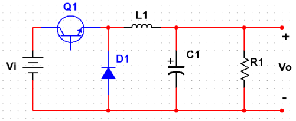
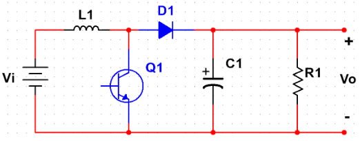
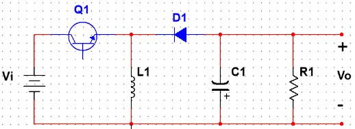
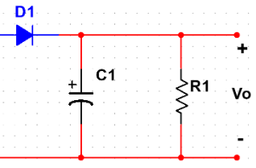

# Convert DC to DC

## 1. 基础理论

### 1.1. 均值 KCL

​	由基尔霍夫电流定律，取均值，并交换求和与均值计算，得：
$$
\sum<i_N> =0
$$
​	其中，$<i_N>$ 表示均值电流。

### 1.2. 均值 KVL

​	由基尔霍夫电压定律，取均值，并交换求和与均值计算，得：
$$
\sum<v_N> =0
$$
​	其中，$<v_N>$ 表示均值电压。

### 1.3. 容感器均值参数

​	在周期性稳态电路中，根据电荷守恒，流入电容器的平均电流为 0，类似地，电感器两端的电压为 0 。

## 3. DC-DC

### 3.1. Buck

​	以一个单刀双掷开关和若干电容、电感构成如下电路，并假设电容、电感无限大，以至于电压、电流的纹波为 0 ，电源转换效率为 1，即无耗。

​	当开关状态为 1 时，即开关向上闭合，$v_x=v_1$ ；当开关状态为 0 时，即开关向下闭合，$v_x = 0$ 。对电路做均值 KVL 分析，周期稳定状态下，电感器的均值电压为 0 ，可得：
$$
<v_2> = <v_x> \\
So,\ V_2 =DV_1
$$
​	类似地，对电流做分析也可以得到 $I_1 = DI_2$ ，其中 D 为开关占空比。通过控制占空比和频率以及电感间的关系，可以调整输出电压的幅度。输出电压恒小于输入电压，此为降压电路。

​	将上图中的单刀双掷开关，向上闭合的位置用 MOSFET 代替，向下闭合的位置用二极管代替，即为 BUCK 电路。其中，MOSFET 和二极管需要承载大电压 $V_1$ ，大电流 $I_2$ 。

### 3.2. Boost

​	现在对上图做出一些调整，假设单刀双掷开关向下闭合的状态为 1 ，向上闭合的状态为 0 ，调换上图中直流源与负载的位置，对包含 $v_x$ 的回路做 KVL 分析，周期稳定状态下，电感器的均值电压为 0 ，可得：
$$
<v_1> = <v_x> \\
So,\ V_1 = (1-D)V_2
$$
​	类似地，对电流做分析也可以得到 $I_2 = (1-D)I_1$ ，其中 D 为开关占空比。此时，开关状态为 1 时，电源向电感器充电；开关状态为 0 时，电源和电感器同时向负载放电，以提供高于电源的负载电压。输出电压恒大于输入电压，此为升压电路。

​	将上述电路中单刀双掷开关向下闭合的位置用 MOSFET 代替，向上闭合的位置用二极管代替，即为 BOOST 电路。其中，MOSFET 和二极管需要承载大电压 $V_2$ ，大电流 $I_1$ 。

### 3.3. Buck-Boost

​	Buck 与 Boost 电路中，包含一种相同的三端子网络，使用这个三端子网络的另一种输入方式，可以获得同时升高或降低电压的功能，如下图。

​	当单刀双掷开关向左闭合，状态为 1 ，向右闭合，状态为 0 。当开关状态为 1 时，$v_L = v_1$ ；当开关状态为 0 时，$v_L=v_2$ 。在周期稳定状态下，为保证电感器均值电压为 0 ，$v_2$ 必须为负值。$v_L$ 的均值可表示为：
$$
<v_L> = DV_1 + (1-D)V_2 \\
So,\ V_2 = -\frac{D}{1-D}V_1
$$
​	在实现时，将开关向左闭合的状态替换为 MOSFET，向右闭合的状态替换为二极管。假设，流过 MOSFET 的均值电流为 $I_1$ ，流过二极管的均值电流为 $I_2$ ，电容需要承载某一路的瞬时电流，随开关状态切换，当开关状态为 1 时，电容承载来自负载的负电流，状态为 0 时，承载来自源的正电流。根据均值 KCL 分析，周期稳定状态下，电容的均值电流为 0 ，即：
$$
<i_c> = DI_1-(1-D)I_2 \\
So,\ I_1 = \frac{1-D}{D}I_2
$$
​	上述结构中，电感需要承载全部的均值电流，即 $I_L = |I_1|+|I_2|$ ；电容需要承载全部的均值电压，即 $V_L = |V_1|+|V_2|$ 。类似地，也可以分析，MOSFET 需要承载全部的电压和全部的电流，二极管也是如此。

### 3.3. 纹波

#### 3.3.1. 容感值约束

​	以 Boost 电路为例，流过二极管的电流 $i_D$ 是一个周期为 T ，占空比为 $(1-D)$ 方波，其等效直流为 $(1-D)I_L$  。为了关注纹波特性，聚焦于右侧部分电路如下。

​	其中，RC 电路的时间常数为 RC，如果开关频率远大于 RC 低通电路截至频率，即 $1/T >> 1/RC$ ，此时可以认为输出电压为理想直流。

​	事实上，实际的输出电压除去等效直流作用于负载电阻的部分，还有一部分交流电流分量作用于电容产生的纹波电压。当交流分量小于 0 时，电容电压线性降低；当交流分量大于 0 时，电容电压线性增加。这就是输出纹波产生的原因。设纹波电压的峰峰值为 $\Delta V_{c, pp}$ ，则有：
$$
\begin{align*}
\Delta v_{C,pp} &= 1/C \cdot \int_{DT}^{T} i_{C}\ dt \\
&= 1/C \cdot DI_L(1-D)T \\
C &\ge \frac{DI_L(1-D)T}{\Delta v_{C,pp}}
\end{align*}
$$
​	通过上式，可以设定能够满足纹波条件的电容值。类似地，也可以得到约束电感电流纹波的表达式：
$$
\begin{align*}
\Delta i_{L,pp} &= 1/L \cdot \int_{0}^{DT} v_{L}\ dt \\
&=1/L \cdot DV_L(1-D)T \\
L &\ge \frac{DV_L(1-D)T}{\Delta i_{L,pp}}
\end{align*}
$$
​	需要注意的是，在计算电容纹波的等效过程中，忽略了电流中的纹波，这种近似并不影响结果。考虑了电流纹波的等效结果并不会影响峰峰值的大小，只是纹波曲线斜率会随电流纹波变化，不再是一个固定的值。

#### 3.3.2. 纹波比

​	通常使用比率表示纹波相对于直流量的大小，如下：
$$
Ripple\ Ratio\ \mathcal{R}_{x} \triangleq  \frac{\Delta x_{pp}/2}{\mathcal{X}}
$$
​	对于 Boost 电路而言，电感电流的纹波峰峰值 $\Delta i_{L,pp} = \frac{V_1DT}{L}$ ，直流分量 $I_1 = \frac{V_2}{R(1-D)}$ ，代入纹波比表达式，可得：
$$
\begin{align*}
\mathcal{R}_L &= \frac{\Delta i_{L,pp}}{2I_1} \\
&= \frac{V_1DTR(1-D)}{2LV_2} \\
&=\frac{D(1-D)^2TR}{2L}
\end{align*}
$$
​	由此，当负载电阻增加，或电感减小时，纹波比会上升。值得注意的是，负载电阻增加意味着输出直流电流的减小，纹波绝对值未变化，当电阻过大时，会导致二极管截止；电感减小意味着直流纹波的增加，纹波绝对值增加，当电感过小时，也会产生二极管的截止。这种工作模式称为不连续导通模式（Discontinuous Conduction Mode，DCM），意味着存在某种情况下开关和二极管均关闭的状态。

​	当纹波比恰好为 1 时，此时刚好位于不发生 DCM 的临界值，即当 $\mathcal{R}_L > 1$ 时，会工作在 DCM 模式。这可以部分限定 R 与 L 的取值范围。为了使电路可以在高负载的条件下工作，需要很小的纹波，以使电感电流在低输出电流下不截止，这需要很大的电感。但是，电路同时需要工作于低负载，高输出功率的状态下，过大的电感，导致其在高输出功率下需要承载的能量超出限制。在设计电路时，需要选取合适的感值，以满足电路在低功率和高功率下的工作表现。

​	此外，如果电路工作于 DCM 模式下，由于二极管的截止，再次计算输出电压与输入电压的比值，如下：
$$
DCM\qquad \frac{V_2}{V_1} = \frac{D_2+D}{D_2} = 1+ \frac{D}{D_2} \\
CCM\qquad \frac{V_2}{V_1} = \frac{1}{1-D} = 1 + \frac{D}{1-D}
$$
​	由于二级管截止时间 $D_2$ 恒小于反向电压的持续时间 $1-D$ ，这表明，工作在 DCM 模式下的输出电压高于工作在 CCM 下的输出电压。如果消除 DCM 表达式中的 $D_2$ ，可以得到：
$$
\frac{V_2}{V_1} = 1/2 + 1/2 \sqrt{1 + 2D^2RT/L}
$$
​	下面，考虑输出电流的模型，假设不考虑左侧的开关电路，将二极管视作一个电流源，二极管流出的平均电流，即为流入负载的平均电流。二级管在 DT 之前，由于 MOSFET 的导通，没有电流通过，在 DT 到 T 之间，由于 MOSFET 的闭合，电流从 $i_{pk}$ 逐渐减小为 0 。其中：
$$
i_{pk} = \frac{V_1DT}{L} \\
v = L\frac{di}{dt} \\
\Delta t = D_2T = L\frac{i_{pk}}{V_2-V_1} = \frac{V_1DT}{V_2-V_1}
$$
​	通过上式，计算二极管的平均电流，如下：
$$
\begin{align*}
<i_d> &= \frac{1}{2} \cdot \frac{V_1DT}{V_2-V_1}\cdot \frac{V_1DT}{L}\cdot \frac{1}{T} \\
 &= \frac{1}{2} \cdot \frac{V_1^2T}{2(V_2-V_1)L}\cdot D^2
\end{align*}
$$
​	通过给定电压的转化率，可以确定输出电流的大小。工作与 DCM 状态下的模型要比工作于 CCM 下的模型复杂许多。

#### 3.3.3. 能量

​	通常，容感器件在工作期间所需要容纳的能量峰值与其物理尺寸呈现正相关。因此，在设计电路时，往往需要考虑器件所需要承载的能量大小。

​	由上文可知，类似地定义电容电感纹波率如下：
$$
\mathcal{R}_{C} = \frac{\Delta v_{C,pp}/2}{\mathcal{V}_C} \\
\mathcal{R}_{L} = \frac{\Delta i_{L,pp}/2}{\mathcal{I}_L}
$$
​	代入电容约束表达式中：
$$
\begin{align*}
C &\ge \frac{D(1-D)I_1T}{\Delta v_{C,pp}} \\
&\ge \frac{D(1-D)I_1T}{2V_2\mathcal{R}_C}
\end{align*}
$$
​	电容存储的能量 E 为 ：$E = 1/2 \cdot CU^2$ ，代入电容约束表达式：
$$
\begin{align*}
E_C &= 1/2 \cdot CV_{pk}^2 \\
&= 1/2 \cdot \frac{D(1-D)I_1T}{2V_2\mathcal{R}_C} \cdot (V_2(1+\mathcal{R_C}))^2 \\
&= \frac{DP_{out}}{4f_{sw}} \cdot \frac{(1+\mathcal{R}_C)^2}{\mathcal{R}_C}
\end{align*}
$$
​	由该表达式，可以粗略的估计所需电容的尺寸的价格。电感类似。

### 3.4. 小结

​	这种电路优势在于效率高，输入功率几乎全部转化为输出功率，输出电压可调范围大，驱动能力强。缺点在于，负载响应较差，当负载电流变化时，输出电压也会随之变化，由于依赖电感、电容器件，输出电压的纹波较大。

 

