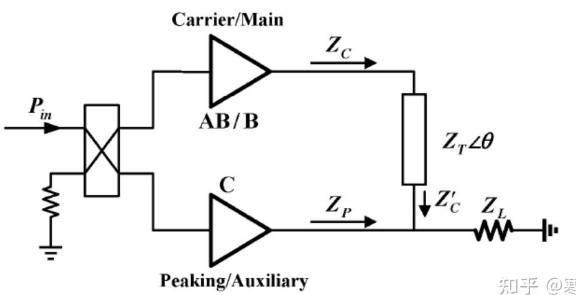
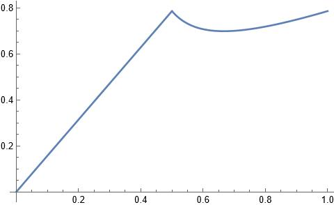

# Doherty 功放

## 一、引言

​	功放设计中，有两个重要的功率参数：均值功率和峰值功率。对于调制信号而言，大部分时间可以认为功放工作在均值功率下，少部分时间工作在峰值功率下。在设计时，必须使功放在峰值功率下，仍能保证较好的线性度，即 $P_{1dB}$ 需要大于峰值功率。B 类功放在 $P_{1dB}$ 输出功率时，功放效率最高，为 $\pi/4$ ，随着输出功率的降低，功放效率随之线性降低。这种情况下，有一个严重的问题在于，均值功率远小于峰值功率，这导致在大部分工作时间内，功放效率极低，对整机功耗极为不利。

​	通常情况下，指标中所提及的输出功率，指的是均值功率。所谓功率回退，指的是从功放支持的最大线性功率（峰值功率）回退到大部分时间的工作功率（均值功率）。例如，一个 $P_{1dB}$ 为 47 dBm 的 功放，需要输出峰均比为 10 dB 的调制信号，那么最终能够输出的最大功率为 37 dBm 。这意味着，工作功率需要从 $P_{1dB}$ 回退 10 dB，极大损失了功放效率。Donerty 即为了解决这类在低输出功率下保证高效率的问题。

## 二、传统 Doherty 结构

### 2.1. 有源负载牵引

​	功放的工作状态由由其自身的半导体管的特性曲线与负载线共同决定。工程上，选定了某一种型号的功放管后，效率基本只与负载线有关。当负载一定时，输出电压越大，电源效率越高；当输出电压基本相同时，负载越大，输出功率会减小，但是效率会提升。

​	依照以上原理，可以依赖有源牵引，改变功放管的输出电阻，进而动态调节功放在不同输出功率下的效率。不管何种类型的功放管，均可以等效为一个受控电流源，只是受控的类型不同。

​	那么，可以将 Doherty 功放结构，等效为上图。$V_{out} = R \cdot (I_1 + I_2)$

分别从两个电流源看去的电阻为：
$$
Z_1 = V_{out} / I_1 = R \cdot (1 + I_2/I_1) \\
Z_2 = V_{out} / I_2 = R \cdot (1 + I_1/I_2)
$$
​	当其中一个电流源减小时，从另一个电流源看去的负载阻抗减小。而在低功率下，对应于。一个电流源减小时，我们需要负载增加，因而需要在另一支路上增加 $\lambda /4$ 阻抗变换线来扭转这种趋势。

### 2.2. 双路式功放结构

​	

​	该结构由 3 部分组成：首先是输入端的功分器，将信号按照一定的功分比和相位关系分成两路信号；然后是 Doherty 结构的两个放大器电路，一个称为载波功放（Carrier/Main），另一个称为峰值功放或者辅助功放（Peaking/Auxiliary），载波功放通常偏置在 AB 类或 B 类，辅助功放通常偏置在 C 类，两个功放的输出端都匹配到了 50 $\Omega$ ，当功放处于小信号工作时，只有主功放工作，辅助功放在输入信号功率达到一定门限时才开始工作；Doherty 功放的末端是一个合路器电路，包括特性阻抗为 $Z_0$ 的阻抗变换线和负载阻抗 $Z_L$ 。

### 2.3. 对称式功放结构

​	在射频设计中，阻抗变换线的特性阻抗一般为 50 $\Omega$ ，负载阻抗通常取 25 $\Omega$ ，两条支路的相位差取 90$\degree$ ，下面，将 Doherty 功放的工作状态分为小信号和大信号讨论。

#### 2.3.1. 小信号工作

​	当功放处于小信号工作状态时，由于输入信号的幅值没有达到峰值功放的开启门限，此时只有载波功放工作，峰值功放处于截至状态。此时，载波功放的负载阻抗为：

$$
Z_C = Z_0^2 / Z_L = 100 \ \Omega
$$
​	通常情况下，$Z_C = Z_0$ ，对应于功放输出端匹配到 50 $\Omega$ ，当工作在小信号时，$Z_C = 2 \cdot Z_0$ ，此时负载线有所不同。两种情况下，在相同的输入电压下，虽然可以得到相同的功率，但是由于负载电阻的不同，高阻状态下的输出电压更大，更容易达到电压饱和，此时输出电流值只有峰值的一半，功放效率更高。

​	当负载为 $Z_0$ 时，功放的饱和输出功率为：
$$
P_{sat-Z_0} = 1/2 \cdot I_1V_1 = 1/2 \cdot I_{max}/2 \cdot V_{max}/2 = 1/4 \cdot I_{max} V_{max} \\

P_{sat-2Z_0} = 1/2 \cdot I_1V_1 = 1/2 \cdot I_{max}/4 \cdot V_{max}/2 = 1/8 \cdot I_{max} V_{max}
$$
​	上式中，$I_{max}$ ，$V_{max}$  均为包含直流分量的电流、电压峰值。不同负载下，虽然饱和输出功率不同，但是电源效率确是相同的，这就解决了在低输出功率下效率降低的问题。

​	在高负载下，电源效率如下：
$$
\begin{flalign*}{}
\eta_{2Z_0} = & P_1/P_{DC} \times 100 \% \\
 = & (1/2 \cdot I_1V_1) / (I_0V_0) \\ 
 = & (1/8 \cdot I_{max}V_{dc})/(1/2\pi \cdot I_{max}V_{dc}) \\
 = & \pi / 4 = \eta_{classB}
\end{flalign*}
$$
​	类似地，在低负载下，电源效率为：
$$
\begin{flalign*}
\eta_{Z_0} = & P_2/P_{DC} \times 100 \% \\
 = & (1/2 \cdot I_2V_2) / (I_0V_0) \\
 = & (1/4 \cdot I_{max}V_{dc}) / (1/\pi \cdot I_{max}V_{dc}) \\
 = & \pi/4 = \eta_{classB}
\end{flalign*}
$$
​	可以看到，不同负载线下，可以保证效率相同。高阻状态可以带来输出电压增益的增大，回退功率时效率的提高。

#### 2.3.2. 大信号工作

​	当大信号工作时，输入信号的功率达到一定门限值，是的峰值功放所分得的功率足以是的峰值功放开启。在这一阶段，由于合路器没有隔离电阻，两个功放的输出电流都会流向负载，这时就发生了有源负载牵引。

​	假设两路功放的基波输出电流随输入信号的变化如下：
$$
\begin{flalign*}
I_1 = & I_{max}/4 \cdot (1+\xi) \\
I_2 = & I_{max}/2 \cdot \xi
\end{flalign*}
$$
​	$\xi$ 的取值在 0 到 1 之间。此时从载波功放看向 $\lambda/4$ 线的负载阻抗为：
$$
Z_C = Z_0^2/[R_{L}(1 + I_2Z_0/V_1)]
$$
​	载波功放的输出电压为：
$$
V_1 = I_1Z_C = (I_{max}/4 \cdot Z_0/R_L)[Z_0-\xi(Z_0-2R_L)] \\
while \ \  Z_0 = 2R_L \\
V_1 = R_LI_{max}
$$
​	这表明，当 Doherty 功放进入大信号工作状态时，尽管载波功放的负载会随着峰值功放的输出电流的影响而发生变化，但是其输出的电压基波分量不变。通过载波功率，还可以推导出 Doherty 功放的整体输出功率：
$$
P_{out} = I_1^2R_{L} \\
For \ \ PA\ class\ B \\
R_{opt} = 2V_{max}/I_{max}
$$
​	化简得：
$$
P_{out} = I_{max}V_{max}/8 \cdot (1 + \xi)^2
$$
​	当功率回退因子 $\xi = 0$ 时，大信号状态下的输出功率于小信号状态下得输出功率是统一的，也即 Doherty 结构在增益上是连续的。

​	当功率回退因子 $\xi = 1$ 时，Doherty 达到最大输出功率：
$$
P_{sat\_doherty} = V_{max}I_{max}/2
$$
​	通过 Doherty 不同信号下的饱和输出功率，也可以计算该种功放的回退大小：
$$
Back\_off = 10\log(P_{sat\_2Z0}/P_{sat\_doherty}) = -6\ dB
$$
​	表明，对称式 Doherty 结构能够实现 6 dB 的功率回退。

### 2.4 小结

​	对于峰值功放而言，输入信号低于临界值，晶体管处于截至状态，没有信号输出；输入信号高于临界值，晶体管导通，峰值功放开始输出电压电流，直至晶体管饱和。

​	对于载波功放而言，其单独工作时，饱和电流为 $I_{max}/4$ ，但随着峰值功放开始工作，载波功放的负载阻抗逐渐减小，输出电流峰值增加。

​	Doherty 功放的核心在于，依赖有源负载牵引，提供变化的负载线。

## 三、Doherty 结构的效率

​	假设输入信号幅度为 $v_{in}$ ，其幅度变化的最大值为 $v_{inm}$ ，以功放管工作在 B 类状态下为前提。在小信号状态下，只有载波功放工作，此时 Doherty 的效率为：
$$
\eta_{doherty} = \pi/4 \cdot (2v_{in}/v_{inm}) \\
where \ \ 0 < v_{in} < v_{inm}/2
$$
​	在大信号阶段，功放输出的最大电流与输出电压有关：
$$
I_{m} = I_{max}/2 \cdot  v_{in}/v_{vim}
$$
​	功放输出功率为：
$$
P_{out} = I_{m} \cdot v_{in}/v_{inm} \cdot {V_{dc}}
$$
​	因此，Doherty 结构的整体效率为：
$$
\eta_{doherty} = \pi/2 \cdot (v_{in}/v_{inm})^2/(3v_{in}/v_{inm}-1) \times 100 \% \\
where \ \ v_{min}/2 < v_{in} < v_{inm}
$$
​	如下图，Doherty 功放的效率曲线存在两个顶点，分别是功率饱和点和功率回退 3 dB 点，而在这两个顶点之间效率有所下降，因为峰值功放刚开启时效率降低，拉低了整体的效率性能。在相同输出功率下，Doherty 功放的效率要比 B 类放大器的效率高。

